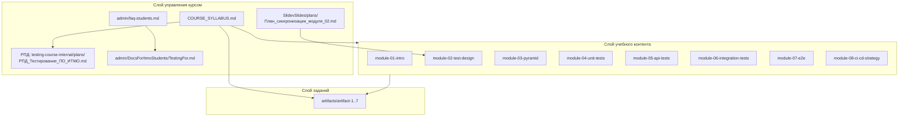
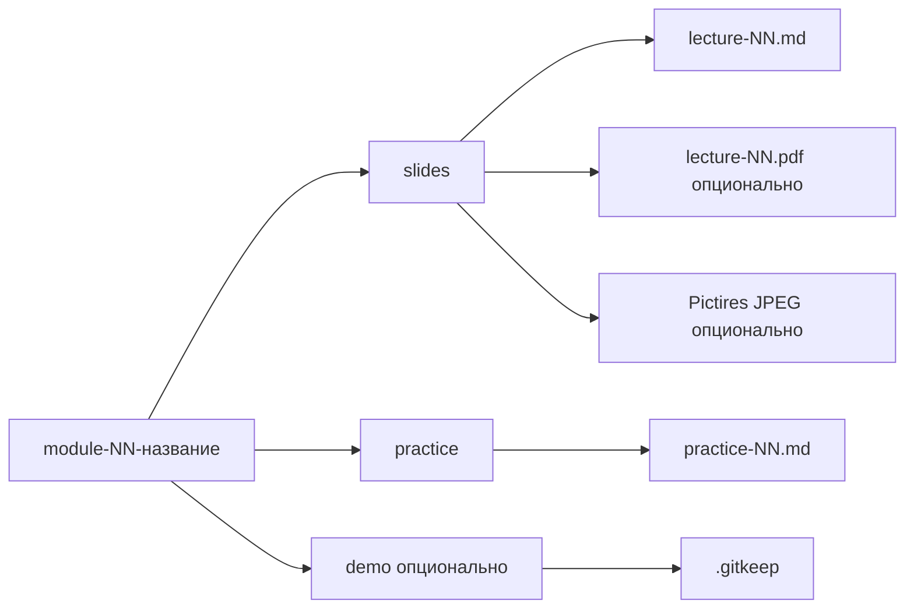
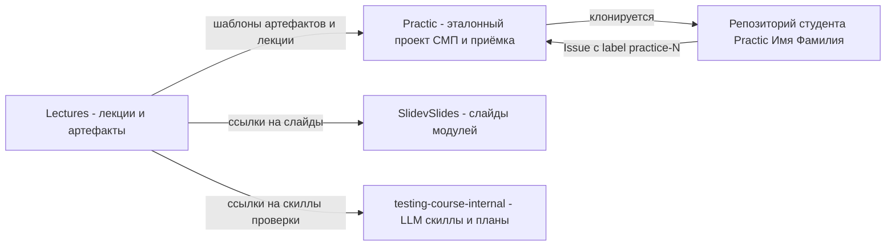

# Архитектура

> Как устроен контент-репозиторий: слои документов, границы модулей и связи
> с соседними репозиториями курса.
> **Обновлять при изменении:** `COURSE_SYLLABUS.md`, `materials/`

## Обзор

`Lectures` — это **репозиторий документов**, а не программа. Его «архитектура» —
это соглашение о том, где живёт какой тип контента и как он связан с другими
репозиториями курса. Выделяются три слоя внутри репозитория: управление курсом
(силлабус, РПД, FAQ), учебный контент (8 модулей с лекциями и практиками) и
шаблоны заданий (артефакты). Внешний контур — три соседних репозитория, которые
потребляют и дополняют контент.

## Детали

### Слои контента

**Вербально.** Силлабус задаёт сетку курса и является корнем зависимостей:
из него выводятся модули и шаблоны артефактов. Каждый модуль — самостоятельный
каталог, внутри которого лежат `slides/` (лекции), `practice/` (практики) и
опционально `demo/` (демонстрационные материалы). Практики ссылаются на
соответствующий артефакт по номеру. Слой администрирования не влияет на учебный
контент; решения по ревью модуля 2 зафиксированы в
`SlidevSlides/plans/План_синхронизации_модуля_02.md`, а сам review-документ удалён 15.09.2026 (Q-2).

### Структура каталога модуля

**Вербально.** Имена `module-01-intro` … `module-08-ci-cd-strategy` фиксируют
порядок модулей. Лекции и практики нумеруются внутри каталога, однако нумерация
неоднородна: часть модулей использует глобальные номера лекций, часть — локальные
(см. Q-1 в `00_OPEN_QUESTIONS.md`). Пустые каталоги удерживаются файлами
`.gitkeep` — это соглашение репозитория.

### Внешний контур: соседние репозитории

**Вербально.** Репозиторий `Lectures` — поставщик контента. `Practic` содержит
эталонный проект СМП, CI-пайплайны и документацию сдачи (`submission-guide.md`,
`git-workflow.md`); на него ведут абсолютные ссылки из лекций и практик.
`SlidevSlides` содержит исходники слайдов; слайды модуля 2 влиты в `Lectures`
(PR #2), план синхронизации — `SlidevSlides/plans/План_синхронизации_модуля_02.md`.
`testing-course-internal` содержит
LLM-скиллы, которыми проверяются не-кодовые артефакты. Студент работает в
персональном репозитории и сдаёт работу через Issue в эталонном `Practic`.

### Ответственности

| Компонент | Отвечает за | Не отвечает за |
|---|---|---|
| `COURSE_SYLLABUS.md` | Параметры курса, модули, оценивание 40+50+10 | Дословное содержание лекций |
| `materials/module-*/slides/` | Markdown-текст лекций и speaker notes | Рендер и публикацию слайдов |
| `materials/module-*/practice/` | Сценарии практик, критерии сдачи | CI-проверку (живёт в `Practic`) |
| `materials/artifacts/` | Шаблоны и требования к артефактам 1–7 | Приём и оценивание работ |
| `materials/admin/` | FAQ, описание для ИТМО, локальная копия РПД (untracked) | Учебный контент |
| `Practic` (внешний) | Проект СМП, CI, приёмка, дедлайны | Текст лекций |
| `testing-course-internal` (внешний) | LLM-рубрики проверки | Контент курса |
| `SlidevSlides` (внешний) | Слайды модулей (в т.ч. модуль 2) | Логика оценивания |

### Стиль организации контента

| Принцип | Проявление |
|---|---|
| Один модуль — один каталог | `module-NN-тема` |
| Один слайд — один раздел `###` | Все `lecture-*.md` |
| Один артефакт — один шаблон | `artifact-N-тема.md` |
| Метаданные шапки | Блок-цитата с модулем, лектором, датой, связями |
| Пустой каталог удерживается `.gitkeep` | `practice/`, `slides/`, `demo/` |
| Бинарники только для экспорта | PDF и JPEG закоммичены рядом с исходниками |

## Связи

- Полный поток «автор → публикация» и «студент → сдача» — `03_DATA_FLOW.md`.
- Точки входа по типам потребителей — `04_ENTRYPOINTS.md`.
- Детальная карта модулей — `06_COURSE_STRUCTURE.md`.
