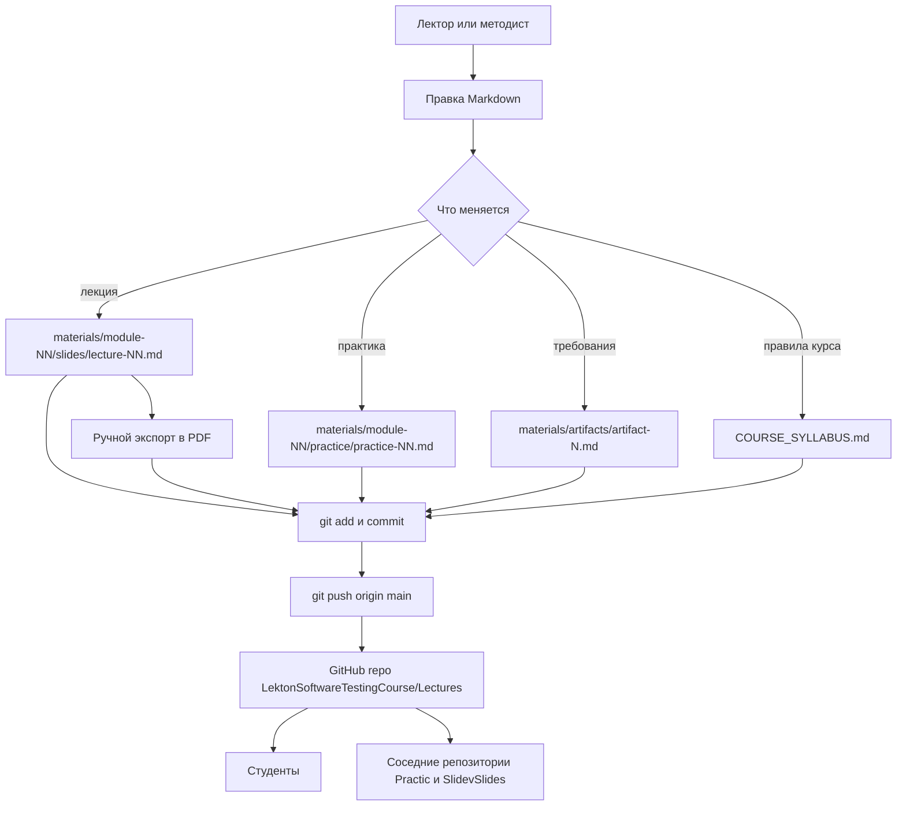
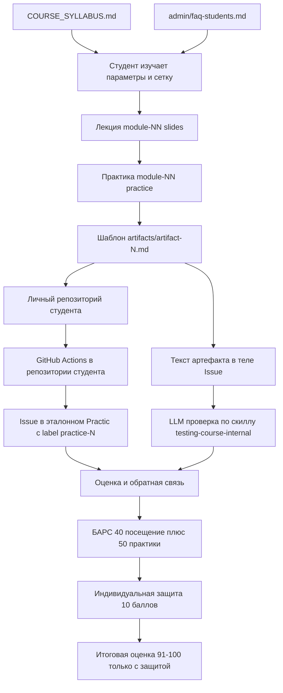
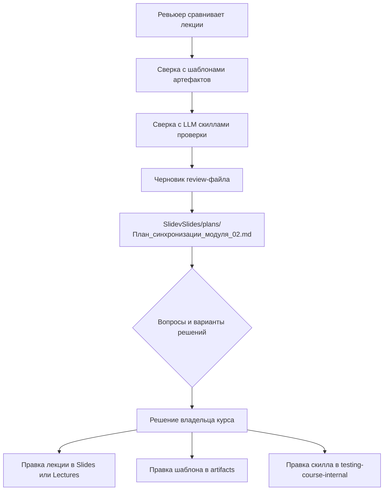

# Потоки данных

> Три реальных потока репозитория: подготовка контента и публикация, обучение
> и сдача практик, ревью согласованности контента.
> **Обновлять при изменении:** `materials/`, `COURSE_SYLLABUS.md`

## Обзор

В контент-репозитории нет рантайма, но есть устойчивые потоки движения данных.
Первый — «автор → GitHub»: как лекция или практика попадает в репозиторий и к
потребителю. Второй — «студент → оценка»: как контент превращается в сданный
артефакт и баллы. Третий — «ревью → правки»: как расхождения в контенте
фиксируются и закрываются. Ниже каждый поток описан диаграммой и текстом.

## Детали

### Поток A. Подготовка контента и публикация

**Вербально.** Автор правит Markdown-исходник в конкретном каталоге модуля.
Изменение попадает в git по обычной схеме `add → commit → push` в `main`;
история коммитов использует префиксы `feat`, `fix`, `docs`, `chore`.
Для лекций дополнительно существует PDF: он собирается вне репозитория и
коммитится рядом с Markdown (коммиты `f10ac0b`, `a163928`, `622d6df`).
Инструмент экспорта в репозитории не зафиксирован — см. Q-6. Потребители
результата — студенты через GitHub и соседние репозитории, которые ссылаются
на файлы `Lectures` относительными путями.

### Поток B. Обучение студента и сдача практики

**Вербально.** Студент начинает с силлабуса и FAQ, затем идёт по модулям.
Практика ссылается на шаблон артефакта и на лекции. Работа выполняется в личном
репозитории `Practic{Имя}{Фамилия}`, где автоматически запускается CI из
GitHub Actions. Сдача — Issue в эталонном репозитории `Practic` с label
`practice-N`, ссылкой на репозиторий, ссылкой на зелёный прогон Actions и путём
к артефакту. Кодовые артефакты проверяются CI, текстовые — LLM-рубриками
соседнего репозитория `testing-course-internal`; для этого полный текст
вставляется в тело Issue. Итог складывается из посещения (40), практик (50) и
индивидуальной защиты (10). Защита обязательна для «Отлично» и инициируется
студентом самостоятельно.

### Поток C. Ревью согласованности контента

**Вербально.** Согласованность контента проверяется вручную. Ревьюер
сопоставляет лекции между собой, с шаблонами артефактов и с LLM-рубриками,
затем оформляет документ с открытыми вопросами, вариантами решений и картой
ответственных. Документ ревью модуля 2 (`review-module-02-open-questions.md`,
15 вопросов В-1…В-15) удалён 15.09.2026; копия вне репозитория, решения
зафиксированы в `SlidevSlides/plans/План_синхронизации_модуля_02.md`. После
решения владельца правки вносятся в тот репозиторий, где живёт источник:
слайды, шаблоны или скиллы. Сквозного автоматического контроля согласованности
нет.

### Сводка потоков

| Поток | Триггер | Вход | Выход | Автоматизация |
|---|---|---|---|---|
| A. Публикация | Правка контента лектором | Markdown, JPEG | Коммит в `main`, PDF | Нет |
| B. Сдача практики | Старт модуля | Лекция, практика, шаблон | Issue, оценка, защита | CI в репозитории студента, LLM-рубрика |
| C. Ревью | Расхождение в контенте | Лекции, шаблоны, скиллы | План синхронизации, правки | Нет |

## Связи

- Компоненты и внешний контур — `02_ARCHITECTURE.md`.
- Точки входа и их потребители — `04_ENTRYPOINTS.md`.
- Открытые расхождения потока A и B — `00_OPEN_QUESTIONS.md`.
