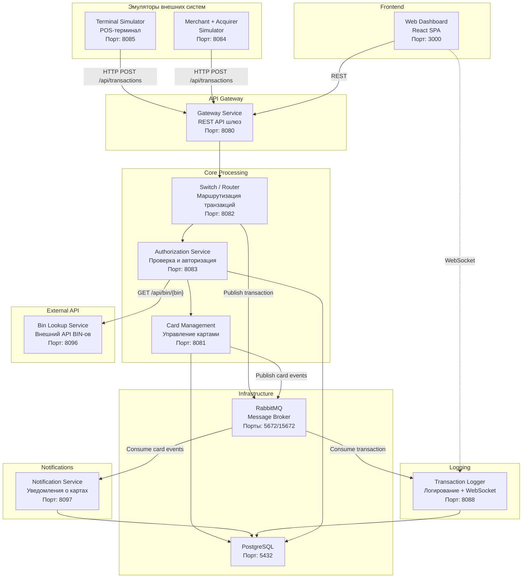

# Lecture 1: Введение в тестирование и enterprise-системы

> **Модуль**: 1 — Введение в тестирование и enterprise-системы
> **Лектор**: Андрей Попов
> **Длительность**: 1,5 астрономических часа (90 мин)
> **Слайдов**: 15
> **Формат**: Markdown, каждый слайд — раздел `###`
> **Структура слайда**: Заголовок + 3–5 буллетов + speaker notes
> **Дата**: 03.09.2026
> **Литература**: см. [Источники](#источники) в конце файла

---

## Тайминг

| Время | Блок | Слайды | Назначение |
|:---:|---|:---:|---|
| 0:00–0:15 | Вводный блок | 1–3 | Знакомство, цели курса, мотивация |
| 0:15–0:40 | Что такое тестирование | 4–6 | Определение, зачем нужно, заблуждения |
| 0:40–1:05 | Enterprise-системы и Lekton | 7–9 | Контекст компании, реальный процессинг |
| 1:05–1:20 | Учебный проект СМП | 10–12 | Концепция, архитектура, путь транзакции |
| 1:20–1:30 | Обзор курса и анонс практики | 13–15 | Модули, артефакты, что делать сейчас |

---

### Слайд 1. Титульный

**Слайд:**
- Курс «Тестирование программного обеспечения»
- Модуль 1. Введение в тестирование и enterprise-системы
- Лектор: Андрей Попов, компания Lekton
- ИТМО, 4 курс

**Speaker notes:**

> Добрый день. Меня зовут Андрей Попов, я руководитель тестирования в компании Lekton. Мы занимаемся разработкой программного обеспечения для процессинговых центров — это системы, через которые проходят банковские карточные транзакции. Сегодня — первая лекция нашего семестрового курса. Мы познакомимся, я расскажу, что мы будем делать весь семестр, и начнём разбираться, что такое тестирование в реальной enterprise-разработке.

> [ИНТЕРАКТИВ — 3 мин] Прежде чем начнём, быстрый опрос. Поднимите руку: кто хоть раз писал автоматические тесты — любые, хоть JUnit, хоть скрипт? *(пауза, посчитать)* А кто писал тесты, которые запускались в CI — не вы вручную, а система после коммита? *(пауза)* Кто работал с Docker — поднимал что-то через `docker compose`? *(пауза)* Отлично, теперь я понимаю аудиторию. Тем, кто с Docker не работал, — на практике будет проще, чем кажется.

---

### Слайд 2. План лекции

**Слайд:**
- Что такое тестирование и зачем оно нужно
- Enterprise-системы: чем они отличаются
- Знакомство с компанией Lekton и реальным процессингом
- Учебный проект СМП — симулятор процессингового центра
- Обзор курса: 8 модулей, 8 артефактов, 50+50 баллов
- Что будет на практике: запуск СМП

**Speaker notes:**

> План на сегодня такой. Сначала мы поговорим о том, что вообще такое тестирование — не из учебника, а из практики. Потом разберём, что такое enterprise-системы и почему тестировать их сложнее, чем учебный проект. Я расскажу про нашу компанию Lekton и как устроен реальный процессинг. Затем мы познакомимся с нашим учебным проектом — Симулятором процессингового центра, или СМП. Это проект, вокруг которого построен весь курс. В конце я покажу карту курса на семестр и расскажу, что вы будете делать уже на первой практике.

---

### Слайд 3. Зачем этот курс

**Слайд:**
- По программе ИТМО: Java, SQL, Git, REST API — есть опыт разработки
- Теории тестирования в программе ранее не было
- Цель курса: научить проектировать тесты, писать автотесты, работать в CI/CD
- Образ выпускника: инженер тестирования — manual + automation + процесс
- 5 качеств, которые развивает курс: эмпирический подход, навык, отличие, мотивация, доступность

**Speaker notes:**

> По информации от ИТМО, программа 4 курса включает Java, SQL, Git и разработку REST API. При этом теории тестирования в программе не было, осознанного опыта с тестовыми фреймворками вроде JUnit — нет. Наш курс закрывает именно этот пробел.

> К концу семестра вы должны освоить три направления. Первое: **проектировать тесты** — не просто «покликал и работает», а системно: анализ требований, классы эквивалентности, граничные значения, decision tables. Второе: **писать автотесты** — unit, API, интеграционные, E2E — на реальном микросервисном проекте. Третье: **работать в CI/CD-окружении** — запускать тесты автоматически, получать отчёты, принимать решения по качеству. Мы не готовим «ручных тестировщиков» или «чистых автоматизаторов» — мы готовим инженеров тестирования, которые понимают весь цикл.

> В индустрии тестирования выделяют пять качеств, которые отличают хорошего тестировщика [Bach & Bolton, 2025, Ch.1]. **Empirical** — исследует реальное поведение продукта экспериментами, а не предположениями. **Skilled** — действует системно, а не интуитивно. **Different** — мыслит иначе, чем разработчики, видит то, что другие упускают. **Motivated** — искренне хочет находить проблемы, а не мечтает писать код. **Available** — имеет выделенное время на тестирование, а не делает его «между задачами». Именно эти качества мы будем развивать в течение семестра.

> James Bach приводит красивую метафору [Bach & Bolton, 2025, Ch.1]: «Тестирование — это фары проекта. Testing is looking where you are going. Фары не замедляют машину — они позволяют ехать быстрее в темноте. Так и тестирование не тормозит разработку — оно позволяет двигаться быстро, не боясь неизвестного». Когда вам на проекте скажут «нет времени на тестирование» — вспомните про фары.

> Кстати, профессия тестировщика — международно признанная. По данным ISTQB, в мире более 300 000 сертифицированных специалистов по тестированию, и число растёт [Spillner et al., 2014, Ch.1]. Так что навыки, которые вы получите, востребованы глобально.

---

### Слайд 4. Что такое тестирование

**Слайд:**
- Тестирование — это оценка качества продукта через исследование его поведения
- Цепочка: ошибка человека → дефект в коде → отказ в работе (error → defect → failure)
- Цель: найти дефекты ДО того, как их найдут пользователи
- Verification: «мы делаем продукт правильно?» (соответствие спецификации)
- Validation: «мы делаем правильный продукт?» (соответствие потребностям)

**Speaker notes:**

> Начнём с базового вопроса: что такое тестирование? Часто думают, что тестирование — это «запустил программу, проверил, что не падает». Это неправильно.

> Давайте разберёмся с терминологией — она нам понадобится весь семестр. В тестировании различают три понятия [ISTQB / Spillner et al., 2014, 2.1.1]: **Error** — ошибка человека (например, разработчик перепутал `>` и `>=`). Эта ошибка приводит к **Defect** (или fault, bug) — дефекту в коде. Когда программа с этим дефектом выполняется, происходит **Failure** — отказ, видимый пользователю (например, транзакция на ровно 100 рублей не проходит, хотя должна). Важно: тестировщик видит failure, но ищет defect. А разработчик, найдя defect, исправляет исходный error. Это называется debugging — и это НЕ тестирование. Тестирование и отладка — разные деятельности.

> Существует два разных взгляда на определение тестирования. Классическое определение из ISTQB: «Тестирование — это процесс, направленный на поиск дефектов» [Spillner et al., 2014, 2.1.2]. Более современный взгляд от Context-Driven школы: «Тестирование — это процесс оценки продукта через обучение: мы исследуем продукт, экспериментируем с ним и на основе этого формируем суждение о его качестве» [Bach & Bolton, 2025, Ch.2]. Оба определения верны и дополняют друг друга.

> Ключевое различие, которое нужно запомнить с первой лекции: **Testing vs Checking** [Bach & Bolton, 2025, Ch.2]. Checking — это механическая проверка: «верни HTTP 200 на health-check», «баланс после резервирования уменьшился на сумму». Такие проверки можно и нужно автоматизировать. Testing — это человеческая деятельность: исследование, поиск неочевидных сценариев, анализ рисков. Автотесты — это checking, а не testing. Машина проверяет то, что задумал человек. Человек исследует то, что не предусмотрел никто. В курсе вы будете и писать автотесты (checking), и проектировать тестовые сценарии (testing).

> И два аспекта тестирования. **Verification** — «мы делаем продукт правильно?» — проверяем, что код соответствует спецификации. **Validation** — «мы делаем правильный продукт?» — проверяем, что продукт решает задачу пользователя. Verification автоматизировать проще (сравнил ответ API с ожидаемым — готово). Validation требует понимания бизнес-логики (действительно ли пользователь может оплатить покупку, или мы что-то упустили в требованиях?).

---

### Слайд 5. Почему тестирование сложно

**Слайд:**
- Невозможно проверить все комбинации входных данных (exhaustive testing impossible)
- Тестирование показывает наличие дефектов, но не доказывает их отсутствие
- Парадокс пестицида: одни и те же тесты перестают находить новые баги
- Стоимость исправления дефекта удваивается на каждом уровне тестирования: чем позже найден, тем дороже
- Раннее тестирование — самый эффективный способ снижения рисков

**Speaker notes:**

> Почему тестирование — это сложно? Международный стандарт ISTQB формулирует 7 принципов тестирования [Spillner et al., 2014, 2.4]. Разберём ключевые.

> **Принцип 1: Testing shows presence of defects, not their absence.** Тестирование может показать, что дефекты ЕСТЬ. Но оно не может доказать, что дефектов НЕТ. Прогнали 1000 тестов, все зелёные — это не значит, что программа безошибочна. Это значит, что мы не нашли ошибок в проверенных сценариях. Дейкстра сформулировал это ещё в 1970-х.

> **Принцип 2: Exhaustive testing is impossible.** Невозможно проверить все комбинации. Возьмём наш учебный проект СМП: 16-значный номер карты, 5 статусов, 3 вида лимитов, разные суммы — это миллионы комбинаций. Проверить их все физически невозможно. Поэтому тестирование — это всегда выбор: какие сценарии наиболее рискованны, какие данные наиболее показательны.

> **Принцип 3: Early testing.** Начинайте тестирование как можно раньше. Анализ требований на противоречия, ревью архитектуры — это тоже тестирование, и оно окупается многократно.

> **Принцип 5: Pesticide paradox.** Если вы прогоняете одни и те же тесты раз за разом, они перестают находить новые дефекты — как пестициды, к которым насекомые привыкают. Тестовый набор нужно регулярно обновлять, добавлять новые сценарии, пересматривать старые.

> Ещё три принципа [Spillner et al., 2014, 2.4]. **Принцип 4: Defect clustering** — дефекты распределены неравномерно, они кластеризуются: большинство багов живёт в небольшом числе модулей. Нашли в каком-то месте много дефектов — рядом почти наверняка есть ещё. Практический вывод: нашли баг в резервировании — копайте глубже именно там. **Принцип 6: Testing is context dependent** — тестирование зависит от контекста: банковский процессинг и интернет-магазин тестируются по-разному — разные риски, разная интенсивность, разные критерии выхода. **Принцип 7: Absence-of-errors fallacy** — система может быть технически безупречной и при этом бесполезной, если не решает задачу пользователя. Ноль багов в трекере — не значит готовность к релизу.

> Теперь о стоимости дефекта. Ключевое правило [Spillner et al., 2014, 6.3.1]: стоимость исправления дефекта удваивается на каждом уровне тестирования. Дефект, найденный на этапе требований, стоит условную единицу. Дожил до компонентного тестирования — вдвое дороже. До интеграционного — вчетверо. До системного — в восемь раз. А если дошёл до продакшна, добавляются прямые издержки (ущерб клиентам, простои бизнес-процессов) и косвенные (штрафы, потеря репутации, стоимость горячих исправлений и повторных регрессий) — всё это Spillner и соавторы относят к defect costs, опираясь на отчёт NIST 2002 года. Есть и эффект «мультипликации»: дефект в требованиях, если его не поймать, порождает цепочку последующих дефектов в дизайне и коде. В финансовых системах, с которыми работает Lekton, множитель может быть ещё выше: продакшн-дефект в процессинге — это не просто баг, а реальные финансовые потери, штрафы регулятора, репутационный ущерб.

> Кстати, о том, почему тестирование сложно не только технически, но и организационно. В индустрии есть понятие **«Parnism»** [Bach & Bolton, 2025, Ch.2] — по имени профессора Дэвида Парнаса, который в 1980-х предложил «притворяться», что мы следуем строгому Waterfall-процессу, даже если на самом деле не следуем. Эта идея породила культуру «fake testing», о которой поговорим на следующем слайде.

---

### Слайд 6. Заблуждения о тестировании

**Слайд:**
- «Тестирование — это кликание» → Нет, это инженерная дисциплина
- «Тестировщик не нужен, если есть автотесты» → Автотесты — это checking, а не testing
- «Тестирование гарантирует качество» → Нет, качество строится на всех этапах
- «Чем больше тестов, тем лучше» → Важна эффективность, а не количество
- «AI заменит тестировщиков» → AI пишет код — тестировать его нужно БОЛЬШЕ, а не меньше

**Speaker notes:**

> Пять заблуждений, с которыми вы столкнётесь в индустрии — и в нашем курсе мы их последовательно развенчиваем.

> **«Тестирование — это кликание».** Современное тестирование — это инженерная дисциплина: проектирование тестовых сценариев, анализ рисков, автоматизация, работа с CI/CD. Тестирование ≠ debugging, это разные деятельности. Debugging — поиск и исправление дефекта в коде, работа разработчика. Testing — систематический поиск дефектов через исследование продукта [ISTQB, Spillner et al., 2014, 2.1.2].

> **«Тестировщик не нужен, если есть автотесты».** Возвращаемся к различию testing vs checking [Bach & Bolton, 2025, Ch.2]. Автотесты выполняют checking — механическую проверку заданных условий. Они не исследуют продукт, не ищут неочевидные сценарии, не анализируют риски. Автотесты проверяют ровно то, что задумал человек. Если сценарий не предусмотрен — автотест его не найдёт. Кроме того, есть конфликт интересов: разработчик, написавший код, психологически не способен глубоко тестировать свою работу — срабатывает "предвзятость подтверждения" — это когнитивное искажение, при котором человек ищет, замечает и помнит только ту информацию, которая подтверждает его мнение, и игнорирует всё, что ему противоречит [ISTQB, Spillner et al., 2014, 2.3]. Нужен выделенный тестировщик, не привязанный к коду эмоционально.

> **«Тестирование гарантирует качество».** ISTQB Принцип 1 и Принцип 7: тестирование показывает наличие дефектов, но не гарантирует их отсутствие [Spillner et al., 2014, 2.4]. Качество строится на всех этапах — от требований до кода. Тестирование помогает найти проблемы, но не может их исправить и не может гарантировать, что ничего не пропущено.

> **«Чем больше тестов, тем лучше».** Важна не масса тестов, а их эффективность: какие риски они покрывают, какие сценарии проверяют. 10 хорошо спроектированных тестов могут быть полезнее 1000 однотипных проверок. Парадокс пестицида тоже здесь: даже 1000 тестов, если их не обновлять, перестанут находить баги.

> **«AI заменит тестировщиков».** Это, пожалуй, самый актуальный миф 2025–2026 годов. James Bach и Michael Bolton [2025, Ch.1] пишут: «GenAI изменит разработку — люди будут писать промпты вместо кода. Но вот что им ТОЧНО понадобится: люди, которые умеют тестировать. Потому что если вы доверяете AI написание кода, вы должны как-то убедиться, что AI выдал работающий результат. AI может сказать, что он "уже протестировал". Вы не узнаете, что он имеет в виду. Вы не узнаете, говорит ли он правду. Единственный способ — чтобы ответственный человек тщательно это протестировал». Так что тестировщики в эпоху AI становятся ещё более востребованными.

> И ещё одно важное понятие — **«fake testing»** [Bach & Bolton, 2025, Ch.1]. Это когда тестирование делается для галочки: тест-кейсы пишутся, но не выполняются; баги находятся, но не оформляются; отчёты рисуются, но не отражают реальность. Fake testing создаёт видимость качества — и это опаснее, чем отсутствие тестирования, потому что создаёт ложное чувство безопасности. В нашем курсе мы учим реальному тестированию, а не «сертификационному».

---

### Слайд 7. Что такое enterprise-системы

**Слайд:**
- Enterprise-система — это не «большой проект», а другой класс сложности
- Признаки: долгоживущий код (10–20 лет), много интеграций, строгие требования к надёжности
- Финансовые системы: транзакции не должны теряться — never
- Регуляторные требования: PCI DSS, аудит, отчётность перед ЦБ
- Высокая цена ошибки: дефект = финансовые потери + репутация + штрафы

**Speaker notes:**

> Теперь о том, что такое enterprise-системы. Это не просто «большой проект». Enterprise-система — это система с долгоживущим кодом (10–20 лет), множеством интеграций и строгими требованиями к надёжности. Возьмём финансовые системы, с которыми работает Lekton. Транзакция не должна теряться — никогда. Если банк проводит платёж, он должен либо дойти, либо корректно отклониться. Нет состояния «потеряли где-то посередине». В отличие от пользовательского приложения, где можно показать ошибку и попросить «попробовать ещё раз», в процессинге такой роскоши нет.

> Второе — регуляторные требования. Платёжные системы подчиняются стандартам: PCI DSS для безопасности, требования Центрального Банка, обязательный аудит. Всё это влияет на то, КАК мы тестируем: нужна документация, прослеживаемость требований к тестам (traceability matrix), формальные отчёты.

> Конкретный пример, чтобы почувствовать масштаб. PCI DSS требует: номер карты нельзя хранить в открытом виде — в логах и базах он маскируется, видны только первые шесть и последние четыре цифры. CVV запрещено хранить вообще, в любом виде, после авторизации. Каждый доступ к данным кардхолдера логируется и доступен для аудита. И всё это нужно не просто реализовать — нужно **доказать аудитору**, что реализовано и протестировано. Отсюда и требование прослеживаемости: каждое регуляторное требование связано с конкретными тестами.

> Третье — цена ошибки. В финансовой системе дефект — это не просто баг в UI. Это реальные деньги, репутация, возможные штрафы регулятора. Поэтому тестирование в enterprise — это не «проверить, что работает», а «доказать, что не сломается в условиях, которых мы не предусмотрели».

> С точки зрения методологии тестирования, enterprise требует **глубокого тестирования** (deep testing) [Bach & Bolton, 2025, Ch.2]. Deep testing максимизирует шансы найти каждый трудновоспроизводимый (elusive) баг, который действительно важен для бизнеса. В стартапе часто достаточно поверхностное тестирование — проверить основные пользовательские сценарии. В enterprise нужна и глубина, и ширина покрытия. Плюс к функциональному тестированию добавляется нефункциональное [Spillner et al., 2014, 3.7.2]: нагрузочное, безопасность, отказоустойчивость, производительность. Именно такой подход мы применяем в Lekton, и именно ему вы будете учиться.

---

### Слайд 8. Lekton и реальный процессинг

**Слайд:**
- Lekton — вендор ПО для процессинговых центров
- Продукты: Lekton Classic (монолит) и Lekton Sigma (микросервисы)
- Пирамида тестирования Lekton (соответствует ISTQB-уровням):
  - Unit-тесты — пишут разработчики
  - Модульные тесты — Java, полностью автоматизированные
  - Интеграционные контура — малые контура
  - E2E + системное тестирование — объединённый контур
  - Тестирование клиентских конфигураций — по спецификациям клиентов
- ~40 тестировщиков в команде

**Speaker notes:**

> Несколько слов о компании, в которой я работаю. Lekton — это вендор программного обеспечения для процессинговых центров. Проще говоря, мы делаем системы, через которые банки обрабатывают карточные транзакции. У нас два продукта: Lekton Classic — монолитная система, и Lekton Sigma — более новая, на микросервисной архитектуре.

> Наша пирамида тестирования следует классической модели, описанной в ISTQB [Spillner et al., 2014, Ch.3]: component tests (unit) → integration tests → system tests → acceptance tests. Unit-тесты пишут разработчики. Модульные тесты — полностью автоматизированные на Java. Есть малые интеграционные контура, где проверяется взаимодействие компонентов. E2E-контур объединён с системным тестированием. И отдельно — тестирование клиентских конфигураций: каждый банк настраивает систему под себя, и мы тестируем эти конфигурации по спецификациям.

> В команде тестирования работает порядка 40 человек. Почему так много? Потому что тестирование — это не только написание тест-кейсов. Это верхушка айсберга [Bach & Bolton, 2025, Ch.3]. Под водой — анализ требований, проектирование тестовой стратегии, настройка окружений, анализ результатов, взаимодействие с разработчиками и аналитиками, работа с регуляторной документацией. Ручное тестирование выполняют команды Support и Delivery. Это реальная enterprise-практика, и наш курс построен так, чтобы дать вам представление о ней.

> Теперь — конкретная история с цифрами, чтобы вы почувствовали масштаб. Сейчас у нас в работе две процессинговые системы: Lekton Classic — монолит на Oracle PL/SQL-процедурах, и Lekton Sigma — огромная микросервисная архитектура. Релизное E2E-тестирование мы ведём параллельно на трёх линейках — например, 25.2, 26.1 и 26.2 (master). Полный цикл E2E с учётом объёма изменений, найденных багов и их исправления занимает порядка одной–двух недель — и это несмотря на то, что ниже по пирамиде уже отработали малые интеграционные контура, модульные тесты и тысячи тестовых сценариев. За эти недели тесты ловят дефекты в начислении процентов, в логике работы со счетами и ограничителями, а также системные проблемы при обновлении системы — например, при автоматизированном переходе с 25.2 на 26.1. Всё это — проблемы, которые не доехали до клиента. А каждая такая проблема, доехавшая до продакшна, вернулась бы к нам в лучшем случае негативом, а в худшем — убытками и репутационными потерями. Вот почему мы гоняем регресс неделями: это дешевле, чем один дефект в проде.

---

### Слайд 9. Путь банковской транзакции

**Слайд:**
- POS-терминал → Эквайрер → Платёжная система → Эмитент → Ответ
- Реальный путь: секунды, миллионы транзакций в день
- Каждый узел — отдельная система со своей логикой
- Отказ любого узла = отказ транзакции
- Тестировать нужно каждый узел и их взаимодействие

**Speaker notes:**

> Чтобы понять, зачем нам учебный проект, давайте посмотрим, как устроен реальный путь банковской транзакции. Вы стоите в магазине, прикладываете карту к терминалу. Терминал отправляет запрос эквайреру — банку, который обслуживает магазин. Эквайрер передаёт в платёжную систему — Visa, Mastercard, Мир. Платёжная система маршрутизирует запрос в банк-эмитент — банк, который выпустил вашу карту. Эмитент проверяет: есть ли карта, не заблокирована ли, хватает ли денег, не превышен ли лимит. И возвращает ответ обратно по цепочке. Всё это — за секунды, и миллионы таких транзакций в день. Каждый узел — отдельная система со своей логикой, и отказ любого узла означает отказ транзакции. Тестировать нужно каждый узел по отдельности и их взаимодействие. Именно эту структуру мы упростили в нашем учебном проекте.

> Несколько цифр для масштаба. У крупного банка-эквайрера — сотни транзакций в секунду в пике, у платёжных систем — десятки тысяч TPS. SLA на авторизацию — две-три секунды на всю цепочку туда и обратно. Если эмитент не отвечает за таймаут, эквайрер отправляет reversal — отмену транзакции, чтобы деньги не зависли. Это тоже тестовый сценарий: таймаут каждого звена. И деталь: реальные системы общаются протоколом ISO 8583 — бинарный формат с полями: поле 2 — номер карты, поле 4 — сумма, поле 11 — STAN, поле 37 — RRN, поле 49 — код валюты. В СМП мы заменили его читаемым JSON, но имена полей — `stan`, `rrn` — сохранили, чтобы вы привыкали к доменной терминологии.

---

### Слайд 10. Учебный проект СМП

**Слайд:**
- СМП — Симулятор процессингового центра
- 11 микросервисов + PostgreSQL + RabbitMQ
- Эмулирует путь транзакции полностью
- Гибридное взаимодействие: синхронный HTTP (авторизация) + асинхронный RabbitMQ (логирование, уведомления)
- Синтетические данные, JSON вместо ISO 8583
- Docker Compose — всё одной командой
- Тесты удалены — вы будете писать их заново

**Speaker notes:**

> Итак, наш учебный проект — СМП, Симулятор процессингового центра. Это упрощённая модель реального процессинга. Одиннадцать микросервисов, база данных PostgreSQL и брокер сообщений RabbitMQ. СМП эмулирует тот самый путь транзакции, о котором мы говорили.

> Ключевая особенность архитектуры — гибридное взаимодействие. Авторизация и резервирование средств идут синхронно через HTTP: терминал отправил запрос — ждёт ответ. А логирование транзакций и уведомления о карточных событиях идут асинхронно через RabbitMQ: Switch публикует сообщение в очередь и сразу возвращает ответ клиенту, не дожидаясь записи в лог. Это называется eventual consistency.

> С точки зрения тестирования такая архитектура — интереснейшая задача [ср. ISTQB Integration Testing, Spillner et al., 2014, 3.3]. Нужно проверять и синхронные контракты (формат запросов/ответов, статус-коды), и асинхронные гарантии доставки (сообщение не должно теряться, даже если очередь временно недоступна). Именно такие задачи решают тестировщики в enterprise.

> Мы используем синтетические данные — никаких реальных карт. Вместо тяжёлого протокола ISO 8583 — упрощённый JSON. Всё поднимается одной командой `docker compose up`. И главное: из проекта **удалены все тесты**. Все unit-тесты, интеграционные, E2E — их нет. Вы будете писать их заново в течение семестра. Это не баг, это фича курса: вы пройдёте путь тестировщика с нуля, на реальном проекте, шаг за шагом. Как говорят Bach и Bolton [2025, Ch.2]: «Относитесь к продукту как к загадке, которую нужно исследовать». СМП — ваша загадка на семестр.

---

### Слайд 11. Архитектура СМП

**Слайд:**



- 11 сервисов + PostgreSQL + RabbitMQ
- Гибридное взаимодействие: синхронный HTTP + асинхронный RabbitMQ
- Изоляция через API и очереди, а не через БД

**Speaker notes:**

> Посмотрим на архитектуру. На диаграмме — все 11 сервисов плюс инфраструктура. Слева — эмуляторы внешних систем: Terminal Simulator и Merchant Simulator. В центре — Gateway, единственная точка входа для REST API. Дальше — ядро обработки: Switch маршрутизирует транзакции, Authorization проверяет и авторизует, Card Management управляет картами. Bin Lookup — внешний API для обогащения данных по BIN. RabbitMQ — асинхронный брокер: Switch публикует транзакции для Logger, Card Management публикует карточные события для Notification Service. Справа — Transaction Logger. Dashboard - UI показывает состояние системы. Дальше — PostgreSQL. Важно: база одна, но напрямую к ней подключаются только четыре сервиса. Остальные общаются через REST API или RabbitMQ. Это архитектурный принцип «изоляция через API и очереди», и мы будем тестировать каждый уровень изоляции.

вопрос аудитории: «Какой сервис здесь самый нагруженный? А какой — самая критичная точка отказа?»

> [ДЕМО-РАЗБОР — 5–6 мин] Диаграмму разбираем по блокам, не всю сразу. Шаг 1 — левый блок: «Эмуляторы внешних систем — Terminal и Merchant. В реальности это POS-терминалы; у нас — симуляторы, которые мы контролируем». Шаг 2 — центр: «Gateway — единственная точка входа. Switch маршрутизирует, Authorization проверяет, Card Management хранит карты». Шаг 3 — низ: «PostgreSQL и RabbitMQ — инфраструктура. База одна, но напрямую к ней подключены только четыре сервиса». Шаг 4 — асинхронные связи: «Эти стрелки через RabbitMQ — асинхронные: Switch публикует и не ждёт». 

---

### Слайд 12. Путь транзакции в СМП

**Слайд:**

```mermaid
sequenceDiagram
    actor T as Terminal Simulator
    participant GW as Gateway
    participant SW as Switch
    participant AUTH as Authorization
    participant CMS as Card Management
    participant BIN as Bin Lookup
    participant RMQ as RabbitMQ
    participant LOG as Logger
    participant NS as Notification Service

    T->>GW: POST /api/transactions (auth request)
    GW->>GW: validate request
    GW->>SW: forward transaction
    SW->>SW: extract BIN, route to issuer
    SW->>AUTH: POST /api/internal/authorize
    AUTH->>BIN: GET /api/bin/{bin} (enrich issuerId)
    BIN-->>AUTH: BinLookupResponse {issuerId, ...}
    AUTH->>CMS: GET /api/cards/{pan}
    CMS-->>AUTH: Card {id, status, limits, ...}
    AUTH->>AUTH: check status, expiry, limits, balance
    alt approved
        AUTH->>CMS: POST /api/cards/{pan}/reserve {amount, rrn}
        CMS-->>AUTH: OK
        CMS-->>RMQ: Publish card event (outbox)
        AUTH->>AUTH: generate RRN, authCode
        AUTH-->>SW: AuthResponse {approved, rrn, authCode}
    else declined
        AUTH-->>SW: AuthResponse {declined, reason}
    end
    SW->>RMQ: Publish Transaction (async)
    SW-->>GW: TransactionResponse
    GW-->>T: HTTP 200 {approved|declined, ...}
    RMQ-->>LOG: Consume Transaction
    LOG->>LOG: Save to DB
    RMQ-->>NS: Consume card event
    NS->>NS: Save notification

    Note over AUTH,CMS: ⚠ Резервирование НЕ атомарно: между GET и POST /reserve
    другая параллельная транзакция может изменить баланс.
```

- Каждый шаг последовательности — точка для тестирования
- Таймауты внешнего API (Bin Lookup), гарантии доставки (RabbitMQ), гонки данных (резервирование)

**Speaker notes:**

> А вот как выглядит путь одной транзакции детально. Терминал отправляет POST на Gateway. Gateway валидирует запрос и передаёт в Switch. Switch извлекает BIN — первые шесть цифр номера карты — и направляет в Authorization. Authorization идёт во внешний API Bin Lookup, затем в Card Management — получает карту. Проверяет: активна? Не истекла? Хватает денег? Не превышен лимит? Если всё ок — резервирует сумму и возвращает APPROVED. Если нет — DECLINED с причиной.

> Дальше — ключевой момент: Switch НЕ ждёт, пока Logger запишет транзакцию. Он публикует сообщение в RabbitMQ и сразу возвращает ответ клиенту. Logger обработает сообщение, когда сможет. Это eventual consistency — и это точка для тестирования: что будет, если RabbitMQ недоступен в момент публикации?

> Обратите внимание на заметку внизу диаграммы: резервирование НЕ атомарно. Между получением данных карты (GET) и резервированием (POST /reserve) другая параллельная транзакция может изменить баланс. Это классическая race condition — и мы будем учиться находить и тестировать такие сценарии.

> [ПРИМЕР] Проиграем один сценарий по этой диаграмме. Карта ACTIVE, дневной лимит — 10 000 рублей, баланс — 8 000. Транзакция на 5 000: статус активен, срок не истёк, сумма меньше лимита и баланса — резервирование, APPROVED с кодом авторизации. Теперь та же карта, сумма 12 000: превышение и лимита, и баланса — DECLINED. А если карта BLOCKED — отказ ещё до проверки лимитов, причина CARD_BLOCKED. Три разных пути по одной диаграмме — и это только «счастливые» ветки, без отказов инфраструктуры.

> В тестировании есть концепция **«leaky pipeline»** [Bach & Bolton, 2025, Ch.3]: на каждом шаге тестирования часть багов теряется. Вы заметили проблему → смогли воспроизвести → правильно диагностировали → оформили баг-репорт → разработчик понял и исправил. На каждом переходе — потери. Поэтому важно тестировать каждый шаг цепочки тщательно, а не только «счастливый путь».

---

### Слайд 13. Карта курса на семестр

**Слайд:**
- 8 модулей, 16 лекций + 16 практик (8 содержательных + 8 проходных)
- 8 оцениваемых артефактов
- 50 баллов — посещение + 50 баллов — практика = 100 баллов
- Модули: введение → тест-дизайн → пирамида + CI/CD → unit → API → интеграция → E2E → стратегия
- Индивидуальная защита для «Отлично», без защиты — максимум «Хорошо»
- LLM разрешены как инструмент, но результат нужно понимать и защищать

**Speaker notes:**

> Теперь о том, как устроен курс. Восемь модулей, каждый — две лекции и две практики. Лекции общие для всего потока, практики — раздельно по группам. Восемь оцениваемых артефактов. Система баллов: 50 за посещение (пропорционально посещённым занятиям) + 50 за практику (каждая содержательная практика — 6–7 баллов). Бонусы: +5 за сдачу практики в дедлайн, +10 за индивидуальную защиту.

> Модули идут от теории к практике: сначала введение, потом тест-дизайн, пирамида тестирования с основами CI/CD, затем unit-тесты на JUnit 5, API-тесты, интеграционные, E2E, и завершаем продвинутым CI/CD и финальной тестовой стратегией.

> Ключевое правило: **без индивидуальной защиты максимум — «Хорошо»**. Даже при 100% выполненных практик. «Отлично» — только через защиту, где вы объясняете свои решения. Я буду спрашивать: «Почему этот тест-кейс?», «Что изменится, если убрать эту зависимость?», «Какие риски остались непокрытыми?». LLM разрешены — ChatGPT, Claude, Copilot. Но вы должны понимать, что сгенерировали, и уметь защитить результат.

> Все практики открыты с первого дня семестра. Сильные студенты могут идти вперёд самостоятельно.

---

### Слайд 14. Артефакты и баллы

**Слайд:**
- Артефакт 1: Запуск СМП + smoke-тесты — 6 баллов (CI)
- Артефакт 2: Тест-дизайн и баг-репорты — 7 баллов (LLM + peer review)
- Артефакт 3: Unit-тесты JUnit 5 — 7 баллов (CI)
- Артефакт 4: API и интеграционные тесты — 7 баллов (CI + LLM)
- Артефакт 5: E2E бизнес-сценарии — 6 баллов (CI + LLM)
- Артефакт 6: CI/CD + нагрузочный smoke — 6 баллов (CI + LLM)
- Артефакт 7: Отчётность и метрики — 6 баллов (LLM)
- Артефакт 8: Финальная тестовая стратегия — 5 баллов (индивидуальная защита)
- Итого базовых: 50 баллов + 50 посещение = 100

**Speaker notes:**

> Вот разбалловка. Первый артефакт — запуск СМП и smoke-тесты, 6 баллов. Это базовое задание: проверить, что ваше окружение работает. Второй — тест-дизайн и баг-репорты, 7 баллов, не-кодовое задание, проверяется LLM-скиллом и peer review. Третий — unit-тесты, 7 баллов, проверяются CI. Четвёртый — API и интеграционные тесты, 7 баллов. Пятый — E2E бизнес-сценарии, 6 баллов. Шестой — CI/CD и нагрузочный smoke, 6 баллов. Седьмой — отчётность и метрики (Allure, coverage trends), 6 баллов. Восьмой — финальная тестовая стратегия, 5 баллов плюс индивидуальная защита.

> Шкала оценок: 91–100 — «Отлично» (только с защитой), 75–90 — «Хорошо», 60–74 — «Удовлетворительно». Бонусы за сдачу в дедлайн (+5 за каждую практику) и за защиту (+10) могут превышать 100, но итог capped на 100.

> [ИНТЕРАКТИВ] Отвечу на самые частые вопросы заранее. «Можно ли пересдать практику?» — да, до дедлайна без потери баллов. «Что если не успел к дедлайну?» — баллы снижаются, но артефакт всё равно засчитывается: главное — довести до конца. «Можно ли делать практики вперёд?» — можно и нужно, все задания открыты с первого дня. «А если LLM написал за меня?» — на защите я спрошу, почему тест устроен именно так; не сможете объяснить — работа не засчитывается. Пользуйтесь инструментами, но понимайте результат.

---

### Слайд 15. Что будет на практике

**Слайд:**
- Практика 1: Запуск СМП
- Клонировать репозиторий, скопировать `.env.example` → `.env`
- `docker compose up -d`
- Проверить health-check всех 11 сервисов + RabbitMQ
- Прогнать `smoke-test.sh`
- Это Артефакт 1 — 6 баллов, проверка через CI
- Вопросы?

**Speaker notes:**

> Завершаем. На первой практике вы будете запускать СМП. План: клонируете репозиторий, копируете `.env.example` в `.env`, запускаете `docker compose up -d`, проверяете, что все 11 сервисов плюс RabbitMQ отвечают на health-check, и прогоняете smoke-тест. Это Артефакт 1 — 6 баллов, проверяется через CI. Если Docker не работает — поднимите руку, разберёмся. Если всё работает — вы готовы к курсу. Вопросы?

---

## Источники

1. **Spillner, A., Linz, T., & Schaefer, H.** (2014). *Software Testing Foundations: A Study Guide for the Certified Tester Exam* (4th ed.). Rocky Nook. ISBN 978-1-937538-42-2. — Главы 1, 2 (Fundamentals), 3 (Testing in the Software Life Cycle), 6 (Test Management).

2. **Bach, J., & Bolton, M.** (2025). *Taking Testing Seriously: The Rapid Software Testing Methodology*. Wiley. ISBN 978-1-394-25320-3. — Главы 1 (Why Another Book About Testing?), 2 (Foundation), 3 (How to Do a Test).

3. **ISTQB** — International Software Testing Qualifications Board. *Certified Tester Foundation Level Syllabus*. [https://www.istqb.org](https://www.istqb.org)

---

> **Для лектора**: слайды — это опорные точки (3–5 буллетов). Вся глубина, цитаты и дополнительные примеры — в speaker notes. Тайминг жёсткий: 90 минут на 15 слайдов = ~6 минут на слайд. Слайды 1–3 и 13–15 — быстрее, слайды 4–7 и 10–12 — подробнее.
