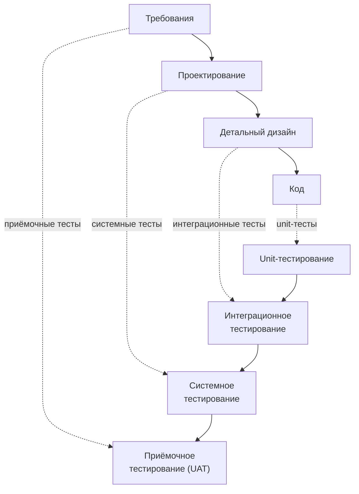

# Lecture 2: Роль тестирования в жизненном цикле ПО

> **Модуль**: 1 — Введение в тестирование и enterprise-системы
> **Лектор**: Андрей Попов
> **Длительность**: 1,5 астрономических часа (90 мин)
> **Слайдов**: 15
> **Формат**: Markdown, каждый слайд — раздел `###`
> **Структура слайда**: Заголовок + 3–5 буллетов + speaker notes
> **Дата**: 10.09.2026
> **Связь с лекцией 1**: [`lecture-01.md`](lecture-01.md) — Введение в тестирование и enterprise-системы
> **Литература**: см. [Источники](#источники) в конце файла

---

## Тайминг

| Время | Блок | Слайды | Назначение |
|:---:|---|:---:|---|
| 0:00–0:10 | Ввод и повторение | 1–2 | Связь с лекцией 1, план |
| 0:10–0:35 | Жизненный цикл ПО (SDLC) | 3–6 | Модели, фазы, где тестирование |
| 0:35–1:00 | Процесс тестирования (STLC) | 7–9 | Фазы, артефакты, роли |
| 1:00–1:15 | Тестирование в enterprise | 10–12 | Реальность Lekton, отличия от стартапа |
| 1:15–1:30 | Практика и артефакт | 13–15 | Разбор архитектуры СМП, анонс |

---

### Слайд 1. Титульный

**Слайд:**
- Модуль 1. Лекция 2
- Роль тестирования в жизненном цикле ПО
- Лектор: Андрей Попов, компания Lekton
- ИТМО, 4 курс

**Speaker notes:**

> Продолжаем первый модуль. На прошлой лекции мы разобрались, что такое тестирование, развенчали основные мифы — помните testing vs checking и «fake testing»? — и познакомились с учебным проектом СМП. Сегодня поговорим о том, как тестирование встроено в процесс разработки. От требований до продакшна. Это важно: вы будете не просто писать тесты, вы будете понимать, зачем каждый тест нужен в общей картине жизненного цикла продукта.

> [ИНТЕРАКТИВ — 4–5 мин] Начнём с трёх вопросов по прошлой лекции — без оценок. Первый: чем testing отличается от checking? *(checking — механическая проверка, автоматизируется; testing — исследование, делает человек)*. Второй: назовите цепочку от человеческой ошибки до видимого сбоя. *(error → defect → failure)*. Третий: почему тысяча зелёных тестов не доказывает отсутствие багов? *(принцип 1 ISTQB: тесты показывают наличие дефектов, а не их отсутствие)*.

---

### Слайд 2. План лекции

**Слайд:**
- Жизненный цикл ПО (SDLC): модели и фазы
- Где тестирование в каждой фазе
- Процесс тестирования (STLC): фазы и артефакты
- Роли в тестировании: QA, test engineer, разработчик, аналитик
- Тестирование в enterprise vs стартап: ключевые отличия
- Модель данных СМП — основа для тест-дизайна (артефакт 2)

**Speaker notes:**

> План такой. Сначала разберём жизненный цикл ПО — SDLC. Посмотрим, какие бывают модели и где в каждой из них живёт тестирование. Потом — процесс тестирования, STLC: какие фазы проходят тестировщики, какие артефакты создают. Поговорим о ролях: чем QA отличается от test engineer, кто за что отвечает в реальной команде. Затем сравним тестирование в enterprise и в стартапе — это поможет понять, почему мы учим именно так, а не иначе. И в конце разберём модель данных СМП и ключевые архитектурные принципы — это основа для тест-дизайна, которым вы займётесь в модуле 2. Напомню: практика 1 — запуск СМП и smoke-тесты, практика 2 — проходная, приём артефакта.

---

### Слайд 3. Жизненный цикл ПО (SDLC)

**Слайд:**
- SDLC — Software Development Life Cycle
- Фазы: требования → проектирование → разработка → тестирование → развёртывание → поддержка
- Тестирование — не одна фаза в конце, а деятельность на ВСЕХ фазах
- Качество строится на каждом этапе, а не «проверяется» post factum
- ISTQB: «Testing appears in each life cycle model, but with very different meanings» [Spillner et al., 2014, 2.2]

**Speaker notes:**

> SDLC — это жизненный цикл разработки ПО. Классические фазы: требования, проектирование, разработка, тестирование, развёртывание, поддержка. Звучит знакомо — многие из вас сталкивались с этим в курсах по программной инженерии.

> Но есть важный нюанс, который часто упускают: тестирование — это НЕ одна фаза в конце. Это деятельность, которая присутствует на всех фазах [ISTQB / Spillner et al., 2014, 2.2]. На этапе требований тестировщик анализирует спецификации на противоречия и тестируемость. На проектировании — участвует в ревью архитектуры, оценивает, насколько систему вообще можно будет протестировать. На разработке — пишутся и прогоняются unit-тесты. На тестировании — интеграционные и системные тесты. На развёртывании — smoke-тесты в продакшн-окружении. На поддержке — регрессионное тестирование при исправлении дефектов.

> Качество нельзя «проверить в конце» — оно строится на каждом этапе. Это, кстати, один из семи принципов ISTQB, которые мы обсуждали на прошлой лекции: «Early testing» — начинайте тестировать как можно раньше.

---

### Слайд 4. Модели SDLC

**Слайд:**
- Каскадная (Waterfall): фазы строго последовательно, тестирование — в самом конце
- V-модель: каждой фазе разработки соответствует своя фаза тестирования
- Итеративная (Agile/Scrum): тестирование непрерывно, в каждом спринте
- Гибрид (реальность enterprise): V-модель для регуляторных частей + Agile для разработки фич

**Speaker notes:**

> Три основные модели SDLC — и как в них выглядит тестирование.

> **Waterfall** — каскадная модель [Royce, 1970]. Фазы идут строго последовательно: завершили требования → проектирование → разработка → и только потом тестирование. Тестирование здесь — «final inspection», финальная приёмка перед сдачей [Spillner et al., 2014, 2.2]. Ключевой недостаток: дефекты, заложенные в требованиях, обнаруживаются слишком поздно — стоимость их исправления удваивается на каждом пройденном уровне тестирования [Spillner et al., 2014, 6.3.1]. В чистом виде Waterfall сегодня редкость, но его элементы встречаются в регулируемых отраслях.

> **V-модель** [Boehm, 1979; IEEE/IEC 12207] — развитие каскадной модели. Левая ветвь «V» — конструктивные фазы (требования → проектирование → детальный дизайн → код). Правая ветвь — соответствующие им фазы тестирования: приёмочное тестирование (соответствует требованиям) → системное (проектированию) → интеграционное (детальному дизайну) → unit-тестирование (коду). Подробнее разберём на следующем слайде.

> **Agile/Scrum** — итеративная модель. Тестирование в каждом спринте, непрерывно, параллельно с разработкой. Нет отдельной «фазы тестирования» — оно встроено в Definition of Done. Быстрая обратная связь, минимум документации, максимум автоматизации.

> В реальном enterprise — **гибрид**. Регуляторные части (безопасность, отчётность для ЦБ, PCI DSS) — по V-модели, с полной документацией и прослеживаемостью требований к тестам (traceability matrix). Разработка новых фич — по Agile, с быстрыми циклами. В Lekton мы используем именно такой гибридный подход. Важно понимать, что выбор модели — не религиозный вопрос, а инженерное решение: какая модель лучше соответствует рискам и ограничениям проекта.

---

### Слайд 5. Где тестирование в каждой фазе SDLC

**Слайд:**
- Требования: анализ тестируемости, выявление противоречий, приёмочные критерии
- Проектирование: ревью архитектуры, план тестирования, оценка рисков
- Разработка: unit-тесты, статический анализ кода, code review
- Тестирование: интеграционные, системные, E2E, регрессионные тесты
- Развёртывание: smoke-тесты, canary-релизы, мониторинг
- Поддержка: регрессия при багфиксах, тестирование патчей

**Speaker notes:**

> Давайте конкретно: что делает тестировщик на каждой фазе?

> **Требования.** Тестировщик анализирует спецификации. Можно ли это вообще протестировать? Нет ли противоречий между разделами? Какие приёмочные критерии? ISTQB называет это «review the test basis» — проверка основы для тестирования [Spillner et al., 2014, 2.2.2]. Если требование сформулировано как «система должна быть быстрой» — это нетестируемо. Нужно: «время ответа API не должно превышать 200 мс для 95-го перцентиля при 500 одновременных запросах».

> [ИНТЕРАКТИВ] Попробуйте сами. Требование: «Система должна быть надёжной». Тестируемо? *(пауза)* Нет. А теперь: «При отказе RabbitMQ авторизация продолжает работать, транзакции не теряются, после восстановления брокера все сообщения попадают в лог в течение 60 секунд». Тестируемо? Да — и такой тест вы напишете в модуле 6. Умение превращать маркетинговые формулировки в проверяемые критерии — это анализ тестируемости, навык артефакта 2.

> **Проектирование.** Тестировщик участвует в ревью архитектуры. Не будет ли узких мест? Как изолировать компоненты для тестирования? Это называется «testability analysis» — оценка тестируемости. Составляется план тестирования и оцениваются риски.

> **Разработка.** Unit-тесты (пишут разработчики), статический анализ кода (линтеры, SonarQube), code review. Тестировщик может участвовать в code review с фокусом на тестируемость и граничные случаи.

> **Тестирование.** Основная фаза: интеграционные тесты (проверка взаимодействия компонентов), системные тесты (система как целое), E2E (сквозные бизнес-сценарии), регрессионные тесты (не сломали ли то, что работало).

> **Развёртывание.** Smoke-тесты в продакшн-окружении — быстрая проверка, что основное работает. Canary-релизы: выкатываем новую версию на часть трафика и мониторим.

> **Поддержка.** Регрессионное тестирование при исправлении дефектов, тестирование патчей и хотфиксов. Каждый багфикс может сломать что-то ещё — мы говорили об этом на прошлой лекции в контексте defect masking.

> Каждый из этих видов тестирования мы будем разбирать в следующих модулях. Unit-тесты — модули 3–4. API и интеграционные — модули 5–6. E2E — модуль 7. CI/CD и отчётность — модуль 8.

---

### Слайд 6. V-модель и уровни тестирования

**Слайд:**

- V-модель связывает каждую фазу разработки с соответствующим уровнем тестирования
- Требования ←→ Приёмочное тестирование (UAT): «делаем ли мы правильный продукт?»
- Проектирование ←→ Системное тестирование: «работает ли система как целое?»
- Детальный дизайн ←→ Интеграционное тестирование: «правильно ли компоненты взаимодействуют?»
- Код ←→ Unit-тестирование: «работает ли каждая функция?»
- Каждый уровень отвечает на свой вопрос — нельзя заменить один другим

**Speaker notes:**

> V-модель — пожалуй, самая важная для понимания структуры тестирования. Она наглядно показывает связь между тем, ЧТО мы строим, и тем, КАК мы это проверяем [Spillner et al., 2014, Ch.3; Boehm, 1979].

> Левая ветвь «V» — уровни абстракции в разработке, от общего к частному. Правая ветвь — соответствующие уровни тестирования, от частного к общему.

> **Unit-тестирование** (соответствует коду): проверяет отдельные функции и методы. «Правильно ли работает эта функция?» Самый быстрый, самый дешёвый, самый массовый уровень.

> **Интеграционное тестирование** (соответствует детальному дизайну): проверяет взаимодействие компонентов. «Правильно ли сервисы общаются друг с другом?» В СМП это, например, проверка, что Authorization корректно вызывает Card Management и обрабатывает ответ.

> **Системное тестирование** (соответствует проектированию): проверяет систему как целое. «Работает ли весь СМП, от терминала до лога?» Включает функциональные и нефункциональные тесты (нагрузка, безопасность).

> **Приёмочное тестирование / UAT** (соответствует требованиям): проверяет, что продукт решает задачу пользователя. «Может ли банк обрабатывать транзакции с помощью этой системы?» Это validation, а не verification — мы говорили о разнице на прошлой лекции.

> Критически важно: **каждый уровень тестирования отвечает на свой вопрос, и нельзя заменить один другим**. Unit-тесты не найдут проблему в интеграции сервисов. E2E-тест не покажет, какая конкретно функция сломана. Поэтому нужна пирамида тестирования — о ней подробно в модуле 3.

---

### Слайд 7. Процесс тестирования (STLC)

**Слайд:**
- STLC — Software Testing Life Cycle: процесс внутри процесса
- Фазы (ISTQB): планирование → анализ и дизайн → реализация и выполнение → оценка и отчёт → закрытие
- Артефакты на выходе: тест-план, тест-кейсы, баг-репорты, тест-отчёт
- В Agile: STLC сжат до спринта, но фазы те же — быстрее и итеративнее
- В курсе вы пройдёте все фазы STLC на примере СМП

**Speaker notes:**

> SDLC — это жизненный цикл проекта в целом. А внутри задачи «тестирование» есть свой собственный жизненный цикл — STLC, Software Testing Life Cycle [ISTQB / Spillner et al., 2014, 2.2].

> ISTQB выделяет пять фаз фундаментального тестового процесса:

> **1. Test Planning and Control** — планирование и контроль. Что тестируем? Какие ресурсы нужны? Какая стратегия? План тестирования фиксируется в документе — тест-плане. В ходе проекта план регулярно пересматривается (test control).

> **2. Test Analysis and Design** — анализ и дизайн. Изучаем требования (test basis), проверяем тестируемость, определяем тестовые условия, проектируем логические тест-кейсы. На этом этапе отвечаем на вопрос «ЧТО будем тестировать?» Ещё не «КАК», а именно «ЧТО».

> **3. Test Implementation and Execution** — реализация и выполнение. Превращаем логические тест-кейсы в конкретные (с данными, с предусловиями), настраиваем окружение, выполняем тесты, фиксируем результаты.

> **4. Test Evaluation and Reporting** — оценка и отчётность. Анализируем результаты, сравниваем с критериями выхода (exit criteria), принимаем решение: достаточно ли протестировано? Пишем тест-отчёт.

> **5. Test Closure Activities** — закрытие. Архивируем тестовую документацию, анализируем lessons learned, закрываем баг-репорты.

> Важно: хотя фазы изображены последовательно, на практике они пересекаются и идут параллельно. В Agile STLC сжат до одного спринта: вы не пишете тест-план на 50 страниц, но те же активности выполняются — быстрее и итеративнее. В нашем курсе вы пройдёте все фазы STLC: тест-дизайн (фаза 2) — артефакт 2, разработка тест-кейсов (фаза 3) — артефакты 3–5, отчётность (фаза 4) — артефакты 6–7, закрытие (фаза 5) — артефакт 8 с финальной защитой.

---

### Слайд 8. Артефакты тестирования

**Слайд:**
- Тест-план: что, как, когда и кем тестируется; критерии начала и окончания
- Тест-кейс: предусловия, шаги, входные данные, ожидаемый результат
- Баг-репорт: заголовок, шаги воспроизведения, ожидание vs факт, severity, priority
- Тест-отчёт: что проверено, что найдено, какие риски остались, рекомендации
- Тестовая стратегия: общий подход к тестированию продукта — уровни, инструменты, автоматизация vs ручное

**Speaker notes:**

> Каждая фаза STLC производит артефакты. Пять главных.

> **Тест-план** [IEEE 829; Spillner et al., 2014, 6.2.2]. Отвечает на вопросы: что тестируем? Как? Когда? Кто отвечает? Какие критерии начала и окончания тестирования? В enterprise это может быть формальный документ на десятки страниц. В Agile — страница в Confluence или даже section в README.

> **Тест-кейс** — конкретная проверка. Хороший тест-кейс содержит: уникальный идентификатор, предусловия (какое состояние системы нужно), шаги, входные данные, ожидаемый результат. ISTQB разделяет логические тест-кейсы («проверить авторизацию с заблокированной картой») и конкретные тест-кейсы («карта 4000000000000001 в статусе BLOCKED, сумма 1000 RUB, ожидаемый ответ DECLINED с причиной CARD_BLOCKED») [Spillner et al., 2014, 2.2.2].

> **Баг-репорт** — описание дефекта. Заголовок (кратко: что, где, когда), шаги воспроизведения, ожидаемый результат, фактический результат, серьёзность (severity — насколько критичен для системы), приоритет (priority — насколько срочно чинить). Подробно будем разбирать в модуле 2.

> [ПРИМЕР] Два баг-репорта на один дефект. Плохой: «Транзакции не работают. Отправил транзакцию — не прошло». Такой вернут разработчику с вопросами, и баг потеряется. Хороший: «Авторизация отклоняется при сумме, равной дневному лимиту. Шаги: карта ACTIVE, dailyLimit=10000, balance=50000; POST /api/transactions, amount=10000. Ожидаемо: APPROVED — сумма равна лимиту, не превышает. Фактически: DECLINED, LIMIT_EXCEEDED. Severity: Major. Гипотеза: проверка `>` вместо `>=`». Второй репорт разработчик берёт в работу сразу: воспроизводимо, локализовано. Вспомните пример с `>` и `>=` из первой лекции — вот он вживую.

> **Тест-отчёт** — что проверено, сколько тестов пройдено/провалено, какие дефекты найдены, какие риски остались, рекомендации. В курсе вы будете генерировать отчёты через Allure и писать test summary.

> **Тестовая стратегия** — документ верхнего уровня: какие уровни тестирования применяем, какие инструменты, что автоматизируем, что тестируем вручную, как оцениваем риски. В курсе это артефакт 8 — ваша финальная работа.

---

### Слайд 9. Роли в тестировании

**Слайд:**
- QA Engineer: процессы, стандарты, метрики качества — «как мы обеспечиваем качество»
- Test Engineer: проектирование и автоматизация тестов — «как мы проверяем продукт»
- Разработчик: unit-тесты, статический анализ, code review
- Аналитик: требования, приёмочные критерии — «что мы строим»
- Независимость тестировщика: ключевой принцип — отсутствие конфликта интересов
- В Lekton: разработчики — unit, тестировщики — модульные и выше, Support/Delivery — ручное

**Speaker notes:**

> Кто есть кто в тестировании?

> **QA Engineer** — Quality Assurance. Это про процессы: как мы обеспечиваем качество на уровне организации. Стандарты, метрики, аудиты, improvement процессов. QA отвечает на вопрос «правильно ли мы строим процесс?»

> **Test Engineer** — это про продукт: проектирование тестов, написание автотестов, анализ результатов. Test Engineer отвечает на вопрос «правильно ли работает продукт?» В реальности эти роли часто пересекаются, особенно в небольших командах.

> **Разработчик** пишет unit-тесты — это его зона ответственности. Плюс статический анализ кода и участие в code review.

> **Аналитик** формулирует требования и приёмочные критерии. От качества требований напрямую зависит качество тестирования: непроверяемое требование нельзя протестировать.

> Ключевой принцип, о котором мы говорили на прошлой лекции — **независимость тестировщика** [Bach & Bolton, 2025, Ch.1]. «The strongest argument we know for dedicated testers is that it avoids conflicts of interest. Since they are NOT responsible for having made the trouble, and they are NOT responsible for fixing it, they can seek and report trouble without fear or regret.» Разработчик, написавший код, психологически не может глубоко тестировать свою работу — срабатывает confirmation bias [Spillner et al., 2014, 2.3]. Поэтому нужен выделенный тестировщик.

> В Lekton разделение такое: разработчики пишут unit-тесты, тестировщики — модульные, интеграционные и E2E. Ручное тестирование клиентских конфигураций выполняют команды Support и Delivery. В курсе вы будете в роли Test Engineer: проектировать тесты, писать автотесты, анализировать результаты.

---

### Слайд 10. Тестирование в enterprise vs стартап

**Слайд:**
- Enterprise: долгоживущий код (10–20 лет), много интеграций, строгая регуляторика
- Стартап: быстрые итерации, минимум документации, тестирование — часто силами разработчиков
- Enterprise требует глубокого тестирования (deep testing): поиск трудновоспроизводимых багов
- Стартапу часто достаточно shallow testing: проверка основных пользовательских сценариев
- Наш курс — enterprise-подход: CI/CD, метрики, отчёты, стратегия

**Speaker notes:**

> Чем тестирование в enterprise отличается от стартапа? Не размером бюджета, а классом рисков.

> **Enterprise.** Код живёт 10–20 лет, его пишут поколения разработчиков. Много интеграций с внешними системами, legacy, партнёрами. Регуляторика: PCI DSS, требования ЦБ, аудит — всё это требует документированного тестирования с прослеживаемостью (traceability matrix). Цена ошибки огромна: продакшн-дефект в процессинге — это не «ой, кнопка не того цвета», а финансовые потери и репутационный ущерб. Поэтому enterprise требует **deep testing** [Bach & Bolton, 2025, Ch.2] — тестирования, которое максимизирует шансы найти каждый трудновоспроизводимый баг.

> **Стартап.** Быстрые итерации, минимум документации, тестирование часто делают сами разработчики (или его нет вообще). Продукт меняется каждую неделю, пользователи простят баг в новом функционале. Здесь часто достаточно **shallow testing** — проверка основных сценариев, мониторинг ошибок в продакшне, быстрые хотфиксы.

> Важно: shallow testing — не «плохое» тестирование. Это адекватный выбор для контекста с низкими рисками. Проблема возникает, когда стартап вырастает до enterprise-масштаба, не меняя культуру тестирования. Именно поэтому в нашем курсе мы учим enterprise-подходу: у вас будет CI/CD, метрики покрытия, отчёты Allure, тестовая стратегия. Эти навыки применимы и в стартапе (вы будете знать, ЧТО вы осознанно не делаете), и в enterprise (вы будете знать, КАК делать правильно).

---

### Слайд 11. CI/CD и тестирование

**Слайд:**
- CI — Continuous Integration: каждый коммит → автоматическая сборка → прогон тестов
- CD — Continuous Delivery: каждый успешный билд готов к развёртыванию
- Пайплайн тестов в CI: unit (быстро) → интеграционные → E2E (медленно) → smoke
- Quality gates: например, coverage ≥ 70%, все тесты зелёные, нет критических багов
- В курсе: GitHub Actions, JaCoCo, Allure Reports

**Speaker notes:**

> CI/CD — это инфраструктура, в которой живут современные тесты. Мы коснёмся этого подробно в модулях 3 и 8, но уже сейчас важно понимать общую картину.

> **Continuous Integration** — практика, при которой каждый коммит в репозиторий запускает автоматическую сборку и прогон тестов. Цель — получить быструю обратную связь: не сломал ли мой коммит что-то? Тесты в CI идут по уровням пирамиды: сначала unit (миллисекунды), потом интеграционные (секунды), потом E2E (минуты). Если тесты на каком-то уровне упали — дальше не идём, билд красный.

> **Continuous Delivery** — практика, при которой каждый успешный билд автоматически готов к развёртыванию в продакшн (или уже разворачивается — Continuous Deployment).

> **Quality gates** — ворота качества. Например: coverage не ниже 70%, все тесты зелёные, нет багов с severity=critical. Если gate не пройден — билд красный, деплой невозможен.

> В курсе мы используем GitHub Actions как CI-систему, JaCoCo для измерения покрытия кода, Allure Reports для детальной отчётности о тестах. Базовый CI-пайплайн вы соберёте в модуле 3 и доведёте до финального пайплайна с отчётами в модуле 8 (артефакт 6).

> Три классических антипаттерна CI [Humble & Farley, Continuous Delivery, Ch.3]. Первый: коммит раз в неделю — «накоплю и залью разом». Это не CI, это отложенная интеграционная боль. Второй: красный билд неделями — все привыкли, что «он всегда красный». Красный билд останавливает работу: починка — приоритет номер один. Третий: «починю вечером, дома». Правило: ты сломал — ты чинишь, сейчас. В курсе CI будет проверять ваши артефакты — почувствуете эти правила на себе.

---

### Слайд 12. Реальность Lekton

**Слайд:**
- Пирамида тестирования Lekton: unit → модульные (Java) → интеграционные контура → E2E → клиентские конфигурации
- CI/CD на всех контурах: сборка, окружения, прогоны
- ~40 тестировщиков; ручное тестирование — Support и Delivery
- Собственные инструменты нагрузочного тестирования
- Java — основной язык модульных и E2E-тестов

**Speaker notes:**

> Как это выглядит у нас в Lekton.

> Пирамида тестирования — классическая, мы показывали её на первой лекции. Unit пишут разработчики. Модульные тесты — полностью автоматизированные на Java, покрывают бизнес-логику каждого сервиса. Интеграционные — малые контура, где проверяется взаимодействие: например, Authorization + Card Management + PostgreSQL. E2E объединён с системным тестированием: полный прогон пути транзакции на объединённом контуре. Сверху — тестирование клиентских конфигураций: каждый банк настраивает систему под себя, и мы проверяем эти конфигурации по спецификациям.

> CI/CD на всех контурах: сборка, поднятие окружений, прогон тестов — всё автоматизировано. В команде тестирования около 40 человек. Ручное тестирование выполняют команды Support и Delivery. Для нагрузочного тестирования используем собственные инструменты. Это не учебный пример — это реальная практика, и наш курс построен так, чтобы дать вам представление о ней. СМП — упрощённая модель, но архитектурные принципы и подходы к тестированию те же.

---

### Слайд 13. Разбор архитектуры СМП — модель данных

**Слайд:**
- **Card**: pan, bin, status (ACTIVE/INACTIVE/BLOCKED/EXPIRED), dailyLimit, monthlyLimit, availableBalance, expiryDate
- **Transaction**: mti, stan, rrn, pan, amount, status (APPROVED/DECLINED), declineReason, authCode
- Ключевые поля для тест-дизайна: status (4 значения), limits (daily/monthly), amount, expiryDate
- Эти данные — основа для классов эквивалентности, граничных значений и decision tables

**Speaker notes:**

> Готовимся к практике и к артефакту 2 — тест-дизайну. Посмотрим на модель данных СМП. Две главные сущности.

> **Card — карта.** Поля: pan (номер карты), bin (первые 6 цифр), status, dailyLimit, monthlyLimit, availableBalance, expiryDate. Статусы: ACTIVE (активна), INACTIVE (не активирована), BLOCKED (заблокирована), EXPIRED (истекла). Это четыре класса эквивалентности для тестирования авторизации. Плюс граничные значения по лимитам: сумма равна dailyLimit, сумма = dailyLimit + 1, нулевой баланс.

> **Transaction — транзакция.** Поля: mti (тип сообщения), stan (system trace audit number), rrn (retrieval reference number), pan, amount, status (APPROVED/DECLINED), declineReason, authCode.

> Для тест-дизайна ключевые поля: status карты (4 значения), лимиты (дневной, месячный), сумма транзакции относительно лимитов и баланса, срок действия карты. Комбинаторика: 4 статуса × 3 отношения к лимиту (в пределах/на границе/превышен) × 2 состояния срока (действительна/истекла) = 24 комбинации для decision table. Это основа для артефакта 2 — тест-дизайна, который вы будете делать в модуле 2. Запомните эти поля — они вернутся при работе с Ольгой Лихачевой.

> [ДЕМО-РАЗБОР — 4–5 мин] Начнём строить decision table прямо сейчас — это будет вашим домашним заданием. Условия: статус карты, сумма относительно лимита, сумма относительно баланса, срок действия. Действия: APPROVED или DECLINED с причиной. Правило 1: статус не ACTIVE — сразу DECLINED, остальные условия не важны, ставим прочерк: четыре строки схлопываются в одну. Правило 2: ACTIVE, срок истёк — DECLINED, CARD_EXPIRED. Правило 3: ACTIVE, сумма больше лимита — DECLINED, LIMIT_EXCEEDED. Правило 4: ACTIVE, сумма больше баланса — DECLINED, INSUFFICIENT_FUNDS. Правило 5: всё в порядке — APPROVED. Вместо 24 комбинаций — пять осмысленных правил. Это и есть тест-дизайн: сжать комбинаторный взрыв до проверяемого набора.

---

### Слайд 14. Разбор архитектуры СМП — ключевые принципы

**Слайд:**
- Только свои карты — нет внешних BIN, упрощение для учебного проекта
- Гибридное взаимодействие: синхронный HTTP (авторизация) + асинхронный RabbitMQ (логирование, уведомления)
- Eventual consistency: запись в лог — не мгновенно, а после доставки через очередь
- Изоляция через API и очереди, а не через БД
- Внешний API (Bin Lookup) с timeout/retry — точка отказа
- Каждый принцип — точка для тестирования

**Speaker notes:**

> Семь ключевых принципов архитектуры СМП — и каждый из них порождает тестовые сценарии.

> **Только свои карты.** СМП обрабатывает только карты из Card Management. Никаких внешних BIN — это упрощение. В реальном процессинге мы бы смотрели, наш это BIN или чужого банка, и маршрутизировали бы транзакцию соответственно.

> **Гибридное взаимодействие.** Авторизация и резервирование — синхронные (HTTP request-response). Логирование и уведомления — асинхронные (через RabbitMQ). Это значит, что нужно тестировать и синхронные контракты (формат запроса/ответа, статус-коды, таймауты), и асинхронные гарантии (доставка сообщений, порядок, отсутствие потерь).

> **Eventual consistency.** Когда Switch возвращает ответ клиенту, транзакция ещё не записана в лог — она только опубликована в очередь. Logger запишет её, когда потребит сообщение. Это значит, что сразу после ответа APPROVED записи в логе может ещё не быть. В тестах это проверяется через polling и awaitility.

> **Изоляция через API и очереди.** База данных одна, но напрямую к ней подключаются только четыре сервиса. Остальные общаются через REST или RabbitMQ. Это архитектурный принцип, который мы проверяем: ни один сервис не должен ходить в чужие таблицы напрямую.

> **Внешний API Bin Lookup.** Единственная точка отказа с внешней зависимостью. Нужно тестировать: таймаут, retry, circuit breaker, fallback-поведение. Что будет, если Bin Lookup не отвечает? Транзакция должна либо упасть с понятной ошибкой, либо отработать с данными по умолчанию.

> **Вопросы для тестирования** (запомните их — это основа для E2E-сценариев): Что будет, если RabbitMQ недоступен, а транзакция APPROVED? Что будет, если Bin Lookup не отвечает? Что будет, если два запроса одновременно меняют баланс одной карты (race condition)? Что будет, если карта заблокирована между получением её данных и резервированием? Эти вопросы — суть работы тестировщика.

---

### Слайд 15. Что будет на практике

**Слайд:**
- Практика 1 (содержательная): запуск СМП + smoke-тесты → Артефакт 1 (6 баллов)
- Практика 2 (проходная): приём артефакта 1 + разбор архитектуры СМП, карта требований
- Домашнее задание к модулю 2: изучить ТЗ Authorization и Card Management
- Подготовка к артефакту 2 (тест-дизайн): классы эквивалентности, границы, decision table
- Вопросы?

**Speaker notes:**

> Подведём итог по практикам модуля. Практика 1 — содержательная: запускаете СМП и прогоняете smoke-тесты. Это Артефакт 1, 6 баллов, проверяется CI. Практика 2 — проходная: приём артефакта 1 и разбор архитектуры СМП с построением карты требований. Если у вас что-то не заработало на практике 1 — там разберёмся, у всех есть возможность доделать до дедлайна 18 сентября.

> В модуле 2 вы переходите к тест-дизайну — это артефакт 2, ведёт Ольга Лихачева. Чтобы подготовиться: прочитайте технические задания на Authorization и Card Management, определите классы эквивалентности для статусов карт и граничные значения для лимитов и сумм. Напомню ключевые поля из модели данных СМП: status карты (ACTIVE/INACTIVE/BLOCKED/EXPIRED), лимиты (dailyLimit, monthlyLimit), сумма относительно баланса, срок действия. Они вам понадобятся для decision table. Вопросы?

---

## Источники

1. **Spillner, A., Linz, T., & Schaefer, H.** (2014). *Software Testing Foundations: A Study Guide for the Certified Tester Exam* (4th ed.). Rocky Nook. ISBN 978-1-937538-42-2. — Главы 2.2 (Fundamental Test Process — STLC), 3 (Testing in the Software Life Cycle — V-модель, уровни тестирования).

2. **Bach, J., & Bolton, M.** (2025). *Taking Testing Seriously: The Rapid Software Testing Methodology*. Wiley. ISBN 978-1-394-25320-3. — Глава 1 (Why Testers? — независимость тестировщика), Глава 2 (Deep vs Shallow Testing).

3. **ISTQB** — International Software Testing Qualifications Board. *Certified Tester Foundation Level Syllabus*. [https://www.istqb.org](https://www.istqb.org)

---

> **Для лектора**: лекция 2 — более «академическая», чем лекция 1: много структур (SDLC, STLC, V-модель, роли, артефакты). Ключевая задача — не перегрузить студентов терминологией, а показать связь с практикой. Каждую теоретическую конструкцию привязывайте к СМП: «вот V-модель — в СМП это выглядит так», «вот фазы STLC — мы пройдём их на артефактах 1–8». Слайды 13–14 — самые важные для практики, не урезайте их по времени.
