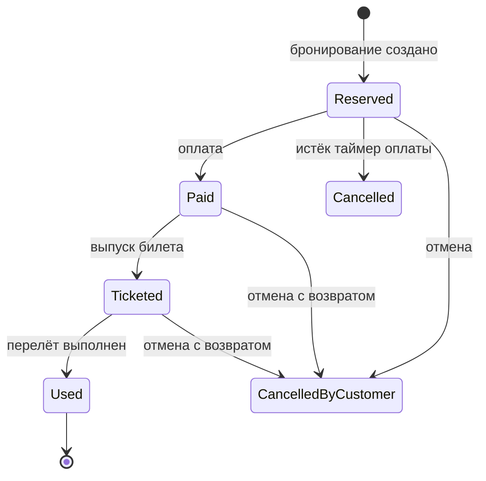
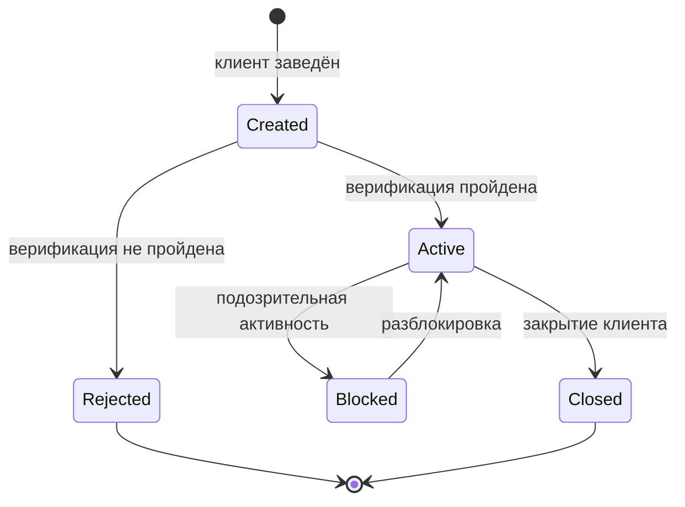
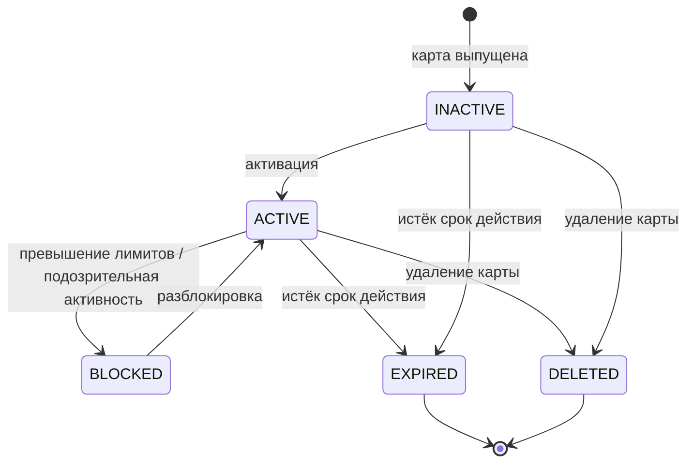

# Lecture 4: Таблицы решений, state-transition, исследовательское тестирование, баг-репорты

> **Модуль**: 2 — Тест-дизайн и техники тестирования
> **Лектор**: Ольга Лихачева
> **Длительность**: 1,5 астрономических часа (90 мин)
> **Слайдов**: 41
> **Формат**: Markdown, каждый слайд — раздел `###`
> **Структура слайда**: Заголовок + 3–5 буллетов + speaker notes
> **Дата**: 24.09.2026
> **Литература**: см. [Источники](#источники) в конце файла

---

### Слайд 1. Титульный

**Слайд:**
- _(визуальный слайд)_

**Speaker notes:**

> Добрый день! Продолжаем модуль 2. На прошлой лекции вы разобрали классы эквивалентности, границы и попарное тестирование и на содержательной практике начали создавать проектную тестовую документацию по СМП.
>
> Сегодня закрываем оставшиеся техники — таблицы решений, диаграммы состояний и переходов, исследовательское тестирование — и подробно разбираем баг-репорты. Все примеры сегодня построены на одном сквозном объекте: заведении клиента через POST /api/v1/clients/create-individual. Это тот же пример, который мы использовали на лекции 3, поэтому вы увидите, как разные техники применяются к одному объекту.
>
> Баг-репорты сегодня — теория. Практика по ним будет в модуле 7, на E2E-тестировании, где вы оформите репорты по итогам реального прогона.
>
> Завтра, 25.09, проходная практика: peer review и сдача артефакта 2 — проектная тестовая документация (стратегия, тестовый план, чек-листы, классы эквивалентности, границы и pairwise с моделью PICT).

---

### Слайд 2. План лекции

**Слайд:**

- Как выбрать технику под задачу
- Таблицы решений (decision tables) — сквозной пример на клиенте
- Диаграммы и таблицы состояний/переходов (state-transition)
- Исследовательское тестирование (exploratory testing)
- Баг-репорты: структура, severity vs priority, реальный пример
- LLM в тест-дизайне: условия применимости и ограничения
- Практика 2 (25.09): peer review и сдача артефакта

**Speaker notes:**

> План лекции. Она большая, поэтому построена вокруг одного сквозного объекта — заведения клиента. Сначала «шпаргалка» выбора техники. Затем таблицы решений: определение, методика, два классических примера и сквозной пример на валидации клиента. Потом state-transition: термины, диаграммы, таблицы переходов, уровни покрытия и жизненный цикл клиента. Далее исследовательское тестирование: определение, применение, чартеры и сессия на нашем объекте. Затем большая часть — баг-репорты: зачем, структура, плохой и хороший пример, места для реального примера из практики, severity против priority и стандарты. В конце — почему нельзя использовать LLM для тест-дизайна, и организационная часть про завтрашнюю проходную.
>
> Логика модуля: лекция 3 дала базовые техники — классы, границы, pairwise. Лекция 4 добавляет техники под те состояния и правила, которые базой не описываются, и переходит к дефектам.

---

### Слайд 3. Разогрев: что мы уже умеем

**Слайд:**
- Лекция 3 — база
- Классы эквивалентности: какие значения система обрабатывает одинаково.
- Граничные значения: что происходит на стыке классов.
- Попарное тестирование: как покрыть комбинации параметров.
- Лекция 4 — что добавим
- Таблицы решений: когда решение зависит от комбинации условий.
- State-transition: когда поведение зависит от состояния и порядка.
- Исследовательское тестирование: когда документации мало.
- Баг-репорты: как зафиксировать найденный дефект.
- Вопросы в зал. Первый: что нельзя смешивать в одном тест-кейсе? (невалидные классы). Второй: сколько точек нужно на границу? (три). Третий: что делать, если требование молчит о формате поля? (спросить аналитика).

**Speaker notes:**

> Короткий разогрев. Напомню, что мы уже умеем. Классы эквивалентности отвечают на вопрос, какие значения система обрабатывает одинаково, и требуют по одному представителю на класс. Граничные значения уточняют поведение на стыке классов — тройкой точек. Попарное тестирование сокращает комбинаторный взрыв, покрывая все пары значений.
>
> Сегодня добавим три техники, которые отвечают на другие вопросы. Если решение системы зависит от комбинации нескольких условий — например, статус карты и лимит и баланс вместе определяют код ответа, — нужна таблица решений. Если поведение зависит от состояния и порядка операций — например, карта сначала выпускается, потом активируется, — нужен state-transition. Если документация неполная или её нет — исследовательское тестирование. И в конце разберём, как правильно оформить найденный дефект.
>
> И три вопроса для разогрева аудитории — они повторяют ключевые правила лекции 3 и проверяют, что база усвоена.

---

### Слайд 4. Выбор техники: когда какую

**Слайд:**

**Колонки:** Ситуация | Техника

| Любой объект тестирования (база) | Классы эквивалентности + граничные значения |
| Зависимости между условиями, бизнес-правила | Таблицы решений |
| Состояния влияют на поведение, важен порядок операций | State-transition |
| Много параметров с неизвестными зависимостями | Pairwise |
| Низкое качество документации, нет времени | Исследовательское тестирование |

**Speaker notes:**

> Ключевая таблица «когда какую технику» [STF, раздел 5.4 «Which technique and when»; Copeland, введение к Секции I; ISTQB CTFL v4.0].
>
> База — классы эквивалентности плюс границы: они применяются всегда и к любому объекту. Если решение зависит от комбинации нескольких условий, ведущих к дискретному действию, — таблица решений. Если поведение определяется состоянием и порядком операций — state-transition. Если параметров много, а взаимодействия неизвестны — pairwise. Если документация плохая или времени мало — исследовательское тестирование.
>
> Два важных замечания. Первое: техники не исключают друг друга — на одном сервисе почти всегда применяется несколько. Второе: артефакт 2 проверяется по рубрике именно в комбинации — стратегия, план, чек-листы, классы, границы и pairwise; таблицы решений и переходы состояний остаются материалом лекции и пригодятся в последующих модулях.
>
> Сегодня мы на каждом шаге будем возвращаться к одной таблице «ситуация — техника», чтобы выбор был осознанным, а не по привычке.

---

### Слайд 5. Сквозной пример лекции: заведение клиента

**Слайд:**
- Один объект на всю лекцию: POST /api/v1/clients/create-individual — тот же запрос, что на лекции 3.
- Поля запроса
- contacts.email, contacts.phone
- individual.demographic.birth_date
- individual.demographic.gender
- individual.demographic.marital_status
- tax.tax_number, external_id
- Что показывает каждая техника
- Таблица решений — от чего зависит код ответа при создании.
- State-transition — жизненный цикл клиента: создан, активен, заблокирован.
- Exploratory — что исследовать в этом запросе.
- Баг-репорт — как описать найденный дефект.
- Так один объект связывает все четыре темы и практику 2, где вы примените техники к Authorization.

**Speaker notes:**

> Сквозной пример лекции — заведение клиента, тот же запрос, что разбирали на лекции 3. Он выбран не случайно: у него есть обязательные и необязательные поля, правила валидации, бизнес-правила создания и жизненный цикл. Значит, на нём можно показать все четыре темы лекции.
>
> Поля запроса: группа contacts — email, phone, notification_phone. Группа individual — демография: дата рождения, пол, семейное положение. Группа tax — налоговый номер. Плюс внешний идентификатор.
>
> Дальше на каждом блоке я буду возвращаться к этому объекту. Таблица решений покажет, от чего зависит код ответа. State-transition — жизненный цикл клиента. Исследовательское тестирование — что здесь стоит поисследовать, когда требования неполны. И наконец баг-репорт — как описать найденный здесь дефект. На практике 2 вы примените те же техники к сервису Authorization, где сквозным объектом будет карта.

---

### Слайд 6. Таблицы решений

**Слайд:**
- _(визуальный слайд)_

**Speaker notes:**

> Первый блок — таблицы решений. Это техника для случаев, когда решение системы зависит от комбинации нескольких условий, а не от одного. Разберём определение, методику, два классических примера и сквозной пример на заведении клиента.

---

### Слайд 7. Таблицы решений: определение и структура

**Слайд:**
- Таблица решений — компактная запись сложных бизнес-правил.
- Условия — верх
- Набор условий, от которых зависит решение.
- Действия — низ
- Что система должна сделать.
- Правила — столбцы
- Каждое правило = уникальная комбинация условий → набор действий.
- Действия зависят только от значений условий, не от порядка.
- Из таблицы напрямую получаются тест-кейсы.

**Speaker notes:**

> Определение и структура таблицы решений [Copeland, гл. 5, введение и основная форма (Таблица 5-1); ISTQB CTFL, раздел 5.1.4; Куликов 2.3].
>
> Таблица решений — это компактный способ записать сложные бизнес-правила: комбинации условий и соответствующие им действия. Структура классическая: сверху условия, снизу действия, а каждый столбец — это правило: уникальная комбинация значений условий и тот набор действий, который она запускает.
>
> Два свойства важны для тест-дизайна. Первое: действия зависят только от значений условий, не от порядка их проверки. Если поведение зависит от последовательности событий — это уже не таблица решений, а state-transition, о которой будем говорить дальше. Второе: из таблицы напрямую получаются тест-кейсы — каждый столбец становится тест-кейсом с ожидаемым действием.
>
> Куликов в классификации техник указывает на тестирование по таблице решений и отсылает к главе 5 Copeland. Для нашего СМП таблица решений — это способ записать, как сочетание условий влияет на код ответа сервиса.

---

### Слайд 8. Таблицы решений: методика построения

**Слайд:**
- Комбинаторика
- Для n бинарных условий — 2n правил. Условия бывают бинарные или диапазонные.
- Диапазонные условия
- Учесть границы диапазонов — таблица решений комбинируется с BVA.
- Ограничение: рост экспоненциальный. Больше пяти-шести условий — таблица становится громоздкой.

**Speaker notes:**

> Методика построения таблицы решений по Copeland [гл. 5 «Методика»; ISTQB CTFL 5.1.4].
>
> Шаг 1 — определить условия: какие факторы влияют на решение. Шаг 2 — действия: что система может сделать. Шаг 3 — перебрать все комбинации условий: для n бинарных условий это 2 в степени n правил. Шаг 4 — если условия диапазонные, внутри диапазонов работают границы: таблица решений комбинируется с BVA. Шаг 5 — каждое правило превращается минимум в один тест-кейс с ожидаемым действием.
>
> Про рост: два условия «Да/Нет» дают четыре правила, три — восемь, четыре — шестнадцать. Рост экспоненциальный, и это главное ограничение техники. Больше пяти-шести условий таблица становится громоздкой, и часть правил приходится схлопывать — об этом на следующем примере. Техника прямо говорит: каждый столбец таблицы — тест-кейс.
>
> Обратите внимание на связь с лекцией 3: диапазонные условия внутри себя требуют границ, то есть таблица решений и граничные значения работают в паре. Классы эквивалентности задают значения условий, границы уточняют переходы между ними, а таблица решений описывает, как комбинации условий дают результат.

---

### Слайд 9. Таблицы решений: пример 1 — автострахование

**Слайд:**
- Условия: «состоит в браке?», «хороший студент?» (Да/Нет). Всего 4 правила.
- (Да, Да)
- Скидка 60%
- (Да, Нет)
- Скидка 25%
- (Нет, Да)
- Скидка 50%
- (Нет, Нет)
- Скидка 0%
- Каждое правило → тест-кейс с ожидаемым действием.

**Speaker notes:**

> Классический пример Copeland — компания автострахования [гл. 5, пример; таблица 5-1].
>
> Условий два: состоит ли клиент в браке и является ли хорошим студентом. Оба бинарные, значит четыре правила. Правило 1 — женат и хороший студент: скидка 60%. Правило 2 — женат, но не студент: 25%. Правило 3 — не женат, но хороший студент: 50%. Правило 4 — не женат и не студент: скидки нет.
>
> Каждое правило становится тест-кейсом: задаём комбинацию условий, ожидаем соответствующую скидку. Таблица на четыре столбца даёт четыре тест-кейса — и это весь набор: других комбинаций не существует. Именно в этом сила таблицы решений: она доказывает полноту, потому что перечисляет все комбинации.
>
> Сравните с классами эквивалентности. Классы сказали бы: «условие "в браке" — два класса, условие "хороший студент" — два класса». Но они не сказали бы, как именно комбинация двух условий влияет на скидку. Таблица решений это делает явно. Вот почему в шпаргалке выбора техники таблица решений стоит напротив строки «зависимости между условиями».

---

### Слайд 10. Таблицы решений: пример 2 — заказ на покупку

**Слайд:**
- Условия: «верный идентификатор?», «верное количество?», «достаточно средств?» → 8 правил. Купить можно, только если все три — «Да».
- Схлопывание
- Значение «не важно» (НВ): если ID неверный — остальные условия неважны, правило одно.
- Для тестов
- Схлопнутая таблица удобна для разработки, но для тест-кейсов берём несхлопнутую.
- Оптимизация таблицы сама может внести ошибки — используйте полную таблицу как основу тестов.

**Speaker notes:**

> Второй пример Copeland — заказ на покупку [гл. 5, пример заказа; схлопывание]. Три бинарных условия: верный идентификатор, верное количество, достаточно средств. Полная таблица — восемь правил. Успешная покупка — только когда все три условия выполнены.
>
> Дальше — приём, который Copeland называет схлопыванием. Если идентификатор неверный, остальные условия не влияют на результат: покупка невозможна в любом случае. Значит, в правилах «ID неверен, количество верное или неверное, средств достаточно или недостаточно» значение других условий можно пометить как «не важно» и схлопнуть четыре правила в одно.
>
> Вот здесь важный нюанс для тестировщика. Схлопнутая таблица удобна разработчику — меньше веток кода. Но для тестов мы берём полную, несхлопнутую таблицу. Оптимизация таблицы сама может внести ошибки, поэтому основа тестов — полный перебор комбинаций. Если вы проверите только «схлопнутое» правило с пометкой «не важно», вы не узнаете, действительно ли системе безразличны остальные условия, — а именно это и надо проверить.
>
> Запомните этот приём: он пригодится, когда мы будем строить таблицу решений для заведения клиента, где тоже есть условия, «перекрывающие» остальные.

---

### Слайд 11. Сквозной пример: таблица решений для клиента

**Слайд:**
- Условия создания клиента и ожидаемый результат
| Условие |
| Возможные значения |
| Обязательные поля заполнены  Да / Нет |
| Форматы полей корректны  Да / Нет |
| Возраст по birth_date ≥ 18  Да / Нет |
| external_id не дублируется  Да / Нет |
- Четыре бинарных условия → 24 = 16 правил. Действие одно из трёх: 201 Created, 400 VALIDATION_ERROR, 409 DUPLICATE.
- Для тестов берём несхлопнутую таблицу: даже если поле не заполнено, проверяем, как система реагирует на остальные условия.

**Speaker notes:**

> Теперь применяем методику к нашему сквозному объекту — заведению клиента. Определяем условия. Первое: заполнены ли обязательные поля. Второе: корректны ли форматы — email, телефон, дата рождения, налоговый номер. Третье: возраст по дате рождения не меньше восемнадцати. Четвёртое: внешний идентификатор не дублируется.
>
> Четыре бинарных условия дают шестнадцать правил. Действие принимает одно из трёх значений: успешное создание с кодом 201, ошибка валидации с кодом 400, конфликт дубликата с кодом 409.
>
> Обратите внимание на два момента. Первый: мы снова работаем в паре с лекцией 3 — «форматы полей корректны» раскрывается через классы эквивалентности, а «возраст ≥ 18» — через граничные значения с тройкой {17, 18, 19}. Таблица решений собирает эти детали в правила. Второй: мы берём несхлопнутую таблицу. Даже если поле не заполнено и ответ заведомо 400, мы проверяем, как система ведёт себя с остальными условиями, — потому что не хотим предполагать, а хотим знать.
>
> Шестнадцать правил — это шестнадцать тест-кейсов. Именно так таблица решений доказывает полноту: она перечисляет все комбинации, и мы видим, что ничего не пропущено.

---

### Слайд 12. Сквозной пример: разбор правил клиента

**Слайд:**
| Обязат. |
| Форматы |
| ≥ 18 |
| external_id |
| Ожидаемый результат |
| Да  Да  Да  уникален   201 Created , клиент создан |
| Да  Да  Да  дубликат   409 DUPLICATE |
| Да  Да  Нет  уникален   400 , код AGE_LIMIT |
| Да  Нет  Да  уникален   400 , код VALIDATION_ERROR |
| Нет  —  —  уникален   400 , REQUIRED_FIELD |
- Каждая строка — тест-кейс с ожидаемым кодом и телом ответа.
- Последняя строка — пример схлопывания: без обязательных полей остальные условия неважны.

**Speaker notes:**

> Показываю фрагмент несхлопнутой таблицы — пять правил из шестнадцати. Первое: все условия выполнены, идентификатор уникален — успех, код 201. Второе: всё корректно, но идентификатор дублируется — код 409. Третье: форматы верны, но возраст меньше восемнадцати — ошибка с конкретным кодом AGE_LIMIT. Четвёртое: возраст в порядке, но формат поля нарушен — ошибка валидации. Пятое: обязательные поля не заполнены.
>
> Заметьте: последняя строка — пример схлопывания. Если обязательное поле не заполнено, остальные условия действительно неважны, и мы с полным правом ставим прочерки. Но мы оставляем её в таблице как отдельную строку, потому что должны проверить именно эту ветку — реакцию системы на отсутствие обязательного поля.
>
> И обратите внимание на ожидаемый результат: не просто «ошибка», а конкретный код и, где возможно, конкретный тип ошибки. Именно так таблица решений превращается в тест-кейсы — с однозначной проверкой. На практике 2 вы построите аналогичную таблицу для сервиса Authorization, где условия — статус карты, лимиты и баланс.

---

### Слайд 13. Таблицы решений: применение и ограничения

**Слайд:**
- Применять
- Сложные бизнес-правила.
- Комбинации условий с дискретными действиями.
- Решения, где важна полнота перебора.
- Не применять
- Система без правил-комбинаций — таблица вырождается.
- Более шести-семи условий — таблица становится нечитаемой.
- Поведение зависит от порядка — это state-transition.
- СМП: таблица решений авторизации = статус карты × лимиты × баланс → код ответа.

**Speaker notes:**

> Итог по таблицам решений. Применяем, когда есть сложные бизнес-правила и комбинации условий, ведущие к дискретным действиям, и когда важна полнота перебора. Не применяем, когда правил-комбинаций нет — если система принимает решение по одному условию, таблица вырождается, хватит классов и границ. Не применяем при большом числе условий — таблица становится нечитаемой. И не применяем, когда поведение зависит от порядка операций: это уже state-transition.
>
> Для СМП таблица решений авторизации строится так: условия — статус карты, отношения суммы к дневному лимиту, месячному лимиту и доступному балансу, срок действия; действие — код ответа. Пример: карта активна, все лимиты в норме, средств достаточно — ответ одобрен. Карта заблокирована — отказ с кодом, остальные условия неважны.
>
> Ещё раз проговорю место техники: в артефакт 2 таблица решений не входит — там классы, границы и pairwise. Но техника пригодится в последующих модулях, когда вы будете разбирать логику авторизации и писать по ней тесты.

---

### Слайд 14. State-transition

**Слайд:**
- _(визуальный слайд)_

**Speaker notes:**

> Второй блок — диаграммы и таблицы состояний и переходов. Эта техника нужна там, где поведение системы зависит не только от входных данных, но и от её текущего состояния и порядка операций. Разберём термины, диаграммы, таблицы переходов, уровни покрытия и жизненный цикл клиента.

---

### Слайд 15. State-transition: термины

**Слайд:**
- Нотация: чёрная точка — старт, «бычий глаз» — конечное состояние.

- **Состояние** — Период ожидания события; система «помнит» прошлое
- **Переход** — Изменение состояния по событию
- **Событие** — Триггер перехода — внешнее или внутреннее (например, таймер)
- **Действие** — Операция, вызванная переходом — записывается после «/»

**Speaker notes:**

> Термины state-transition по Copeland [гл. 7; ISTQB CTFL 5.1.3; Куликов 2.3; ISTQB Glossary].
>
> Состояние — это период, когда система ждёт события и «помнит» своё прошлое. Классический пример — стек: его поведение зависит от того, пуст он, заполнен или в промежуточном состоянии. Переход — изменение состояния, вызванное событием. Событие — триггер: оно может быть внешним (запрос, команда пользователя) или внутренним (таймер, истечение срока). Действие — операция, выполняемая при переходе; в нотации её записывают после слэша: событие/действие.
>
> На диаграмме состояний чёрная точка обозначает стартовое состояние, а «бычий глаз» — конечное. ISTQB определяет и саму технику, и конечный автомат как модель. Ключевое отличие от таблицы решений: здесь важен порядок. Если в таблице решений результат зависел только от комбинации условий, то здесь — от того, в каком состоянии система находится в момент события.

---

### Слайд 16. State-transition: диаграммы (пример бронирования)

**Слайд:**

- Условия-«охранники» записываются в квадратных скобках [ ].
- Одна диаграмма — один объект: не смешивать бронирование и пассажира.

**Speaker notes:**

> Пример Copeland — бронирование авиабилета [гл. 7, пример; нотация]. На диаграмме видно: бронирование создано, оплачено, выпущен билет, перелёт выполнен. Из состояния «забронировано» может сработать внутренний таймер оплаты — тогда бронирование отменяется. Из большинства состояний клиент может отменить бронь, и при отмене после оплаты — возврат денег.
>
> Обратите внимание на условия-охранники: они записываются в квадратных скобках и ограничивают переход, например [после 23:00 отмена невозможна]. И правило проектирования: одна диаграмма — один объект. Не смешивайте на одной диаграмме бронирование и пассажира — получится каша из состояний, которую невозможно тестировать.
>
> Именно поэтому state-transition — это не «просто ещё одна таблица». Диаграмма отвечает на вопрос «какие состояния бывают и как между ними переходят», таблица переходов — на вопрос «что происходит при каждом сочетании состояние-событие», а уровни покрытия — на вопрос «сколько проверок достаточно».

---

### Слайд 17. Сквозной пример: жизненный цикл клиента

**Слайд:**

- Состояния: Created / Active / Blocked / Closed (+ Rejected).
- Главная цель техники — неправильный порядок операций.

**Speaker notes:**

> Теперь переносим state-transition на наш сквозной объект — заведение клиента. У клиента есть жизненный цикл. Клиент заводится — состояние Created. После верификации становится Active, либо, если верификация не пройдена, — Rejected. Активный клиент может быть заблокирован при подозрительной активности и разблокирован обратно. Также клиент может быть закрыт. Rejected и Closed — конечные состояния.
>
> Почему это важно тестировать как state-transition? Потому что главные дефекты здесь — неправильный порядок операций. Попытка отправить платёж по клиенту, который ещё не верифицирован. Разблокировка клиента, который не заблокирован. Операция по закрытому клиенту. Всё это не про значения полей, а про последовательность.
>
> Связь с заведением клиента прямая: запрос создания переводит систему в состояние Created и заводит клиента, от которого дальше зависят операции. Это и есть та самая процессинговая цепочка, о которой мы говорили: без клиента нельзя открыть счёт, без счёта — провести транзакцию. Поэтому порядок критичен, а state-transition — правильная техника.

---

### Слайд 18. State-transition: таблицы переходов

**Слайд:**
- Таблица из четырёх колонок: Текущее состояние | Событие | Действие | Следующее состояние.
- Перечисляет все пары «состояние × событие», включая недопустимые.
- Польза: помогает найти «дыры» в требованиях до написания кода.
- Недостаток: таблица быстро растёт — много пустых клеток.
- Пример: «Created + оплата» — недопустимая пара, о которой требования часто молчат.

**Speaker notes:**

> Таблицы переходов — формальное дополнение к диаграмме [Copeland, гл. 7 «Таблицы состояний и переходов»; ISTQB CTFL 5.1.3].
>
> Таблица из четырёх колонок: текущее состояние, событие, действие, следующее состояние. Её сила в полноте: в таблицу вносятся все пары «состояние × событие» — включая те, которых в системе быть не должно. Именно так вы находите дыры в требованиях: вы пишете строку «Created + оплата» и понимаете, что спецификация не описывает, что система должна делать. Хорошо, если это найдено на этапе анализа, а не в проде.
>
> Недостаток очевиден: таблица растёт как произведение числа состояний на число событий, и большая часть клеток пустая. Для большого автомата это громоздко — тогда используют диаграммы и деревья переходов. Но для статусной модели клиента или карты таблица компактна и полезна.
>
> Практический совет: недопустимые пары — это не мусор в таблице, а готовые негативные тест-кейсы. Каждая такая пара — проверка, что система корректно отклоняет недопустимую операцию.

---

### Слайд 19. Сквозной пример: таблица переходов клиента

**Слайд:**
| Текущее состояние |
| Событие |
| Следующее состояние |
| Ожидание |
| Created  верификация пройдена  Active  разрешено |
| Created  открыть счёт  Created  отказ, код NOT_VERIFIED |
| Blocked  разблокировать  Active  разрешено |
| Active  разблокировать  Active  отказ, код INVALID_STATE |
| Closed  любое  Closed  отказ, код CLIENT_CLOSED |
- Строки 2, 4 и 5 — недопустимые переходы. Каждая — негативный тест-кейс, который часто отсутствует в требованиях.

**Speaker notes:**

> Показываю фрагмент таблицы переходов для клиента. Строка первая: клиент в состоянии Created, приходит верификация — переходим в Active, разрешено. Строка вторая: клиент в Created, приходит событие открыть счёт — перехода нет, должно быть отклонено с кодом, который говорит, что клиент не верифицирован. Строка третья: заблокированный клиент разблокируется — снова Active. Строка четвёртая: активный клиент пытается разблокироваться — недопустимо, отказ с кодом неверного состояния. Строка пятая: любое событие по закрытому клиенту отклоняется.
>
> Три строки из пяти — недопустимые переходы. И это самое ценное в таблице. Требования обычно описывают, что должно работать, и молчат о том, что должно отклоняться. А дефекты живут именно здесь: система, которая «разблокирует» активного клиента или открывает счёт до верификации, формально не нарушила ни одного описанного правила — потому что правила не было.
>
> На проходной 25.09 мы будем принимать артефакт 2, и там этой техники нет. Но запомните приём: когда в модуле 7 вы будете работать со статусами, таблица переходов даст вам негативные кейсы, которые не придумываются «из головы», а выводятся системно.

---

### Слайд 20. State-transition: уровни покрытия

**Слайд:**
- Для критичных систем дополнительно проверяем недопустимые переходы.

- **Уровень 1 — все состояния** — Каждое состояние посещено хотя бы раз (низкий уровень)
- **Уровень 2 — все события** — Каждое событие выполнено хотя бы раз
- **Уровень 3 — все пути** — Может быть бесконечно из-за петель
- **Уровень 4 — все переходы** — Рекомендуемый уровень покрытия

**Speaker notes:**

> Уровни покрытия state-transition по Copeland [гл. 7 «Создание тест-кейсов»; ISTQB CTFL 5.1.3].
>
> Первый уровень — посетить все состояния: самый дешёвый, но слабый — систему можно прогнать по главному пути и попутно зацепить состояния. Второй — выполнить все события. Третий — покрыть все пути: при наличии петель путей бесконечно много, поэтому полное покрытие путей недостижимо. Четвёртый — покрыть все переходы: каждый переход диаграммы выполнен хотя бы раз. Это рекомендуемый практикой уровень.
>
> Для критичных систем добавляем проверку недопустимых переходов: пробуем разблокировать активного клиента или открыть счёт до верификации и проверяем, что система это корректно отклоняет. Это связано с критериями завершения тестирования: мы останавливаемся, когда все переходы выполнены, а недопустимые — отклонены.
>
> Проведём аналогию с лекцией 3. Там уровнем покрытия была «одна пара значений — хотя бы раз». Здесь — «один переход — хотя бы раз». Принцип один: мы выбираем информативное подмножество по формальной модели, а не перебираем всё.

---

### Слайд 21. State-transition в СМП: статусы карты

**Слайд:**

- Статусы: ACTIVE / INACTIVE / BLOCKED / EXPIRED (+ DELETED).
- Неправильный порядок операций — главная цель техники.

**Speaker notes:**

> Теперь переносим state-transition на сервис Authorization — тот объект, с которым вы работаете на практике 2. Источник данных — техническое задание Authorization и модель Card: pan, bin, status, dailyLimit, monthlyLimit, availableBalance, expiryDate.
>
> У карты четыре рабочих статуса — ACTIVE, INACTIVE, BLOCKED, EXPIRED — плюс DELETED для удалённых. Переходы: активация из INACTIVE в ACTIVE; превышение лимитов или подозрительная активность переводят в BLOCKED; разблокировка возвращает в ACTIVE; истечение срока действия переводит в EXPIRED; удаление — в DELETED.
>
> Зачем это тестировать как state-transition? Потому что главные дефекты здесь — неправильный порядок операций: попытка авторизовать карту до активации, разблокировка активной карты, списание по истёкшей. Типовые цепочки переходов для карты: ACTIVE в BLOCKED и обратно, ACTIVE в EXPIRED, ACTIVE в DELETED.
>
> Обратите внимание: карта — тот же тип объекта, что клиент. У обоих есть жизненный цикл, и оба требуют state-transition. На практике 2 вы будете строить для карты классы эквивалентности по статусу — ACTIVE, INACTIVE, BLOCKED, EXPIRED. Это пересечение техник: статус карты одновременно и класс эквивалентности для авторизации, и состояние для state-transition.

---

### Слайд 22. State-transition: применение и ограничения

**Слайд:**
- Применять
- Поведение зависит от состояния и порядка операций.
- Есть жизненный цикл объекта: клиент, карта, заказ.
- Нужно найти дыры в требованиях.
- Не применять
- Поведение не зависит от предыстории.
- Результат определяется только комбинацией условий — это таблица решений.
- Состояний и событий слишком много.
- Правило выбора: если порядок операций меняет результат — state-transition; если порядок не важен, а важна комбинация — таблица решений.

**Speaker notes:**

> Итог по state-transition. Применяем, когда поведение зависит от состояния и порядка операций, когда есть жизненный цикл объекта — клиент, карта, заказ, — и когда нужно найти дыры в требованиях. Не применяем, когда поведение не зависит от предыстории, когда результат определяется только комбинацией условий или когда состояний и событий слишком много.
>
> Сформулирую правило выбора между двумя техниками блока. Если порядок операций меняет результат — state-transition. Если порядок не важен, а важна комбинация условий — таблица решений. Классический пример различия: «оплатить бронь дважды» — это про состояние и порядок, потому что результат зависит от того, оплачена ли бронь уже. А «скидка зависит от семейного положения и статуса студента» — про комбинацию, порядок тут ни при чём.
>
> Ни одна из техник не заменяет классы и границы. State-transition отвечает на вопрос «в каком состоянии допустима операция», а классы и границы — на вопрос «какие значения и на каких границах допустимы внутри состояния». В артефакте 2 у вас классы, границы и pairwise; state-transition и таблица решений — материал этой лекции и задел на последующие модули.

---

### Слайд 23. Исследовательское тестирование

**Слайд:**
- _(визуальный слайд)_

**Speaker notes:**

> Третий блок — исследовательское тестирование. Это техника из категории «на основе опыта»: она нужна там, где документации мало или она неполна. Разберём определение, случаи применения, мифы, чартеры и сессии — и напишем чартер для нашего сквозного примера.

---

### Слайд 24. Исследовательское тестирование: определение

**Слайд:**
- Классическое определение (Kaner): ET — стиль тестирования, где изучение, планирование и выполнение проверок идут параллельно и взаимообогащают друг друга.
- В каждом тесте есть исследовательская компонента; ET — это «осознанное» исследование, а не «кликание».
- Testing vs Checking: машины проверяют (checking), люди тестируют (testing).
- ET ≠ «беспорядочное» тестирование: структуру задают цели, чартеры и время.
- Категория ISTQB: experience-based — техники, основанные на опыте тестировщика.

**Speaker notes:**

> Определение исследовательского тестирования [Куликов 2.7.4, определение Канера; ISTQB CTFL 5.3; TTS гл. 3; Kaner, «A Tutorial in Exploratory Testing»].
>
> Классическое определение Канера: ET — это стиль тестирования, в котором изучение продукта, планирование следующих шагов и выполнение проверок идут параллельно и взаимообогащают друг друга. Вы узнали что-то новое о системе — и тут же меняете план проверок.
>
> Важная мысль из TTS (Бах и Болтон): в каждом тесте есть исследовательская компонента — даже в самом скриптовом вы что-то узнаёте. ET — это не кликание, а осознанное исследование, управляемое гипотезами. Отсюда же знаменитое testing vs checking: машины выполняют checking — механические проверки по заданным условиям; люди занимаются testing — исследованием, поиском того, что не предусмотрели.
>
> В классификации ISTQB это третья категория — experience-based, техники на основе опыта. Вспомните лекцию 3: там были specification-based — классы, границы, pairwise — и structure-based — белый ящик. Исследовательское тестирование, угадывание ошибок и тестирование по чек-листам — из категории опыта.
>
> И сразу развеем главное заблуждение: ET — это не беспорядочное тыканье. Структуру ET задают цели, чартеры и время — об этом дальше.

---

### Слайд 25. Исследовательское тестирование: когда применять и мифы

**Слайд:**
- Когда применять
- Плохая или отсутствующая документация.
- Мало времени.
- Подозрение на слабые тест-кейсы.
- Сторонние компоненты, верификация фиксов.
- Мифы
- ✗ «ET — unstructured» → структурируется целями, чартерами, временем.
- ✗ «ET = random» → выбор следующего шага основан на знании продукта.
- Не использовать как первую и единственную технику — ET дополняет систематические техники.
- Результаты ET плохо поддаются измерению — фиксируйте их через отчёты.

**Speaker notes:**

> Когда применять исследовательское тестирование и какие мифы развеять [Куликов 2.7.4; ISTQB CTFL 5.3; Bach; TTS гл. 3].
>
> ET уместно, когда документация плохая или её нет вовсе; когда времени мало и нужен быстрый срез качества; когда есть подозрение, что написанные тест-кейсы слабые и что-то упускают; при работе со сторонними компонентами; при верификации исправлений. Куликов перечисляет эти случаи применения в 2.7.4.
>
> Два мифа. Первый: ET — это unstructured. На самом деле структура есть: цели, чартеры, временные рамки. Второй: ET = random. Нет: выбор каждого следующего шага основан на знании продукта и наблюдениях, а не на случайности.
>
> Важная оговорка: ET не стоит использовать как первую и единственную технику — без систематической базы (классы, границы, таблицы) вы получите набор случайных находок без покрытия. ET — дополнение к систематическим техникам, а не их замена. И ещё один практический момент: результаты ET трудно измерить, поэтому их фиксируют в отчётах о сессиях.
>
> Это ровно та причина, по которой в артефакте 2 у вас классы, границы и pairwise: систематическая база. Исследовательское тестирование могло бы дополнять её, но не заменять.

---

### Слайд 26. Сквозной пример: чартер для заведения клиента

**Слайд:**
- Чартер: «Исследовать POST /api/v1/clients/create-individual на предмет поведения системы при частично заполненных и структурно некорректных данных, за 60 минут».
- Вопросы исследования
- Что будет, если передать null вместо отсутствующего поля?
- Что если contacts — пустой массив?
- Что если два поля нарушают правила одновременно?
- Различаются ли сообщения об ошибке для разных нарушений?
- Что происходит при повторном запросе с тем же external_id сразу?
- Модели для исследования (Hendrickson)
- Данные: границы, пустоты, спецсимволы.
- Состояния: клиент уже существует, дубликат.
- Взаимодействия: порядок полей, вложенность.
- Окружение: повторный запрос, параллельность.

**Speaker notes:**

> Теперь напишем чартер для нашего сквозного объекта. Чартер — это короткое описание миссии сессии, отвечающее на четыре вопроса: почему тестируем, что тестируем, как и какие проблемы ищем. Формулировка: исследовать запрос создания клиента на предмет поведения при частично заполненных и структурно некорректных данных, за шестьдесят минут.
>
> Вопросы исследования вытекают из объекта. Что будет, если передать null вместо отсутствующего поля — это классическая граница между «поле отсутствует» и «поле присутствует со значением null», которую мы разбирали на лекции 3. Что если массив contacts пуст. Что если два поля нарушают правила одновременно — здесь мы проверим, как система выбирает, какую ошибку вернуть первой. Различаются ли сообщения об ошибке для разных нарушений — это как раз то, что невозможно проверить по таблице решений, потому что требования об этом молчат.
>
> Модели для исследования по Хендриксон: данные, состояния, взаимодействия, окружение. Работая с этими четырьмя моделями, вы систематически покрываете пространство, а не тычете наугад.
>
> Обратите внимание: чартер не заменяет таблицу решений и границы — он их дополняет вопросами, на которые формальная модель не отвечает. Именно поэтому исследовательское тестирование применяют вместе с систематическими техниками.

---

### Слайд 27. Исследовательское тестирование: практика

**Слайд:**
- Мини-практика: за 3–5 минут напишите чартер для одного сценария СМП.

- **Test charter** — «Почему? Что? Как? Какие проблемы?» — 1–2 часа на чартер
- **Session-based testing** — Сессии около 90 минут: цель, время, отчёт
- **Эвристики и чек-листы** — Hendrickson, Test Heuristics Cheat Sheet — источник идей для проверок
- **Модели для исследования** — Состояния, данные, взаимодействия (Hendrickson, «Explore It!»)
- **Способы (Kaner)** — Модели, примеры, частичные изменения сценариев, вмешательство в работу

**Speaker notes:**

> Как исследовательское тестирование выглядит на практике [ISTQB CTFL 5.3, test charter; Hendrickson «Explore It!»; Куликов 2.7.4; Kaner].
>
> Инструмент номер один — тест-чартер: короткое описание миссии сессии, отвечающее на четыре вопроса: почему тестируем, что тестируем, как будем тестировать и какие проблемы ищем. Чартер обычно рассчитан на один-два часа. Session-based testing — организация работы сессиями примерно по девяносто минут: у сессии есть цель, ограничение по времени и отчёт о результатах.
>
> Вторая опора — эвристики и чек-листы. Test Heuristics Cheat Sheet Хендриксон — готовый источник идей: что спрашивать про продукт, какие границы искать, какие взаимодействия пробовать. В книге «Explore It!» Хендриксон предлагает модели для исследования: состояния, данные, взаимодействия, окружающая среда.
>
> Канер описывает и конкретные способы проведения ET: использование моделей, работа с примерами, частичные изменения сценариев, вмешательство в работу системы.
>
> Мини-практика: за три-пять минут напишите чартер для одного сценария СМП — например, для пополнения баланса или для поиска транзакции. Мы не будем их разбирать все, но сам навык формулировать чартер важен.

---

### Слайд 28. Баг-репорты

**Слайд:**
- _(визуальный слайд)_

**Speaker notes:**

> Четвёртый и самый большой блок — баг-репорты. Это теория; практика будет в модуле 7, на E2E-тестировании. Разберём, зачем нужен баг-репорт, из чего он состоит, покажем плохой и хороший пример на нашем сквозном объекте, оставим место для реального примера из практики, разберём severity против priority и типичные ошибки.

---

### Слайд 29. Баг-репорты: зачем и кому

**Слайд:**
- Баг-репорт — основной видимый результат работы тестировщика: по нему судят о его квалификации.
- Читатели: разработчик (воспроизвести и найти причину), тест-менеджер, руководство.
- Качественный отчёт = «продажа» исправления; плохой — повод отложить или проигнорировать.
- Баг-репорт — заявление, что продукт стал менее ценным для кого-то (Kaner).
- Сегодня — теория. Практика по баг-репортам — модуль 7 (E2E), по итогам реального прогона сценариев.

**Speaker notes:**

> Баг-репорты — тема, ради которой студенты часто и приходят на курс. Начинаем с главного [LLST; TTS гл. 3; ISTQB CTFL 6.6.2].
>
> Почему это важно? Баг-репорт — основной видимый результат работы тестировщика. Код вы не пишете, фичи не проектируете — но каждый найденный и качественно описанный дефект виден всем. По баг-репортам судят о вашей квалификации чаще, чем по любым метрикам.
>
> Подумайте, кто будет читать ваш отчёт. Разработчику нужно воспроизвести дефект и найти причину — значит, нужны точные шаги. Тест-менеджеру нужна оценка серьёзности и влияния на релиз. Руководству нужно понимать, какие риски несёт продукт. Каждый читатель ищет в отчёте своё.
>
> Качественный баг-репорт — это инструмент продаж: он продаёт разработчику необходимость исправления. Плохой отчёт — повод отложить баг или проигнорировать его. И определение Канера: баг-репорт — это заявление, что продукт стал менее ценным для кого-то. Не «что-то сломалось», а «вот кто и как пострадает».
>
> Важное организационное замечание: сегодня мы разбираем теорию. Практика по баг-репортам — в модуле 7, на E2E-тестировании, где вы оформите репорты по итогам реального прогона сценариев.

---

### Слайд 30. Баг-репорты: структура отчёта

**Слайд:**
- _(визуальный слайд)_

**Speaker notes:**

> Структура баг-репорта [STF 6.6, шаблон (Table 6-1); Куликов 2.5; TTS гл. 3; LLST].
>
> Ядро любого отчёта — четыре элемента: заголовок, шаги воспроизведения, ожидаемый результат и фактический результат. Без ожидаемого и фактического результата разработчик не поймёт, в чём дефект; без шагов — не сможет его воспроизвести. Заголовок — это строка продажи: строка резюме самая важная часть отчёта. Куликов добавляет к шагам требование специфичности: «отправил транзакцию — не прошло» — это не STR; нужно указать карту, сумму, endpoint и порядок действий.
>
> Вокруг ядра — типовые атрибуты: идентификатор, объект теста, версия, платформа, дата, статус, severity и priority, связанное требование и тест-кейс, источник проблемы, комментарии и ссылки. Куликов показывает, что поля Jira — Summary, Priority, Environment, Description, Steps to Reproduce — это тот же набор другими словами: академический шаблон и трекер описывают одно и то же.
>
> Вложения: скриншот или видео активного окна с обведённой проблемой, при необходимости файлы. Стоимость обработки отчёта тоже важна: каждый лишний шаг или нечитаемое вложение — это время разработчика.
>
> Сейчас покажу два примера на нашем сквозном объекте: как выглядит плохой отчёт и как — хороший.

---

### Слайд 31. Сквозной пример: плохой баг-репорт

**Слайд:**
- Заголовок: «Не работает создание клиента»
| Шаги воспроизведения  1. Отправить запрос на создание клиента 2. Получить ошибку |
| Ожидаемый результат  Клиент создан |
| Фактический результат  Ошибка |
| Severity / Priority  — |
- Нет данных запроса: какие поля, какие значения.
- Не указан код и тело ответа.
- Не указаны severity и priority.

**Speaker notes:**

> Показываю плохой баг-репорт на нашем сквозном объекте. Заголовок — «Не работает создание клиента». Это расплывчатый заголовок: из него непонятно ни что именно не работает, ни при каких условиях.
>
> Шаги: «отправить запрос на создание клиента, получить ошибку». Это не шаги — это пересказ симптома. Нет данных запроса: какие поля заполнены, какие значения переданы. Ожидаемый результат — «клиент создан», фактический — «ошибка». Какой клиент? Какая ошибка? Какой код ответа?
>
> Severity и priority не указаны вовсе, то есть у разработчика нет информации о том, насколько это важно и срочно.
>
> Разберём, почему такой отчёт не работает. Разработчик не может его воспроизвести: непонятно, с какими данными отправлялся запрос. Не может локализовать: непонятно, какое поле нарушило правило. Не может оценить серьёзность: нет кода ответа и описания влияния. Итог — отчёт возвращается с вопросами или откладывается.
>
> Теперь сравним с хорошим отчётом на том же объекте.

---

### Слайд 32. Сквозной пример: хороший баг-репорт

**Слайд:**
- BR-001: Создание клиента возвращает 201 при email длиной 255 символов вместо 400 VALIDATION_ERROR
| Шаги воспроизведения  1.  POST /api/v1/clients/create-individual  2. Заполнить  contacts.email  строкой из 255 символов (см. вложение) 3. Остальные поля — валидные значения (см. вложение) |
| Ожидаемый результат   400 , код  VALIDATION_ERROR , клиент не создан |
| Фактический результат   201 Created , клиент создан |
| Связанное требование  email длиной не более 254 символов |
| Severity / Priority  SERIOUS (данные вне контракта попадают в систему) / NEXT RELEASE |

**Speaker notes:**

> А вот хороший баг-репорт на том же объекте. Заголовок: «Создание клиента возвращает код 201 при email длиной 255 символов вместо ожидаемого 400 VALIDATION_ERROR». Это строка продажи: из заголовка сразу понятно, что не так, при каком условии и что ожидалось.
>
> Шаги воспроизведения конкретны: метод, endpoint, какое поле и каким значением заполнить, что остальные поля валидны. Есть указание на вложение с данными. Любой коллега воспроизведёт дефект с первого раза.
>
> Ожидаемый результат: код 400 с телом VALIDATION_ERROR, клиент не создан. Фактический: код 201, клиент создан. Обратите внимание — оба результата конкретны и сравнимы. Именно сравнение ожидаемого и фактического делает дефект дефектом, а не мнением.
>
> Указано связанное требование — email не более 254 символов. Это даёт прослеживаемость: разработчик видит, какое правило нарушено, и сразу понимает, где искать в коде.
>
> Severity — SERIOUS, потому что данные вне контракта попадают в систему. Priority — NEXT RELEASE, потому что это не блокирует работу, но должно быть исправлено в ближайшем релизе. Обратите внимание: severity и priority здесь разные по природе, и об этом следующий слайд.
>
> Сравните два отчёта. Оба описывают один дефект. Но первый разработчик вернёт с вопросами, а второй возьмёт в работу сразу. Разница — не в таланте, а в четырёх элементах ядра и специфичности.

---

### Слайд 33. Реальный пример из практики

**Слайд:**
- Место для реального примера. Здесь на занятии разбирается действительный баг-репорт из рабочей практики: заголовок, шаги воспроизведения, ожидаемый и фактический результат, severity и priority.
- На что смотрим в реальном примере
- Как сформулирован заголовок.
- Насколько специфичны шаги.
- Как обоснованы severity и priority.
- Какие атрибуты используются в реальном трекере.
- Что обсудить со студентами
- Почему дефект классифицирован именно так.
- Что помогло воспроизвести проблему.
- Как отчёт повлиял на приоритет исправления.
- Что бы вы улучшили в формулировках.

**Speaker notes:**

> Здесь — место для реального примера из практики. На занятии я показываю действительный баг-репорт из рабочего трекера: вы видите, как выглядит отчёт в реальной жизни, а не в учебном шаблоне.
>
> На что обращаем внимание. Первое — заголовок: как он сформулирован, понятно ли из него, что и при каких условиях. Второе — шаги: насколько они специфичны, хватило бы их для воспроизведения. Третье — severity и priority: как они обоснованы. Четвёртое — какие атрибуты реально используются в трекере: не «все поля из учебного шаблона», а тот рабочий минимум, который заполняет команда.
>
> Вопросы для обсуждения. Почему дефект классифицирован именно так, а не иначе. Что помогло воспроизвести проблему — какая деталь в отчёте оказалась решающей. Как отчёт повлиял на приоритет исправления. И что бы вы улучшили в формулировках.
>
> Практический вывод: реальные отчёты компактнее учебного шаблона, но всегда содержат ядро — заголовок, шаги, ожидаемый и фактический результат. Всё остальное — контекст проекта.

---

### Слайд 34. Баг-репорты: severity vs priority

**Слайд:**
- Severity (важность)
- Степень ущерба от дефекта — с точки зрения пользователя.
- Не меняется без новых данных о дефекте.
- Классы (STF): 1 FATAL, 2 VERY SERIOUS, 3 SERIOUS, 4 MODERATE, 5 MILD.
- Priority (срочность)
- Как быстро исправить — зависит от контекста проекта.
- Может меняться: договорённости, релиз, заказчик.
- Классы (STF): 1 IMMEDIATE, 2 NEXT RELEASE, 3 ON OCCASION, 4 OPEN.
- Severity ≠ Priority: серьёзный дефект может иметь низкий приоритет (и наоборот — косметический с высоким). Пример: ошибка расчёта дат до 1999 г. против перевёрнутого логотипа.

**Speaker notes:**

> Самое частое смешение понятий — severity и priority [STF 6.6.3; Куликов 2.5.3; LLST; ISTQB «Defect Management»].
>
> Severity — важность: степень ущерба от дефекта, оценённая с точки зрения пользователя. Она не меняется без новых данных: если дефект теряет данные — он серьёзен, и никакой релиз это не изменит. Пять классов: от FATAL до MILD.
>
> Priority — срочность: как быстро надо исправить. Она зависит от контекста проекта: что в ближайшем релизе, что обещано заказчику, какие есть договорённости. Поэтому приоритет может меняться, а severity — нет. Четыре класса: от IMMEDIATE до OPEN.
>
> Ключевое: это разные оси. Классический пример: ошибка, из-за которой неверно обрабатываются записи до декабря 1999 года, — серьёзна по severity, но сегодня уже никого не волнует, приоритет низкий. А перевёрнутый логотип — косметика, severity низкий, но если его заметил ключевой клиент перед демо — приоритет высокий. Куликов иллюстрирует это примером с водой в пустыне: стакан воды бесполезен у реки, но бесценен в пустыне — ценность зависит от контекста.
>
> В нашем примере с email длиной 255 символов: severity серьёзный, потому что нарушен контракт и данные вне правил попадают в систему; priority — следующий релиз, потому что это не блокирует работу.
>
> [ИНТЕРАКТИВ — 3 мин] Дайте два-три кейса и попросите назвать severity и priority. Например: «транзакция одобрена, но в лог не записана»; «опечатка в тексте ошибки»; «падение сервиса ночью в выходной».

---

### Слайд 35. Баг-репорты: типичные ошибки и стандарты

**Слайд:**
- Типичные ошибки
- Расплывчатый заголовок.
- Отсутствие важных шагов или лишние шаги.
- «Решение вместо проблемы».
- Несколько дефектов в одном отчёте.
- Стандарты классификации
- IEEE 1044-2009 — классификация аномалий (формально отозван в 2020).
- Актуальная линейка — ISO/IEC/IEEE 29119; шаблоны документации — IEEE 829 / 29119-3.
- На практике шаблон задаёт тест-менеджер единым для проекта.

**Speaker notes:**

> Закрываем тему баг-репортов типичными ошибками и стандартами [Куликов 2.5.5; STF 6.6; TTS гл. 3; IEEE 1044; ISO/IEC/IEEE 29119].
>
> Ошибки, которые повторяются у всех новичков. Расплывчатый заголовок: «Не работает создание клиента» вместо «Создание клиента возвращает 201 при email длиной 255 символов». Отсутствие важных шагов или, наоборот, лишние шаги, которые мешают воспроизвести проблему. Ошибка «решение вместо проблемы»: тестировщик пишет «надо поменять >= на >» вместо описания фактического поведения. И главное — несколько дефектов в одном отчёте: разные дефекты живут и закрываются по-разному.
>
> Про стандарты — честная оговорка. Стандарт классификации аномалий IEEE 1044-2009 существует и широко цитируется, но в 2020 году IEEE перевёл его в статус неактивного, формально отозвав. Его место в актуальной линейке заняла серия ISO/IEC/IEEE 29119, часть 3 которой описывает документацию тестирования. Поэтому, когда в литературе встречаются ссылки на отозванные стандарты, — говорите об этом прямо, чтобы не считать их действующими.
>
> На практике шаблон отчёта задаёт тест-менеджер единым для проекта — и в нашем курсе шаблон баг-репорта будет единым для всех. Применять его вы будете в модуле 7, когда по итогам E2E-прогона будете оформлять баг-репорты.

---

### Слайд 36. Единый шаблон баг-репорта курса

**Слайд:**
| Поле  Что указывать |
| ID  Уникальный идентификатор, например  BR-001 |
| Заголовок  Что, где и при каком условии — одной строкой |
| Шаги воспроизведения  Нумерованные, со конкретными данными и endpoint |
| Ожидаемый результат  Код ответа, тело, состояние системы |
| Фактический результат  Что произошло в действительности |
| Severity  Степень ущерба по шкале |
| Priority  Срочность исправления по шкале |
| Связанное требование  Требование или тест-кейс, который нарушен |
- Этот шаблон будет использоваться в модуле 7; единый формат обеспечивает честный peer review.

**Speaker notes:**

> Сводим структуру в единый шаблон, который будет использоваться в курсе. Восемь полей: идентификатор, заголовок, шаги воспроизведения, ожидаемый результат, фактический результат, severity, priority, связанное требование.
>
> Сравните с ядром, о котором говорили: четыре обязательных элемента плюс атрибуты. Шаблон компактнее полного набора из трекера, но достаточен, чтобы воспроизвести, локализовать и оценить дефект.
>
> Единый формат важен по двум причинам. Первая: он делает возможным peer review — студенты проверяют работы друг друга по одинаковым полям. Вторая: он приучает к рабочей дисциплине — в реальном трекере вы заполняете именно такой набор.
>
> Подчеркну ещё раз: шаблон применяется в модуле 7 по итогам E2E-прогона. Сегодня мы разобрали теорию и структуру — этого достаточно, чтобы на E2E-практике оформить репорт правильно.

---

### Слайд 37. LLM в тест-дизайне: условия применимости и ограничения

**Слайд:**
- Ключевая мысль: LLM при одном и том же запросе даёт разный набор тестовых сценариев — результат не воспроизводится.
- Тест-дизайн инженерен, потому что воспроизводим
- Один вход — один структурированный выход с покрытием классов и границ.
- LLM недетерминирован
- Один промпт — разные наборы; результат нельзя повторить, проверить и защитить.
- Отдельный блок слайдов с примерами — «LLM в тест-дизайне: условия применимости и ограничения». Разбираем условия применимости, порядок изучения новой темы и четыре ограничения.

**Speaker notes:**

> И завершающий содержательный блок — про LLM. У студентов возникнет естественный вопрос: если есть языковая модель, зачем делать тест-дизайн вручную? Ответ короткий: LLM при одном и том же запросе даёт разный набор сценариев, то есть результат не воспроизводится.
>
> Мы разобрали, что тест-дизайн инженерен именно потому, что воспроизводим: один вход — требования — даёт один структурированный выход. LLM этому свойству не удовлетворяет по своей природе: следующее слово выбирается вероятностно.
>
> Этой теме посвящён отдельный блок слайдов с примерами — «LLM в тест-дизайне: условия применимости и ограничения». Сначала разберём, при каких условиях LLM даёт пригодный результат и как выстраивать изучение новой темы. Затем — четыре ограничения: недетерминированность результата, пробелы в негативных классах, ошибки в границах, отсутствие покрытия и прослеживаемости. В конце — что LLM выполняет и как использовать её без ущерба для результата.
>
> Если мы не успеем разобрать этот блок в основном времени лекции — я покажу его отдельно или дам ссылку на файл.

---

### Слайд 38. Резюме лекции 4

**Слайд:**
- Таблицы решений: правила = тест-кейсы; каждый столбец — комбинация условий; для тестов — несхлопнутая таблица.
- State-transition: покрытие всех переходов; таблицы переходов ловят «дыры» в требованиях; применяется, когда важен порядок операций.
- Исследовательское тестирование: изучение, планирование и проверка идут параллельно; чартеры и сессии; дополняет систематические техники.
- Баг-репорт: заголовок + STR + expected + actual + severity + priority; практика — в модуле 7.
- LLM: недетерминирован, не заменяет технику — только черновики и вопросы.
- Практика 2 (25.09): сдача артефакта — стратегия, тестовый план, чек-листы, классы эквивалентности, границы и pairwise по Authorization / Card-Management; peer review.

**Speaker notes:**

> Подводим итог лекции. Таблицы решений: каждое правило становится тест-кейсом, каждый столбец — комбинация условий, а для тестов мы берём полную, несхлопнутую таблицу. Мы построили её для заведения клиента — четыре условия, шестнадцать правил.
>
> State-transition: рекомендуемый уровень покрытия — все переходы; таблицы переходов помогают находить дыры в требованиях до кода; техника применяется, когда важен порядок операций. Разобрали жизненный цикл клиента и статусы карты.
>
> Исследовательское тестирование: это параллельные изучение, планирование и проверка, структурированные чартерами и сессиями. Оно дополняет систематические техники, но не заменяет их.
>
> Баг-репорт: ядро из четырёх элементов плюс severity и priority как две разные оси. Теория — сегодня, практика — в модуле 7.
>
> LLM: недетерминирован, не заменяет технику — только черновики и вопросы.
>
> Завтра — проходная практика: peer review и сдача артефакта 2. Состав: стратегия, тестовый план, чек-листы, классы эквивалентности, границы и попарное тестирование с моделью PICT по Authorization и Card-Management.

---

### Слайд 39. Практика 2 · Проходная (25.09)

**Слайд:**

- 1. Peer review тестовой документации по шаблону артефакта
- 2. Сдача артефакта 2 четырьмя документами: стратегия, план, test-design, чек-листы
- 3. Test-design: классы эквивалентности, границы, pairwise по Authorization / Card-Management
- 4. Модель PICT и попарный набор в docs/practice-2/pict/
- 5. Проверка по LLM-рубрике (skill-1) и peer review
- 6. Дедлайн сдачи артефакта 2 — 25.09

**Speaker notes:**

> На проходной сдаётся артефакт 2: проектная тестовая документация. Он состоит из четырёх отдельных документов: тестовая стратегия СМП, тестовый план СМП, test-design ядра (классы эквивалентности, границы и попарное тестирование с моделью PICT и сгенерированным набором) и чек-листы дымового тестирования и критического пути.
>
> Сначала — peer review по единому шаблону: вы обмениваетесь артефактами и проверяете друг друга по чек-листу, который я дам. Потом — сдача: артефакт проверяется LLM-рубрикой по скиллу 1 — классы эквивалентности, границы, pairwise, чек-листы, стратегия и план — и моей проверкой.
>
> Формат строго по шаблону, чтобы peer review был честным. Баллы начисляются только при наличии всех четырёх документов.
>
> Обратите внимание: таблицы решений и переходы состояний в артефакт 2 не входят — это материал сегодняшней лекции и задел на последующие модули. Баг-репорты тоже не входят: практика по ним — в модуле 7.

---

### Слайд 40. Источники

**Слайд:**
- ISTQB — Certified Tester Foundation Level (CTFL) v4.0, Syllabus и Glossary.
- Copeland, Lee. A Practitioner's Guide to Software Test Design. Artech House.
- Куликов, С. С. Тестирование программного обеспечения. Базовый курс.
- Kaner, Bach, Pettichord. Lessons Learned in Software Testing (LLST / TTS).
- Kaner. A Tutorial in Exploratory Testing.
- Hendrickson, Elisabeth. Explore It!; Test Heuristics Cheat Sheet.
- ISO/IEC/IEEE 29119 — документация и техники тестирования; исторический ориентир — IEEE 829.
- IEEE 1044-2009 — классификация аномалий (переведён в статус неактивного в 2020).

**Speaker notes:**

> Список источников лекции. Расшифрую сокращения, которые встречались в заметках: ISTQB — International Software Testing Qualifications Board, CTFL — Certified Tester Foundation Level. LLST и TTS — обозначения книги «Lessons Learned in Software Testing» (Kaner, Bach, Pettichord). ISO/IEC/IEEE 29119 — актуальная линейка стандартов тестирования; IEEE 829 и IEEE 1044 отозваны, но по-прежнему цитируются в литературе.
>
> Книга Copeland — основной источник по таблицам решений и переходам состояний: главы 5 и 7. Куликов — русскоязычный курс, где эти техники изложены в разделах 2.3–2.5. Хендриксон — источник по исследовательскому тестированию и эвристикам. Определение исследовательского тестирования принадлежит Канеру.

---

### Слайд 41. Вопросы?

**Слайд:**
- _(визуальный слайд)_

**Speaker notes:**

> Спасибо! Напомню ближайшие шаги. Сегодня 24.09 — после лекции дорабатываете проектную тестовую документацию и модель PICT. Завтра 25.09 — проходная практика: peer review и сдача артефакта 2. Теория баг-репортов и переходов состояний пригодится в модулях 7 и 8. Дальше модуль 3 «Пирамида тестирования и основы CI/CD» начнётся 1 октября.
>
> Ссылки для подготовки: ТЗ Authorization и Card-Management, шаблон артефакта, инструмент PICT, разделы 2.3–2.6 Куликова, главы 5 и 7 Copeland, глава 3 «Lessons Learned in Software Testing» по баг-репортам.

---
