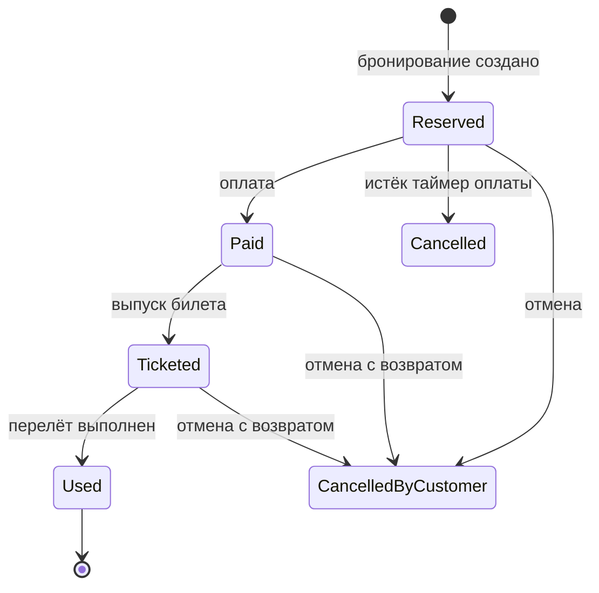
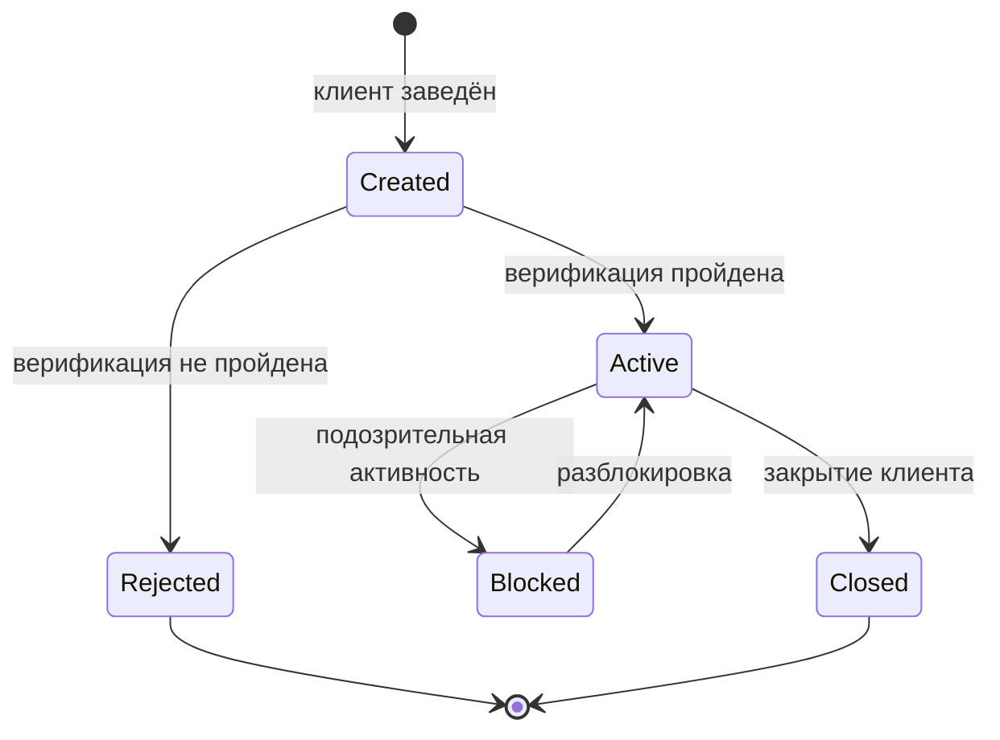
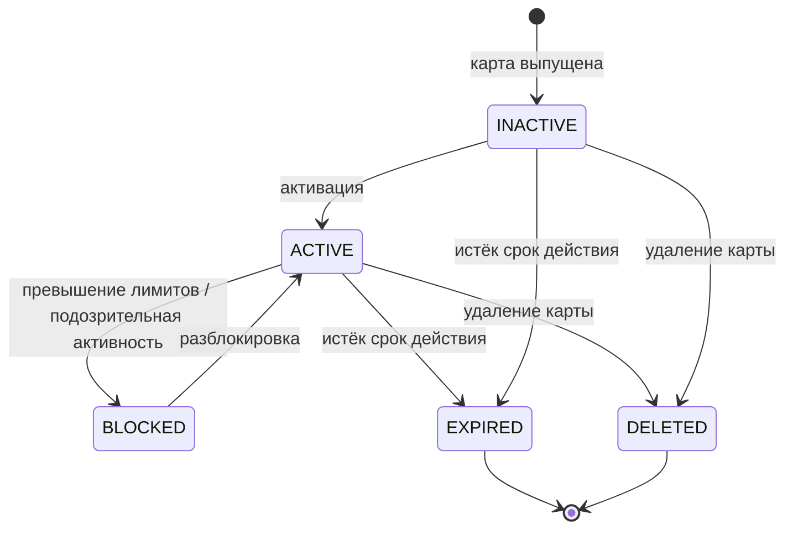

---
# Глобальный конфиг деки + титульный слайд (первый слайд)
theme: "slidev-theme-lekton"
title: "Таблицы решений, state-transition, исследовательское тестирование, баг-репорты"
lecturer: "Ольга Лихачева"
mermaid: 
  theme: "base"
  themeVariables: 
    primaryColor: "#f0fdf4"
    primaryBorderColor: "#18b34d"
    primaryTextColor: "#1f2937"
    lineColor: "#94a3b8"
    fontSize: "16px"
layout: "cover"
image: "/img/img-1-cover.jpg"
kicker: "ИТМО · Тестирование ПО · Осень 2026"
heading: "Таблицы решений, state-transition, исследовательское тестирование, баг-репорты"
subtitle: "Модуль 2 · Лекция 4 · Тест-дизайн"
chips: 
  - "Ольга Лихачева · Lekton"
  - "4 курс"
  - "24 сентября · Четверг 13:30–15:00"
---

<!--
Добрый день! Продолжаем модуль 2. На прошлой лекции вы разобрали классы эквивалентности, границы и попарное тестирование и на содержательной практике начали создавать проектную тестовую документацию по СМП.

Сегодня закрываем оставшиеся техники — таблицы решений, диаграммы состояний и переходов, исследовательское тестирование — и подробно разбираем баг-репорты. Все примеры сегодня построены на одном сквозном объекте: заведении клиента через POST /api/v1/clients/create-individual. Это тот же пример, который мы использовали на лекции 3, поэтому вы увидите, как разные техники применяются к одному объекту.

Баг-репорты сегодня — теория. Практика по ним будет в модуле 7, на E2E-тестировании, где вы оформите репорты по итогам реального прогона.

Завтра, 25.09, проходная практика: peer review и сдача артефакта 2 — проектная тестовая документация (стратегия, тестовый план, чек-листы, классы эквивалентности, границы и pairwise с моделью PICT).
-->

---
layout: "agenda"
kicker: "Модуль 2 · Лекция 4"
heading: "План лекции"
items: 
  - "Как выбрать технику под задачу"
  - "Таблицы решений (decision tables) — сквозной пример на клиенте"
  - "Диаграммы и таблицы состояний/переходов (state-transition)"
  - "Исследовательское тестирование (exploratory testing)"
  - "Баг-репорты: структура, severity vs priority, реальный пример"
  - "Почему нельзя использовать LLM для тест-дизайна"
  - "Практика 2 (25.09): peer review и сдача артефакта"
---

<!--
План лекции. Она большая, поэтому построена вокруг одного сквозного объекта — заведения клиента. Сначала «шпаргалка» выбора техники. Затем таблицы решений: определение, методика, два классических примера и сквозной пример на валидации клиента. Потом state-transition: термины, диаграммы, таблицы переходов, уровни покрытия и жизненный цикл клиента. Далее исследовательское тестирование: определение, применение, чартеры и сессия на нашем объекте. Затем большая часть — баг-репорты: зачем, структура, плохой и хороший пример, места для реального примера из практики, severity против priority и стандарты. В конце — почему нельзя использовать LLM для тест-дизайна, и организационная часть про завтрашнюю проходную.

Логика модуля: лекция 3 дала базовые техники — классы, границы, pairwise. Лекция 4 добавляет техники под те состояния и правила, которые базой не описываются, и переходит к дефектам.
-->

---
layout: "default"
kicker: "Модуль 2 · Лекция 4"
heading: "Разогрев: что мы уже умеем"
---

  
Лекция 3 — база

  

    
<strong>Классы эквивалентности:</strong> какие значения система обрабатывает одинаково.

    
<strong>Граничные значения:</strong> что происходит на стыке классов.

    
<strong>Попарное тестирование:</strong> как покрыть комбинации параметров.

  

  
Лекция 4 — что добавим

  

    
<strong>Таблицы решений:</strong> когда решение зависит от комбинации условий.

    
<strong>State-transition:</strong> когда поведение зависит от состояния и порядка.

    
<strong>Исследовательское тестирование:</strong> когда документации мало.

    
<strong>Баг-репорты:</strong> как зафиксировать найденный дефект.

  

<strong>Вопросы в зал.</strong> Первый: что нельзя смешивать в одном тест-кейсе? (невалидные классы). Второй: сколько точек нужно на границу? (три). Третий: что делать, если требование молчит о формате поля? (спросить аналитика).

<!--
Короткий разогрев. Напомню, что мы уже умеем. Классы эквивалентности отвечают на вопрос, какие значения система обрабатывает одинаково, и требуют по одному представителю на класс. Граничные значения уточняют поведение на стыке классов — тройкой точек. Попарное тестирование сокращает комбинаторный взрыв, покрывая все пары значений.

Сегодня добавим три техники, которые отвечают на другие вопросы. Если решение системы зависит от комбинации нескольких условий — например, статус карты и лимит и баланс вместе определяют код ответа, — нужна таблица решений. Если поведение зависит от состояния и порядка операций — например, карта сначала выпускается, потом активируется, — нужен state-transition. Если документация неполная или её нет — исследовательское тестирование. И в конце разберём, как правильно оформить найденный дефект.

И три вопроса для разогрева аудитории — они повторяют ключевые правила лекции 3 и проверяют, что база усвоена.
-->

---
layout: "table"
kicker: "Модуль 2 · Лекция 4"
heading: "Выбор техники: когда какую"
headers: 
  - "Ситуация"
  - "Техника"
rows: 
  - cells: ["Любой объект тестирования (база)", "Классы эквивалентности + граничные значения"]
  - cells: ["Зависимости между условиями, бизнес-правила", "Таблицы решений"]
  - cells: ["Состояния влияют на поведение, важен порядок операций", "State-transition"]
  - cells: ["Много параметров с неизвестными зависимостями", "Pairwise"]
  - cells: ["Низкое качество документации, нет времени", "Исследовательское тестирование"]
---

<!--
Ключевая таблица «когда какую технику» [STF, раздел 5.4 «Which technique and when»; Copeland, введение к Секции I; ISTQB CTFL v4.0].

База — классы эквивалентности плюс границы: они применяются всегда и к любому объекту. Если решение зависит от комбинации нескольких условий, ведущих к дискретному действию, — таблица решений. Если поведение определяется состоянием и порядком операций — state-transition. Если параметров много, а взаимодействия неизвестны — pairwise. Если документация плохая или времени мало — исследовательское тестирование.

Два важных замечания. Первое: техники не исключают друг друга — на одном сервисе почти всегда применяется несколько. Второе: артефакт 2 проверяется по рубрике именно в комбинации — стратегия, план, чек-листы, классы, границы и pairwise; таблицы решений и переходы состояний остаются материалом лекции и пригодятся в последующих модулях.

Сегодня мы на каждом шаге будем возвращаться к одной таблице «ситуация — техника», чтобы выбор был осознанным, а не по привычке.
-->

---
layout: "default"
kicker: "Модуль 2 · Лекция 4"
heading: "Сквозной пример лекции: заведение клиента"
---

Один объект на всю лекцию: POST /api/v1/clients/create-individual — тот же запрос, что на лекции 3.

  
Поля запроса

  

    
contacts.email, contacts.phone

    
individual.demographic.birth_date

    
individual.demographic.gender

    
individual.demographic.marital_status

    
tax.tax_number, external_id

  

  
Что показывает каждая техника

  

    
<strong>Таблица решений</strong> — от чего зависит код ответа при создании.

    
<strong>State-transition</strong> — жизненный цикл клиента: создан, активен, заблокирован.

    
<strong>Exploratory</strong> — что исследовать в этом запросе.

    
<strong>Баг-репорт</strong> — как описать найденный дефект.

  

Так один объект связывает все четыре темы и практику 2, где вы примените техники к Authorization.

<!--
Сквозной пример лекции — заведение клиента, тот же запрос, что разбирали на лекции 3. Он выбран не случайно: у него есть обязательные и необязательные поля, правила валидации, бизнес-правила создания и жизненный цикл. Значит, на нём можно показать все четыре темы лекции.

Поля запроса: группа contacts — email, phone, notification_phone. Группа individual — демография: дата рождения, пол, семейное положение. Группа tax — налоговый номер. Плюс внешний идентификатор.

Дальше на каждом блоке я буду возвращаться к этому объекту. Таблица решений покажет, от чего зависит код ответа. State-transition — жизненный цикл клиента. Исследовательское тестирование — что здесь стоит поисследовать, когда требования неполны. И наконец баг-репорт — как описать найденный здесь дефект. На практике 2 вы примените те же техники к сервису Authorization, где сквозным объектом будет карта.
-->

---
layout: "section"
kicker: "Модуль 2 · Лекция 4"
heading: "Таблицы решений"
image: "/img/img-2-section.jpg"
---

<!--
Первый блок — таблицы решений. Это техника для случаев, когда решение системы зависит от комбинации нескольких условий, а не от одного. Разберём определение, методику, два классических примера и сквозной пример на заведении клиента.
-->

---
layout: "default"
kicker: "Модуль 2 · Лекция 4"
heading: "Таблицы решений: определение и структура"
---

<strong>Таблица решений</strong> — компактная запись сложных бизнес-правил.

  
Условия — верх

  
Набор условий, от которых зависит решение.

  
Действия — низ

  
Что система должна сделать.

  
Правила — столбцы

  
Каждое правило = уникальная комбинация условий → набор действий.

Действия зависят <strong>только от значений условий</strong>, не от порядка.

Из таблицы напрямую получаются тест-кейсы.

<!--
Определение и структура таблицы решений [Copeland, гл. 5, введение и основная форма (Таблица 5-1); ISTQB CTFL, раздел 5.1.4; Куликов 2.3].

Таблица решений — это компактный способ записать сложные бизнес-правила: комбинации условий и соответствующие им действия. Структура классическая: сверху условия, снизу действия, а каждый столбец — это правило: уникальная комбинация значений условий и тот набор действий, который она запускает.

Два свойства важны для тест-дизайна. Первое: действия зависят только от значений условий, не от порядка их проверки. Если поведение зависит от последовательности событий — это уже не таблица решений, а state-transition, о которой будем говорить дальше. Второе: из таблицы напрямую получаются тест-кейсы — каждый столбец становится тест-кейсом с ожидаемым действием.

Куликов в классификации техник указывает на тестирование по таблице решений и отсылает к главе 5 Copeland. Для нашего СМП таблица решений — это способ записать, как сочетание условий влияет на код ответа сервиса.
-->

---
layout: "default"
kicker: "Модуль 2 · Лекция 4"
heading: "Таблицы решений: методика построения"
---

<Flow :steps="['1. Определить условия', '2. Определить действия', '3. Перебрать все комбинации', '4. Учесть границы диапазонов', '5. Каждое правило → тест-кейс']" />

  
Комбинаторика

  
Для n бинарных условий — 2n правил. Условия бывают бинарные или диапазонные.

  
Диапазонные условия

  
Учесть границы диапазонов — таблица решений комбинируется с BVA.

Ограничение: рост экспоненциальный. Больше пяти-шести условий — таблица становится громоздкой.

<!--
Методика построения таблицы решений по Copeland [гл. 5 «Методика»; ISTQB CTFL 5.1.4].

Шаг 1 — определить условия: какие факторы влияют на решение. Шаг 2 — действия: что система может сделать. Шаг 3 — перебрать все комбинации условий: для n бинарных условий это 2 в степени n правил. Шаг 4 — если условия диапазонные, внутри диапазонов работают границы: таблица решений комбинируется с BVA. Шаг 5 — каждое правило превращается минимум в один тест-кейс с ожидаемым действием.

Про рост: два условия «Да/Нет» дают четыре правила, три — восемь, четыре — шестнадцать. Рост экспоненциальный, и это главное ограничение техники. Больше пяти-шести условий таблица становится громоздкой, и часть правил приходится схлопывать — об этом на следующем примере. Техника прямо говорит: каждый столбец таблицы — тест-кейс.

Обратите внимание на связь с лекцией 3: диапазонные условия внутри себя требуют границ, то есть таблица решений и граничные значения работают в паре. Классы эквивалентности задают значения условий, границы уточняют переходы между ними, а таблица решений описывает, как комбинации условий дают результат.
-->

---
layout: "default"
kicker: "Модуль 2 · Лекция 4"
heading: "Таблицы решений: пример 1 — автострахование"
---

Условия: «состоит в браке?», «хороший студент?» (Да/Нет). Всего 4 правила.

  
(Да, Да)

  
Скидка 60%

  
(Да, Нет)

  
Скидка 25%

  
(Нет, Да)

  
Скидка 50%

  
(Нет, Нет)

  
Скидка 0%

Каждое правило → тест-кейс с ожидаемым действием.

<!--
Классический пример Copeland — компания автострахования [гл. 5, пример; таблица 5-1].

Условий два: состоит ли клиент в браке и является ли хорошим студентом. Оба бинарные, значит четыре правила. Правило 1 — женат и хороший студент: скидка 60%. Правило 2 — женат, но не студент: 25%. Правило 3 — не женат, но хороший студент: 50%. Правило 4 — не женат и не студент: скидки нет.

Каждое правило становится тест-кейсом: задаём комбинацию условий, ожидаем соответствующую скидку. Таблица на четыре столбца даёт четыре тест-кейса — и это весь набор: других комбинаций не существует. Именно в этом сила таблицы решений: она доказывает полноту, потому что перечисляет все комбинации.

Сравните с классами эквивалентности. Классы сказали бы: «условие "в браке" — два класса, условие "хороший студент" — два класса». Но они не сказали бы, как именно комбинация двух условий влияет на скидку. Таблица решений это делает явно. Вот почему в шпаргалке выбора техники таблица решений стоит напротив строки «зависимости между условиями».
-->

---
layout: "default"
kicker: "Модуль 2 · Лекция 4"
heading: "Таблицы решений: пример 2 — заказ на покупку"
---

Условия: «верный идентификатор?», «верное количество?», «достаточно средств?» → 8 правил. Купить можно, только если все три — «Да».

  
Схлопывание

  
Значение «не важно» (НВ): если ID неверный — остальные условия неважны, правило одно.

  
Для тестов

  
Схлопнутая таблица удобна для разработки, но для тест-кейсов берём <strong>несхлопнутую</strong>.

Оптимизация таблицы сама может внести ошибки — используйте полную таблицу как основу тестов.

<!--
Второй пример Copeland — заказ на покупку [гл. 5, пример заказа; схлопывание]. Три бинарных условия: верный идентификатор, верное количество, достаточно средств. Полная таблица — восемь правил. Успешная покупка — только когда все три условия выполнены.

Дальше — приём, который Copeland называет схлопыванием. Если идентификатор неверный, остальные условия не влияют на результат: покупка невозможна в любом случае. Значит, в правилах «ID неверен, количество верное или неверное, средств достаточно или недостаточно» значение других условий можно пометить как «не важно» и схлопнуть четыре правила в одно.

Вот здесь важный нюанс для тестировщика. Схлопнутая таблица удобна разработчику — меньше веток кода. Но для тестов мы берём полную, несхлопнутую таблицу. Оптимизация таблицы сама может внести ошибки, поэтому основа тестов — полный перебор комбинаций. Если вы проверите только «схлопнутое» правило с пометкой «не важно», вы не узнаете, действительно ли системе безразличны остальные условия, — а именно это и надо проверить.

Запомните этот приём: он пригодится, когда мы будем строить таблицу решений для заведения клиента, где тоже есть условия, «перекрывающие» остальные.
-->

---
layout: "default"
kicker: "Модуль 2 · Лекция 4"
heading: "Сквозной пример: таблица решений для клиента"
---

Условия создания клиента и ожидаемый результат

<table class="w-full text-left">
<thead style="background:#f1f5f9">
<tr>
  <th class="p-1 font-bold" style="width:26%">Условие</th>
  <th class="p-1 font-bold">Возможные значения</th>
</tr>
</thead>
<tbody class="text-slate-600">
<tr class="border-t"><td class="p-1 font-semibold">Обязательные поля заполнены</td><td class="p-1">Да / Нет</td></tr>
<tr class="border-t"><td class="p-1 font-semibold">Форматы полей корректны</td><td class="p-1">Да / Нет</td></tr>
<tr class="border-t"><td class="p-1 font-semibold">Возраст по birth_date ≥ 18</td><td class="p-1">Да / Нет</td></tr>
<tr class="border-t"><td class="p-1 font-semibold">external_id не дублируется</td><td class="p-1">Да / Нет</td></tr>
</tbody>
</table>

Четыре бинарных условия → 24 = <strong>16 правил</strong>. Действие одно из трёх: 201 Created, 400 VALIDATION_ERROR, 409 DUPLICATE.

Для тестов берём <strong>несхлопнутую</strong> таблицу: даже если поле не заполнено, проверяем, как система реагирует на остальные условия.

<!--
Теперь применяем методику к нашему сквозному объекту — заведению клиента. Определяем условия. Первое: заполнены ли обязательные поля. Второе: корректны ли форматы — email, телефон, дата рождения, налоговый номер. Третье: возраст по дате рождения не меньше восемнадцати. Четвёртое: внешний идентификатор не дублируется.

Четыре бинарных условия дают шестнадцать правил. Действие принимает одно из трёх значений: успешное создание с кодом 201, ошибка валидации с кодом 400, конфликт дубликата с кодом 409.

Обратите внимание на два момента. Первый: мы снова работаем в паре с лекцией 3 — «форматы полей корректны» раскрывается через классы эквивалентности, а «возраст ≥ 18» — через граничные значения с тройкой {17, 18, 19}. Таблица решений собирает эти детали в правила. Второй: мы берём несхлопнутую таблицу. Даже если поле не заполнено и ответ заведомо 400, мы проверяем, как система ведёт себя с остальными условиями, — потому что не хотим предполагать, а хотим знать.

Шестнадцать правил — это шестнадцать тест-кейсов. Именно так таблица решений доказывает полноту: она перечисляет все комбинации, и мы видим, что ничего не пропущено.
-->

---
layout: "default"
kicker: "Модуль 2 · Лекция 4"
heading: "Сквозной пример: разбор правил клиента"
---

<table class="w-full text-left">
<thead style="background:#f1f5f9">
<tr>
  <th class="p-1 font-bold">Обязат.</th>
  <th class="p-1 font-bold">Форматы</th>
  <th class="p-1 font-bold">≥ 18</th>
  <th class="p-1 font-bold">external_id</th>
  <th class="p-1 font-bold">Ожидаемый результат</th>
</tr>
</thead>
<tbody class="text-slate-600">
<tr class="border-t"><td class="p-1">Да</td><td class="p-1">Да</td><td class="p-1">Да</td><td class="p-1">уникален</td><td class="p-1">201 Created, клиент создан</td></tr>
<tr class="border-t"><td class="p-1">Да</td><td class="p-1">Да</td><td class="p-1">Да</td><td class="p-1">дубликат</td><td class="p-1">409 DUPLICATE</td></tr>
<tr class="border-t"><td class="p-1">Да</td><td class="p-1">Да</td><td class="p-1">Нет</td><td class="p-1">уникален</td><td class="p-1">400, код AGE_LIMIT</td></tr>
<tr class="border-t"><td class="p-1">Да</td><td class="p-1">Нет</td><td class="p-1">Да</td><td class="p-1">уникален</td><td class="p-1">400, код VALIDATION_ERROR</td></tr>
<tr class="border-t"><td class="p-1">Нет</td><td class="p-1">—</td><td class="p-1">—</td><td class="p-1">уникален</td><td class="p-1">400, REQUIRED_FIELD</td></tr>
</tbody>
</table>

  Каждая строка — <strong>тест-кейс</strong> с ожидаемым кодом и телом ответа.

  Последняя строка — пример <strong>схлопывания</strong>: без обязательных полей остальные условия неважны.

<!--
Показываю фрагмент несхлопнутой таблицы — пять правил из шестнадцати. Первое: все условия выполнены, идентификатор уникален — успех, код 201. Второе: всё корректно, но идентификатор дублируется — код 409. Третье: форматы верны, но возраст меньше восемнадцати — ошибка с конкретным кодом AGE_LIMIT. Четвёртое: возраст в порядке, но формат поля нарушен — ошибка валидации. Пятое: обязательные поля не заполнены.

Заметьте: последняя строка — пример схлопывания. Если обязательное поле не заполнено, остальные условия действительно неважны, и мы с полным правом ставим прочерки. Но мы оставляем её в таблице как отдельную строку, потому что должны проверить именно эту ветку — реакцию системы на отсутствие обязательного поля.

И обратите внимание на ожидаемый результат: не просто «ошибка», а конкретный код и, где возможно, конкретный тип ошибки. Именно так таблица решений превращается в тест-кейсы — с однозначной проверкой. На практике 2 вы построите аналогичную таблицу для сервиса Authorization, где условия — статус карты, лимиты и баланс.
-->

---
layout: "default"
kicker: "Модуль 2 · Лекция 4"
heading: "Таблицы решений: применение и ограничения"
---

  
Применять

  

    
Сложные бизнес-правила.

    
Комбинации условий с дискретными действиями.

    
Решения, где важна полнота перебора.

  

  
Не применять

  

    
Система без правил-комбинаций — таблица вырождается.

    
Более шести-семи условий — таблица становится нечитаемой.

    
Поведение зависит от порядка — это state-transition.

  

<strong>СМП:</strong> таблица решений авторизации = статус карты × лимиты × баланс → код ответа.

<!--
Итог по таблицам решений. Применяем, когда есть сложные бизнес-правила и комбинации условий, ведущие к дискретным действиям, и когда важна полнота перебора. Не применяем, когда правил-комбинаций нет — если система принимает решение по одному условию, таблица вырождается, хватит классов и границ. Не применяем при большом числе условий — таблица становится нечитаемой. И не применяем, когда поведение зависит от порядка операций: это уже state-transition.

Для СМП таблица решений авторизации строится так: условия — статус карты, отношения суммы к дневному лимиту, месячному лимиту и доступному балансу, срок действия; действие — код ответа. Пример: карта активна, все лимиты в норме, средств достаточно — ответ одобрен. Карта заблокирована — отказ с кодом, остальные условия неважны.

Ещё раз проговорю место техники: в артефакт 2 таблица решений не входит — там классы, границы и pairwise. Но техника пригодится в последующих модулях, когда вы будете разбирать логику авторизации и писать по ней тесты.
-->

---
layout: "section"
kicker: "Модуль 2 · Лекция 4"
heading: "State-transition"
image: "/img/img-2-section.jpg"
---

<!--
Второй блок — диаграммы и таблицы состояний и переходов. Эта техника нужна там, где поведение системы зависит не только от входных данных, но и от её текущего состояния и порядка операций. Разберём термины, диаграммы, таблицы переходов, уровни покрытия и жизненный цикл клиента.
-->

---
layout: "cards"
kicker: "Модуль 2 · Лекция 4"
heading: "State-transition: термины"
cols: 2
cards: 
  - icon: "🧭"
    title: "Состояние"
    text: "Период ожидания события; система «помнит» прошлое"
    color: "#18b34d"
  - icon: "➡️"
    title: "Переход"
    text: "Изменение состояния по событию"
    color: "#00d2aa"
  - icon: "⚡"
    title: "Событие"
    text: "Триггер перехода — внешнее или внутреннее (например, таймер)"
    color: "#ff7101"
  - icon: "🎬"
    title: "Действие"
    text: "Операция, вызванная переходом — записывается после «/»"
    color: "#ee00b3"
---

Нотация: чёрная точка — старт, «бычий глаз» — конечное состояние.

<!--
Термины state-transition по Copeland [гл. 7; ISTQB CTFL 5.1.3; Куликов 2.3; ISTQB Glossary].

Состояние — это период, когда система ждёт события и «помнит» своё прошлое. Классический пример — стек: его поведение зависит от того, пуст он, заполнен или в промежуточном состоянии. Переход — изменение состояния, вызванное событием. Событие — триггер: оно может быть внешним (запрос, команда пользователя) или внутренним (таймер, истечение срока). Действие — операция, выполняемая при переходе; в нотации её записывают после слэша: событие/действие.

На диаграмме состояний чёрная точка обозначает стартовое состояние, а «бычий глаз» — конечное. ISTQB определяет и саму технику, и конечный автомат как модель. Ключевое отличие от таблицы решений: здесь важен порядок. Если в таблице решений результат зависел только от комбинации условий, то здесь — от того, в каком состоянии система находится в момент события.
-->

---
layout: "default"
kicker: "Модуль 2 · Лекция 4"
heading: "State-transition: диаграммы (пример бронирования)"
---

Условия-«охранники» записываются в квадратных скобках <code class="font-mono">[ ]</code>.

<strong>Одна диаграмма — один объект:</strong> не смешивать бронирование и пассажира.

<!--
Пример Copeland — бронирование авиабилета [гл. 7, пример; нотация]. На диаграмме видно: бронирование создано, оплачено, выпущен билет, перелёт выполнен. Из состояния «забронировано» может сработать внутренний таймер оплаты — тогда бронирование отменяется. Из большинства состояний клиент может отменить бронь, и при отмене после оплаты — возврат денег.

Обратите внимание на условия-охранники: они записываются в квадратных скобках и ограничивают переход, например [после 23:00 отмена невозможна]. И правило проектирования: одна диаграмма — один объект. Не смешивайте на одной диаграмме бронирование и пассажира — получится каша из состояний, которую невозможно тестировать.

Именно поэтому state-transition — это не «просто ещё одна таблица». Диаграмма отвечает на вопрос «какие состояния бывают и как между ними переходят», таблица переходов — на вопрос «что происходит при каждом сочетании состояние-событие», а уровни покрытия — на вопрос «сколько проверок достаточно».
-->

---
layout: "default"
kicker: "Модуль 2 · Лекция 4"
heading: "Сквозной пример: жизненный цикл клиента"
---

Состояния: <strong>Created / Active / Blocked / Closed</strong> (+ Rejected).

Главная цель техники — <strong>неправильный порядок операций</strong>.

<!--
Теперь переносим state-transition на наш сквозной объект — заведение клиента. У клиента есть жизненный цикл. Клиент заводится — состояние Created. После верификации становится Active, либо, если верификация не пройдена, — Rejected. Активный клиент может быть заблокирован при подозрительной активности и разблокирован обратно. Также клиент может быть закрыт. Rejected и Closed — конечные состояния.

Почему это важно тестировать как state-transition? Потому что главные дефекты здесь — неправильный порядок операций. Попытка отправить платёж по клиенту, который ещё не верифицирован. Разблокировка клиента, который не заблокирован. Операция по закрытому клиенту. Всё это не про значения полей, а про последовательность.

Связь с заведением клиента прямая: запрос создания переводит систему в состояние Created и заводит клиента, от которого дальше зависят операции. Это и есть та самая процессинговая цепочка, о которой мы говорили: без клиента нельзя открыть счёт, без счёта — провести транзакцию. Поэтому порядок критичен, а state-transition — правильная техника.
-->

---
layout: "default"
kicker: "Модуль 2 · Лекция 4"
heading: "State-transition: таблицы переходов"
---

Таблица из четырёх колонок: <strong>Текущее состояние | Событие | Действие | Следующее состояние</strong>.

Перечисляет <strong>все</strong> пары «состояние × событие», включая недопустимые.

<strong>Польза:</strong> помогает найти «дыры» в требованиях до написания кода.

<strong>Недостаток:</strong> таблица быстро растёт — много пустых клеток.

Пример: «Created + оплата» — недопустимая пара, о которой требования часто молчат.

<!--
Таблицы переходов — формальное дополнение к диаграмме [Copeland, гл. 7 «Таблицы состояний и переходов»; ISTQB CTFL 5.1.3].

Таблица из четырёх колонок: текущее состояние, событие, действие, следующее состояние. Её сила в полноте: в таблицу вносятся все пары «состояние × событие» — включая те, которых в системе быть не должно. Именно так вы находите дыры в требованиях: вы пишете строку «Created + оплата» и понимаете, что спецификация не описывает, что система должна делать. Хорошо, если это найдено на этапе анализа, а не в проде.

Недостаток очевиден: таблица растёт как произведение числа состояний на число событий, и большая часть клеток пустая. Для большого автомата это громоздко — тогда используют диаграммы и деревья переходов. Но для статусной модели клиента или карты таблица компактна и полезна.

Практический совет: недопустимые пары — это не мусор в таблице, а готовые негативные тест-кейсы. Каждая такая пара — проверка, что система корректно отклоняет недопустимую операцию.
-->

---
layout: "default"
kicker: "Модуль 2 · Лекция 4"
heading: "Сквозной пример: таблица переходов клиента"
---

<table class="w-full text-left">
<thead style="background:#f1f5f9">
<tr>
  <th class="p-1 font-bold">Текущее состояние</th>
  <th class="p-1 font-bold">Событие</th>
  <th class="p-1 font-bold">Следующее состояние</th>
  <th class="p-1 font-bold">Ожидание</th>
</tr>
</thead>
<tbody class="text-slate-600">
<tr class="border-t"><td class="p-1">Created</td><td class="p-1">верификация пройдена</td><td class="p-1">Active</td><td class="p-1">разрешено</td></tr>
<tr class="border-t"><td class="p-1">Created</td><td class="p-1">открыть счёт</td><td class="p-1">Created</td><td class="p-1">отказ, код NOT_VERIFIED</td></tr>
<tr class="border-t"><td class="p-1">Blocked</td><td class="p-1">разблокировать</td><td class="p-1">Active</td><td class="p-1">разрешено</td></tr>
<tr class="border-t"><td class="p-1">Active</td><td class="p-1">разблокировать</td><td class="p-1">Active</td><td class="p-1">отказ, код INVALID_STATE</td></tr>
<tr class="border-t"><td class="p-1">Closed</td><td class="p-1">любое</td><td class="p-1">Closed</td><td class="p-1">отказ, код CLIENT_CLOSED</td></tr>
</tbody>
</table>

Строки 2, 4 и 5 — <strong>недопустимые переходы</strong>. Каждая — негативный тест-кейс, который часто отсутствует в требованиях.

<!--
Показываю фрагмент таблицы переходов для клиента. Строка первая: клиент в состоянии Created, приходит верификация — переходим в Active, разрешено. Строка вторая: клиент в Created, приходит событие открыть счёт — перехода нет, должно быть отклонено с кодом, который говорит, что клиент не верифицирован. Строка третья: заблокированный клиент разблокируется — снова Active. Строка четвёртая: активный клиент пытается разблокироваться — недопустимо, отказ с кодом неверного состояния. Строка пятая: любое событие по закрытому клиенту отклоняется.

Три строки из пяти — недопустимые переходы. И это самое ценное в таблице. Требования обычно описывают, что должно работать, и молчат о том, что должно отклоняться. А дефекты живут именно здесь: система, которая «разблокирует» активного клиента или открывает счёт до верификации, формально не нарушила ни одного описанного правила — потому что правила не было.

На проходной 25.09 мы будем принимать артефакт 2, и там этой техники нет. Но запомните приём: когда в модуле 7 вы будете работать со статусами, таблица переходов даст вам негативные кейсы, которые не придумываются «из головы», а выводятся системно.
-->

---
layout: "cards"
kicker: "Модуль 2 · Лекция 4"
heading: "State-transition: уровни покрытия"
cols: 2
cards: 
  - icon: "1"
    title: "Уровень 1 — все состояния"
    text: "Каждое состояние посещено хотя бы раз (низкий уровень)"
    color: "#64748b"
  - icon: "2"
    title: "Уровень 2 — все события"
    text: "Каждое событие выполнено хотя бы раз"
    color: "#00d2aa"
  - icon: "3"
    title: "Уровень 3 — все пути"
    text: "Может быть бесконечно из-за петель"
    color: "#ff7101"
  - icon: "4"
    title: "Уровень 4 — все переходы"
    text: "Рекомендуемый уровень покрытия"
    color: "#18b34d"
---

Для критичных систем дополнительно проверяем <strong>недопустимые переходы</strong>.

<!--
Уровни покрытия state-transition по Copeland [гл. 7 «Создание тест-кейсов»; ISTQB CTFL 5.1.3].

Первый уровень — посетить все состояния: самый дешёвый, но слабый — систему можно прогнать по главному пути и попутно зацепить состояния. Второй — выполнить все события. Третий — покрыть все пути: при наличии петель путей бесконечно много, поэтому полное покрытие путей недостижимо. Четвёртый — покрыть все переходы: каждый переход диаграммы выполнен хотя бы раз. Это рекомендуемый практикой уровень.

Для критичных систем добавляем проверку недопустимых переходов: пробуем разблокировать активного клиента или открыть счёт до верификации и проверяем, что система это корректно отклоняет. Это связано с критериями завершения тестирования: мы останавливаемся, когда все переходы выполнены, а недопустимые — отклонены.

Проведём аналогию с лекцией 3. Там уровнем покрытия была «одна пара значений — хотя бы раз». Здесь — «один переход — хотя бы раз». Принцип один: мы выбираем информативное подмножество по формальной модели, а не перебираем всё.
-->

---
layout: "default"
kicker: "Модуль 2 · Лекция 4"
heading: "State-transition в СМП: статусы карты"
---

Статусы: <strong>ACTIVE / INACTIVE / BLOCKED / EXPIRED</strong> (+ DELETED).

Неправильный порядок операций — главная цель техники.

<!--
Теперь переносим state-transition на сервис Authorization — тот объект, с которым вы работаете на практике 2. Источник данных — техническое задание Authorization и модель Card: pan, bin, status, dailyLimit, monthlyLimit, availableBalance, expiryDate.

У карты четыре рабочих статуса — ACTIVE, INACTIVE, BLOCKED, EXPIRED — плюс DELETED для удалённых. Переходы: активация из INACTIVE в ACTIVE; превышение лимитов или подозрительная активность переводят в BLOCKED; разблокировка возвращает в ACTIVE; истечение срока действия переводит в EXPIRED; удаление — в DELETED.

Зачем это тестировать как state-transition? Потому что главные дефекты здесь — неправильный порядок операций: попытка авторизовать карту до активации, разблокировка активной карты, списание по истёкшей. Типовые цепочки переходов для карты: ACTIVE в BLOCKED и обратно, ACTIVE в EXPIRED, ACTIVE в DELETED.

Обратите внимание: карта — тот же тип объекта, что клиент. У обоих есть жизненный цикл, и оба требуют state-transition. На практике 2 вы будете строить для карты классы эквивалентности по статусу — ACTIVE, INACTIVE, BLOCKED, EXPIRED. Это пересечение техник: статус карты одновременно и класс эквивалентности для авторизации, и состояние для state-transition.
-->

---
layout: "default"
kicker: "Модуль 2 · Лекция 4"
heading: "State-transition: применение и ограничения"
---

  
Применять

  

    
Поведение зависит от состояния и порядка операций.

    
Есть жизненный цикл объекта: клиент, карта, заказ.

    
Нужно найти дыры в требованиях.

  

  
Не применять

  

    
Поведение не зависит от предыстории.

    
Результат определяется только комбинацией условий — это таблица решений.

    
Состояний и событий слишком много.

  

<strong>Правило выбора:</strong> если порядок операций меняет результат — state-transition; если порядок не важен, а важна комбинация — таблица решений.

<!--
Итог по state-transition. Применяем, когда поведение зависит от состояния и порядка операций, когда есть жизненный цикл объекта — клиент, карта, заказ, — и когда нужно найти дыры в требованиях. Не применяем, когда поведение не зависит от предыстории, когда результат определяется только комбинацией условий или когда состояний и событий слишком много.

Сформулирую правило выбора между двумя техниками блока. Если порядок операций меняет результат — state-transition. Если порядок не важен, а важна комбинация условий — таблица решений. Классический пример различия: «оплатить бронь дважды» — это про состояние и порядок, потому что результат зависит от того, оплачена ли бронь уже. А «скидка зависит от семейного положения и статуса студента» — про комбинацию, порядок тут ни при чём.

Ни одна из техник не заменяет классы и границы. State-transition отвечает на вопрос «в каком состоянии допустима операция», а классы и границы — на вопрос «какие значения и на каких границах допустимы внутри состояния». В артефакте 2 у вас классы, границы и pairwise; state-transition и таблица решений — материал этой лекции и задел на последующие модули.
-->

---
layout: "section"
kicker: "Модуль 2 · Лекция 4"
heading: "Исследовательское тестирование"
image: "/img/img-2-section.jpg"
---

<!--
Третий блок — исследовательское тестирование. Это техника из категории «на основе опыта»: она нужна там, где документации мало или она неполна. Разберём определение, случаи применения, мифы, чартеры и сессии — и напишем чартер для нашего сквозного примера.
-->

---
layout: "default"
kicker: "Модуль 2 · Лекция 4"
heading: "Исследовательское тестирование: определение"
---

Классическое определение (Kaner): ET — стиль тестирования, где <strong>изучение, планирование и выполнение проверок идут параллельно</strong> и взаимообогащают друг друга.

В каждом тесте есть исследовательская компонента; ET — это «осознанное» исследование, а не «кликание».

<strong>Testing vs Checking:</strong> машины проверяют (checking), люди тестируют (testing).

ET ≠ «беспорядочное» тестирование: структуру задают цели, чартеры и время.

Категория ISTQB: <strong>experience-based</strong> — техники, основанные на опыте тестировщика.

<!--
Определение исследовательского тестирования [Куликов 2.7.4, определение Канера; ISTQB CTFL 5.3; TTS гл. 3; Kaner, «A Tutorial in Exploratory Testing»].

Классическое определение Канера: ET — это стиль тестирования, в котором изучение продукта, планирование следующих шагов и выполнение проверок идут параллельно и взаимообогащают друг друга. Вы узнали что-то новое о системе — и тут же меняете план проверок.

Важная мысль из TTS (Бах и Болтон): в каждом тесте есть исследовательская компонента — даже в самом скриптовом вы что-то узнаёте. ET — это не кликание, а осознанное исследование, управляемое гипотезами. Отсюда же знаменитое testing vs checking: машины выполняют checking — механические проверки по заданным условиям; люди занимаются testing — исследованием, поиском того, что не предусмотрели.

В классификации ISTQB это третья категория — experience-based, техники на основе опыта. Вспомните лекцию 3: там были specification-based — классы, границы, pairwise — и structure-based — белый ящик. Исследовательское тестирование, угадывание ошибок и тестирование по чек-листам — из категории опыта.

И сразу развеем главное заблуждение: ET — это не беспорядочное тыканье. Структуру ET задают цели, чартеры и время — об этом дальше.
-->

---
layout: "default"
kicker: "Модуль 2 · Лекция 4"
heading: "Исследовательское тестирование: когда применять и мифы"
---

  
Когда применять

  

    
Плохая или отсутствующая документация.

    
Мало времени.

    
Подозрение на слабые тест-кейсы.

    
Сторонние компоненты, верификация фиксов.

  

  
Мифы

  

    
✗ «ET — unstructured» → структурируется целями, чартерами, временем.

    
✗ «ET = random» → выбор следующего шага основан на знании продукта.

  

<strong>Не использовать как первую и единственную технику</strong> — ET дополняет систематические техники.

Результаты ET плохо поддаются измерению — фиксируйте их через отчёты.

<!--
Когда применять исследовательское тестирование и какие мифы развеять [Куликов 2.7.4; ISTQB CTFL 5.3; Bach; TTS гл. 3].

ET уместно, когда документация плохая или её нет вовсе; когда времени мало и нужен быстрый срез качества; когда есть подозрение, что написанные тест-кейсы слабые и что-то упускают; при работе со сторонними компонентами; при верификации исправлений. Куликов перечисляет эти случаи применения в 2.7.4.

Два мифа. Первый: ET — это unstructured. На самом деле структура есть: цели, чартеры, временные рамки. Второй: ET = random. Нет: выбор каждого следующего шага основан на знании продукта и наблюдениях, а не на случайности.

Важная оговорка: ET не стоит использовать как первую и единственную технику — без систематической базы (классы, границы, таблицы) вы получите набор случайных находок без покрытия. ET — дополнение к систематическим техникам, а не их замена. И ещё один практический момент: результаты ET трудно измерить, поэтому их фиксируют в отчётах о сессиях.

Это ровно та причина, по которой в артефакте 2 у вас классы, границы и pairwise: систематическая база. Исследовательское тестирование могло бы дополнять её, но не заменять.
-->

---
layout: "default"
kicker: "Модуль 2 · Лекция 4"
heading: "Сквозной пример: чартер для заведения клиента"
---

<strong>Чартер:</strong> «Исследовать POST /api/v1/clients/create-individual на предмет поведения системы при частично заполненных и структурно некорректных данных, за 60 минут».

  
Вопросы исследования

  

    
Что будет, если передать null вместо отсутствующего поля?

    
Что если contacts — пустой массив?

    
Что если два поля нарушают правила одновременно?

    
Различаются ли сообщения об ошибке для разных нарушений?

    
Что происходит при повторном запросе с тем же external_id сразу?

  

  
Модели для исследования (Hendrickson)

  

    
<strong>Данные:</strong> границы, пустоты, спецсимволы.

    
<strong>Состояния:</strong> клиент уже существует, дубликат.

    
<strong>Взаимодействия:</strong> порядок полей, вложенность.

    
<strong>Окружение:</strong> повторный запрос, параллельность.

  

<!--
Теперь напишем чартер для нашего сквозного объекта. Чартер — это короткое описание миссии сессии, отвечающее на четыре вопроса: почему тестируем, что тестируем, как и какие проблемы ищем. Формулировка: исследовать запрос создания клиента на предмет поведения при частично заполненных и структурно некорректных данных, за шестьдесят минут.

Вопросы исследования вытекают из объекта. Что будет, если передать null вместо отсутствующего поля — это классическая граница между «поле отсутствует» и «поле присутствует со значением null», которую мы разбирали на лекции 3. Что если массив contacts пуст. Что если два поля нарушают правила одновременно — здесь мы проверим, как система выбирает, какую ошибку вернуть первой. Различаются ли сообщения об ошибке для разных нарушений — это как раз то, что невозможно проверить по таблице решений, потому что требования об этом молчат.

Модели для исследования по Хендриксон: данные, состояния, взаимодействия, окружение. Работая с этими четырьмя моделями, вы систематически покрываете пространство, а не тычете наугад.

Обратите внимание: чартер не заменяет таблицу решений и границы — он их дополняет вопросами, на которые формальная модель не отвечает. Именно поэтому исследовательское тестирование применяют вместе с систематическими техниками.
-->

---
layout: "cards"
kicker: "Модуль 2 · Лекция 4"
heading: "Исследовательское тестирование: практика"
cols: 2
cards: 
  - icon: "📋"
    title: "Test charter"
    text: "«Почему? Что? Как? Какие проблемы?» — 1–2 часа на чартер"
    color: "#18b34d"
  - icon: "⏱️"
    title: "Session-based testing"
    text: "Сессии около 90 минут: цель, время, отчёт"
    color: "#00d2aa"
  - icon: "💡"
    title: "Эвристики и чек-листы"
    text: "Hendrickson, Test Heuristics Cheat Sheet — источник идей для проверок"
    color: "#ff7101"
  - icon: "🗺️"
    title: "Модели для исследования"
    text: "Состояния, данные, взаимодействия (Hendrickson, «Explore It!»)"
    color: "#ee00b3"
  - icon: "🔀"
    title: "Способы (Kaner)"
    text: "Модели, примеры, частичные изменения сценариев, вмешательство в работу"
    color: "#64748b"
---

Мини-практика: за 3–5 минут напишите чартер для одного сценария СМП.

<!--
Как исследовательское тестирование выглядит на практике [ISTQB CTFL 5.3, test charter; Hendrickson «Explore It!»; Куликов 2.7.4; Kaner].

Инструмент номер один — тест-чартер: короткое описание миссии сессии, отвечающее на четыре вопроса: почему тестируем, что тестируем, как будем тестировать и какие проблемы ищем. Чартер обычно рассчитан на один-два часа. Session-based testing — организация работы сессиями примерно по девяносто минут: у сессии есть цель, ограничение по времени и отчёт о результатах.

Вторая опора — эвристики и чек-листы. Test Heuristics Cheat Sheet Хендриксон — готовый источник идей: что спрашивать про продукт, какие границы искать, какие взаимодействия пробовать. В книге «Explore It!» Хендриксон предлагает модели для исследования: состояния, данные, взаимодействия, окружающая среда.

Канер описывает и конкретные способы проведения ET: использование моделей, работа с примерами, частичные изменения сценариев, вмешательство в работу системы.

Мини-практика: за три-пять минут напишите чартер для одного сценария СМП — например, для пополнения баланса или для поиска транзакции. Мы не будем их разбирать все, но сам навык формулировать чартер важен.
-->

---
layout: "section"
kicker: "Модуль 2 · Лекция 4"
heading: "Баг-репорты"
image: "/img/img-2-section.jpg"
---

<!--
Четвёртый и самый большой блок — баг-репорты. Это теория; практика будет в модуле 7, на E2E-тестировании. Разберём, зачем нужен баг-репорт, из чего он состоит, покажем плохой и хороший пример на нашем сквозном объекте, оставим место для реального примера из практики, разберём severity против priority и типичные ошибки.
-->

---
layout: "default"
kicker: "Модуль 2 · Лекция 4"
heading: "Баг-репорты: зачем и кому"
---

Баг-репорт — <strong>основной видимый результат работы тестировщика</strong>: по нему судят о его квалификации.

<strong>Читатели:</strong> разработчик (воспроизвести и найти причину), тест-менеджер, руководство.

Качественный отчёт = «продажа» исправления; плохой — повод отложить или проигнорировать.

Баг-репорт — заявление, что продукт стал <strong>менее ценным для кого-то</strong> (Kaner).

Сегодня — теория. Практика по баг-репортам — модуль 7 (E2E), по итогам реального прогона сценариев.

<!--
Баг-репорты — тема, ради которой студенты часто и приходят на курс. Начинаем с главного [LLST; TTS гл. 3; ISTQB CTFL 6.6.2].

Почему это важно? Баг-репорт — основной видимый результат работы тестировщика. Код вы не пишете, фичи не проектируете — но каждый найденный и качественно описанный дефект виден всем. По баг-репортам судят о вашей квалификации чаще, чем по любым метрикам.

Подумайте, кто будет читать ваш отчёт. Разработчику нужно воспроизвести дефект и найти причину — значит, нужны точные шаги. Тест-менеджеру нужна оценка серьёзности и влияния на релиз. Руководству нужно понимать, какие риски несёт продукт. Каждый читатель ищет в отчёте своё.

Качественный баг-репорт — это инструмент продаж: он продаёт разработчику необходимость исправления. Плохой отчёт — повод отложить баг или проигнорировать его. И определение Канера: баг-репорт — это заявление, что продукт стал менее ценным для кого-то. Не «что-то сломалось», а «вот кто и как пострадает».

Важное организационное замечание: сегодня мы разбираем теорию. Практика по баг-репортам — в модуле 7, на E2E-тестировании, где вы оформите репорты по итогам реального прогона сценариев.
-->

---
layout: "split"
kicker: "Модуль 2 · Лекция 4"
heading: "Баг-репорты: структура отчёта"
leftTitle: "Обязательное ядро"
leftItems: 
  - "Заголовок (что, где, при каких условиях)"
  - "Шаги воспроизведения (Steps to Reproduce)"
  - "Ожидаемый результат"
  - "Фактический результат"
  - "Специфичность STR: детали важнее — иначе не воспроизвести"
rightTitle: "Типовые атрибуты (STF Table 6-1)"
rightItems: 
  - "ID, объект теста, версия, платформа, дата, статус"
  - "Severity, priority"
  - "Связанное требование, тест-кейс"
  - "Источник проблемы, комментарии, ссылки"
  - "Вложения: скриншоты/видео, файлы; поля Jira: Summary, Priority, Environment, Description, STR"
---

<!--
Структура баг-репорта [STF 6.6, шаблон (Table 6-1); Куликов 2.5; TTS гл. 3; LLST].

Ядро любого отчёта — четыре элемента: заголовок, шаги воспроизведения, ожидаемый результат и фактический результат. Без ожидаемого и фактического результата разработчик не поймёт, в чём дефект; без шагов — не сможет его воспроизвести. Заголовок — это строка продажи: строка резюме самая важная часть отчёта. Куликов добавляет к шагам требование специфичности: «отправил транзакцию — не прошло» — это не STR; нужно указать карту, сумму, endpoint и порядок действий.

Вокруг ядра — типовые атрибуты: идентификатор, объект теста, версия, платформа, дата, статус, severity и priority, связанное требование и тест-кейс, источник проблемы, комментарии и ссылки. Куликов показывает, что поля Jira — Summary, Priority, Environment, Description, Steps to Reproduce — это тот же набор другими словами: академический шаблон и трекер описывают одно и то же.

Вложения: скриншот или видео активного окна с обведённой проблемой, при необходимости файлы. Стоимость обработки отчёта тоже важна: каждый лишний шаг или нечитаемое вложение — это время разработчика.

Сейчас покажу два примера на нашем сквозном объекте: как выглядит плохой отчёт и как — хороший.
-->

---
layout: "default"
kicker: "Модуль 2 · Лекция 4"
heading: "Сквозной пример: плохой баг-репорт"
---

<strong>Заголовок:</strong> «Не работает создание клиента»

<table class="w-full text-left">
<tbody class="text-slate-600">
<tr class="border-t"><td class="p-1 font-semibold" style="width:28%">Шаги воспроизведения</td><td class="p-1">1. Отправить запрос на создание клиента 2. Получить ошибку</td></tr>
<tr class="border-t"><td class="p-1 font-semibold">Ожидаемый результат</td><td class="p-1">Клиент создан</td></tr>
<tr class="border-t"><td class="p-1 font-semibold">Фактический результат</td><td class="p-1">Ошибка</td></tr>
<tr class="border-t"><td class="p-1 font-semibold">Severity / Priority</td><td class="p-1">—</td></tr>
</tbody>
</table>

Нет данных запроса: какие поля, какие значения.

Не указан код и тело ответа.

Не указаны severity и priority.

<!--
Показываю плохой баг-репорт на нашем сквозном объекте. Заголовок — «Не работает создание клиента». Это расплывчатый заголовок: из него непонятно ни что именно не работает, ни при каких условиях.

Шаги: «отправить запрос на создание клиента, получить ошибку». Это не шаги — это пересказ симптома. Нет данных запроса: какие поля заполнены, какие значения переданы. Ожидаемый результат — «клиент создан», фактический — «ошибка». Какой клиент? Какая ошибка? Какой код ответа?

Severity и priority не указаны вовсе, то есть у разработчика нет информации о том, насколько это важно и срочно.

Разберём, почему такой отчёт не работает. Разработчик не может его воспроизвести: непонятно, с какими данными отправлялся запрос. Не может локализовать: непонятно, какое поле нарушило правило. Не может оценить серьёзность: нет кода ответа и описания влияния. Итог — отчёт возвращается с вопросами или откладывается.

Теперь сравним с хорошим отчётом на том же объекте.
-->

---
layout: "default"
kicker: "Модуль 2 · Лекция 4"
heading: "Сквозной пример: хороший баг-репорт"
---

<strong>BR-001:</strong> Создание клиента возвращает 201 при email длиной 255 символов вместо 400 VALIDATION_ERROR

<table class="w-full text-left">
<tbody class="text-slate-600">
<tr class="border-t"><td class="p-1 font-semibold" style="width:26%">Шаги воспроизведения</td><td class="p-1">1. POST /api/v1/clients/create-individual 2. Заполнить contacts.email строкой из 255 символов (см. вложение) 3. Остальные поля — валидные значения (см. вложение)</td></tr>
<tr class="border-t"><td class="p-1 font-semibold">Ожидаемый результат</td><td class="p-1">400, код VALIDATION_ERROR, клиент не создан</td></tr>
<tr class="border-t"><td class="p-1 font-semibold">Фактический результат</td><td class="p-1">201 Created, клиент создан</td></tr>
<tr class="border-t"><td class="p-1 font-semibold">Связанное требование</td><td class="p-1">email длиной не более 254 символов</td></tr>
<tr class="border-t"><td class="p-1 font-semibold">Severity / Priority</td><td class="p-1">SERIOUS (данные вне контракта попадают в систему) / NEXT RELEASE</td></tr>
</tbody>
</table>

<!--
А вот хороший баг-репорт на том же объекте. Заголовок: «Создание клиента возвращает код 201 при email длиной 255 символов вместо ожидаемого 400 VALIDATION_ERROR». Это строка продажи: из заголовка сразу понятно, что не так, при каком условии и что ожидалось.

Шаги воспроизведения конкретны: метод, endpoint, какое поле и каким значением заполнить, что остальные поля валидны. Есть указание на вложение с данными. Любой коллега воспроизведёт дефект с первого раза.

Ожидаемый результат: код 400 с телом VALIDATION_ERROR, клиент не создан. Фактический: код 201, клиент создан. Обратите внимание — оба результата конкретны и сравнимы. Именно сравнение ожидаемого и фактического делает дефект дефектом, а не мнением.

Указано связанное требование — email не более 254 символов. Это даёт прослеживаемость: разработчик видит, какое правило нарушено, и сразу понимает, где искать в коде.

Severity — SERIOUS, потому что данные вне контракта попадают в систему. Priority — NEXT RELEASE, потому что это не блокирует работу, но должно быть исправлено в ближайшем релизе. Обратите внимание: severity и priority здесь разные по природе, и об этом следующий слайд.

Сравните два отчёта. Оба описывают один дефект. Но первый разработчик вернёт с вопросами, а второй возьмёт в работу сразу. Разница — не в таланте, а в четырёх элементах ядра и специфичности.
-->

---
layout: "default"
kicker: "Модуль 2 · Лекция 4"
heading: "Реальный пример из практики"
---

<strong>Место для реального примера.</strong> Здесь на занятии разбирается действительный баг-репорт из рабочей практики: заголовок, шаги воспроизведения, ожидаемый и фактический результат, severity и priority.

  
На что смотрим в реальном примере

  

    
Как сформулирован заголовок.

    
Насколько специфичны шаги.

    
Как обоснованы severity и priority.

    
Какие атрибуты используются в реальном трекере.

  

  
Что обсудить со студентами

  

    
Почему дефект классифицирован именно так.

    
Что помогло воспроизвести проблему.

    
Как отчёт повлиял на приоритет исправления.

    
Что бы вы улучшили в формулировках.

  

<!--
Здесь — место для реального примера из практики. На занятии я показываю действительный баг-репорт из рабочего трекера: вы видите, как выглядит отчёт в реальной жизни, а не в учебном шаблоне.

На что обращаем внимание. Первое — заголовок: как он сформулирован, понятно ли из него, что и при каких условиях. Второе — шаги: насколько они специфичны, хватило бы их для воспроизведения. Третье — severity и priority: как они обоснованы. Четвёртое — какие атрибуты реально используются в трекере: не «все поля из учебного шаблона», а тот рабочий минимум, который заполняет команда.

Вопросы для обсуждения. Почему дефект классифицирован именно так, а не иначе. Что помогло воспроизвести проблему — какая деталь в отчёте оказалась решающей. Как отчёт повлиял на приоритет исправления. И что бы вы улучшили в формулировках.

Практический вывод: реальные отчёты компактнее учебного шаблона, но всегда содержат ядро — заголовок, шаги, ожидаемый и фактический результат. Всё остальное — контекст проекта.
-->

---
layout: "default"
kicker: "Модуль 2 · Лекция 4"
heading: "Баг-репорты: severity vs priority"
---

  
Severity (важность)

  

    
Степень ущерба от дефекта — с точки зрения пользователя.

    
Не меняется без новых данных о дефекте.

    
Классы (STF): 1 FATAL, 2 VERY SERIOUS, 3 SERIOUS, 4 MODERATE, 5 MILD.

  

  
Priority (срочность)

  

    
Как быстро исправить — зависит от контекста проекта.

    
Может меняться: договорённости, релиз, заказчик.

    
Классы (STF): 1 IMMEDIATE, 2 NEXT RELEASE, 3 ON OCCASION, 4 OPEN.

  

<strong>Severity ≠ Priority:</strong> серьёзный дефект может иметь низкий приоритет (и наоборот — косметический с высоким). Пример: ошибка расчёта дат до 1999 г. против перевёрнутого логотипа.

<!--
Самое частое смешение понятий — severity и priority [STF 6.6.3; Куликов 2.5.3; LLST; ISTQB «Defect Management»].

Severity — важность: степень ущерба от дефекта, оценённая с точки зрения пользователя. Она не меняется без новых данных: если дефект теряет данные — он серьёзен, и никакой релиз это не изменит. Пять классов: от FATAL до MILD.

Priority — срочность: как быстро надо исправить. Она зависит от контекста проекта: что в ближайшем релизе, что обещано заказчику, какие есть договорённости. Поэтому приоритет может меняться, а severity — нет. Четыре класса: от IMMEDIATE до OPEN.

Ключевое: это разные оси. Классический пример: ошибка, из-за которой неверно обрабатываются записи до декабря 1999 года, — серьёзна по severity, но сегодня уже никого не волнует, приоритет низкий. А перевёрнутый логотип — косметика, severity низкий, но если его заметил ключевой клиент перед демо — приоритет высокий. Куликов иллюстрирует это примером с водой в пустыне: стакан воды бесполезен у реки, но бесценен в пустыне — ценность зависит от контекста.

В нашем примере с email длиной 255 символов: severity серьёзный, потому что нарушен контракт и данные вне правил попадают в систему; priority — следующий релиз, потому что это не блокирует работу.

[ИНТЕРАКТИВ — 3 мин] Дайте два-три кейса и попросите назвать severity и priority. Например: «транзакция одобрена, но в лог не записана»; «опечатка в тексте ошибки»; «падение сервиса ночью в выходной».
-->

---
layout: "default"
kicker: "Модуль 2 · Лекция 4"
heading: "Баг-репорты: типичные ошибки и стандарты"
---

  
Типичные ошибки

  

    
Расплывчатый заголовок.

    
Отсутствие важных шагов или лишние шаги.

    
«Решение вместо проблемы».

    
Несколько дефектов в одном отчёте.

  

  
Стандарты классификации

  

    
IEEE 1044-2009 — классификация аномалий (формально отозван в 2020).

    
Актуальная линейка — ISO/IEC/IEEE 29119; шаблоны документации — IEEE 829 / 29119-3.

    
На практике шаблон задаёт тест-менеджер единым для проекта.

  

<!--
Закрываем тему баг-репортов типичными ошибками и стандартами [Куликов 2.5.5; STF 6.6; TTS гл. 3; IEEE 1044; ISO/IEC/IEEE 29119].

Ошибки, которые повторяются у всех новичков. Расплывчатый заголовок: «Не работает создание клиента» вместо «Создание клиента возвращает 201 при email длиной 255 символов». Отсутствие важных шагов или, наоборот, лишние шаги, которые мешают воспроизвести проблему. Ошибка «решение вместо проблемы»: тестировщик пишет «надо поменять >= на >» вместо описания фактического поведения. И главное — несколько дефектов в одном отчёте: разные дефекты живут и закрываются по-разному.

Про стандарты — честная оговорка. Стандарт классификации аномалий IEEE 1044-2009 существует и широко цитируется, но в 2020 году IEEE перевёл его в статус неактивного, формально отозвав. Его место в актуальной линейке заняла серия ISO/IEC/IEEE 29119, часть 3 которой описывает документацию тестирования. Поэтому, когда в литературе встречаются ссылки на отозванные стандарты, — говорите об этом прямо, чтобы не считать их действующими.

На практике шаблон отчёта задаёт тест-менеджер единым для проекта — и в нашем курсе шаблон баг-репорта будет единым для всех. Применять его вы будете в модуле 7, когда по итогам E2E-прогона будете оформлять баг-репорты.
-->

---
layout: "default"
kicker: "Модуль 2 · Лекция 4"
heading: "Единый шаблон баг-репорта курса"
---

<table class="w-full text-left">
<thead style="background:#f1f5f9">
<tr><th class="p-1 font-bold" style="width:30%">Поле</th><th class="p-1 font-bold">Что указывать</th></tr>
</thead>
<tbody class="text-slate-600">
<tr class="border-t"><td class="p-1 font-semibold">ID</td><td class="p-1">Уникальный идентификатор, например BR-001</td></tr>
<tr class="border-t"><td class="p-1 font-semibold">Заголовок</td><td class="p-1">Что, где и при каком условии — одной строкой</td></tr>
<tr class="border-t"><td class="p-1 font-semibold">Шаги воспроизведения</td><td class="p-1">Нумерованные, со конкретными данными и endpoint</td></tr>
<tr class="border-t"><td class="p-1 font-semibold">Ожидаемый результат</td><td class="p-1">Код ответа, тело, состояние системы</td></tr>
<tr class="border-t"><td class="p-1 font-semibold">Фактический результат</td><td class="p-1">Что произошло в действительности</td></tr>
<tr class="border-t"><td class="p-1 font-semibold">Severity</td><td class="p-1">Степень ущерба по шкале</td></tr>
<tr class="border-t"><td class="p-1 font-semibold">Priority</td><td class="p-1">Срочность исправления по шкале</td></tr>
<tr class="border-t"><td class="p-1 font-semibold">Связанное требование</td><td class="p-1">Требование или тест-кейс, который нарушен</td></tr>
</tbody>
</table>

Этот шаблон будет использоваться в модуле 7; единый формат обеспечивает честный peer review.

<!--
Сводим структуру в единый шаблон, который будет использоваться в курсе. Восемь полей: идентификатор, заголовок, шаги воспроизведения, ожидаемый результат, фактический результат, severity, priority, связанное требование.

Сравните с ядром, о котором говорили: четыре обязательных элемента плюс атрибуты. Шаблон компактнее полного набора из трекера, но достаточен, чтобы воспроизвести, локализовать и оценить дефект.

Единый формат важен по двум причинам. Первая: он делает возможным peer review — студенты проверяют работы друг друга по одинаковым полям. Вторая: он приучает к рабочей дисциплине — в реальном трекере вы заполняете именно такой набор.

Подчеркну ещё раз: шаблон применяется в модуле 7 по итогам E2E-прогона. Сегодня мы разобрали теорию и структуру — этого достаточно, чтобы на E2E-практике оформить репорт правильно.
-->

---
layout: "default"
kicker: "Модуль 2 · Лекция 4"
heading: "Почему нельзя использовать LLM для тест-дизайна"
---

Ключевая мысль: LLM при одном и том же запросе даёт <strong>разный набор тестовых сценариев</strong> — результат не воспроизводится.

  
Тест-дизайн инженерен, потому что воспроизводим

  
Один вход — один структурированный выход с покрытием и трассировкой.

  
LLM недетерминирован

  
Один промпт — разные наборы; результат нельзя повторить, проверить и защитить.

Отдельный блок слайдов с примерами — <strong>«Почему нельзя использовать LLM для тест-дизайна»</strong>. Разбираем четыре свойства и три примера.

<!--
И завершающий содержательный блок — про LLM. У студентов возникнет естественный вопрос: если есть языковая модель, зачем делать тест-дизайн вручную? Ответ короткий: LLM при одном и том же запросе даёт разный набор сценариев, то есть результат не воспроизводится.

Мы разобрали, что тест-дизайн инженерен именно потому, что воспроизводим: один вход — требования — даёт один структурированный выход. LLM этому свойству не удовлетворяет по своей природе: следующее слово выбирается вероятностно.

Этой теме посвящён отдельный блок слайдов с примерами — «Почему нельзя использовать LLM для тест-дизайна». Там мы разберём четыре свойства: недетерминированность результата, пробелы в негативных классах, ошибки в границах и отсутствие покрытия и прослеживаемости. Плюс честно скажем, что LLM умеет и как его использовать безопасно.

Если мы не успеем разобрать этот блок в основном времени лекции — я покажу его отдельно или дам ссылку на файл.
-->

---
layout: "default"
kicker: "Модуль 2 · Лекция 4"
heading: "Резюме лекции 4"
---

<strong>Таблицы решений:</strong> правила = тест-кейсы; каждый столбец — комбинация условий; для тестов — несхлопнутая таблица.

<strong>State-transition:</strong> покрытие всех переходов; таблицы переходов ловят «дыры» в требованиях; применяется, когда важен порядок операций.

<strong>Исследовательское тестирование:</strong> изучение, планирование и проверка идут параллельно; чартеры и сессии; дополняет систематические техники.

<strong>Баг-репорт:</strong> заголовок + STR + expected + actual + severity + priority; практика — в модуле 7.

<strong>LLM:</strong> недетерминирован, не заменяет технику — только черновики и вопросы.

<strong>Практика 2 (25.09):</strong> сдача артефакта — стратегия, тестовый план, чек-листы, классы эквивалентности, границы и pairwise по Authorization / Card-Management; peer review.

<!--
Подводим итог лекции. Таблицы решений: каждое правило становится тест-кейсом, каждый столбец — комбинация условий, а для тестов мы берём полную, несхлопнутую таблицу. Мы построили её для заведения клиента — четыре условия, шестнадцать правил.

State-transition: рекомендуемый уровень покрытия — все переходы; таблицы переходов помогают находить дыры в требованиях до кода; техника применяется, когда важен порядок операций. Разобрали жизненный цикл клиента и статусы карты.

Исследовательское тестирование: это параллельные изучение, планирование и проверка, структурированные чартерами и сессиями. Оно дополняет систематические техники, но не заменяет их.

Баг-репорт: ядро из четырёх элементов плюс severity и priority как две разные оси. Теория — сегодня, практика — в модуле 7.

LLM: недетерминирован, не заменяет технику — только черновики и вопросы.

Завтра — проходная практика: peer review и сдача артефакта 2. Состав: стратегия, тестовый план, чек-листы, классы эквивалентности, границы и попарное тестирование с моделью PICT по Authorization и Card-Management.
-->

---
layout: "terminal"
kicker: "Модуль 2 · Лекция 4"
heading: "Практика 2 · Проходная (25.09)"
lines:
  - text: "1. Peer review тестовой документации по шаблону артефакта"
  - text: "2. Сдача артефакта 2: стратегия, тестовый план, чек-листы"
  - text: "3. Test-design: классы эквивалентности, границы, pairwise по Authorization / Card-Management"
  - text: "4. Модель PICT и попарный набор в docs/practice-2/pict/"
  - text: "5. Проверка по LLM-рубрике (skill-1) и peer review"
  - text: "6. Дедлайн сдачи артефакта 2 — 25.09"
footer: "Артефакт 2 · 7 баллов · баллы начисляются только при наличии всех компонентов"
---

<!--
Завтра на проходной сдаёте артефакт 2: проектную тестовую документацию. В состав входят тестовая стратегия и тестовый план СМП, чек-листы дымового тестирования и критического пути, а также test-design ядра — классы эквивалентности, границы и попарное тестирование с моделью PICT и сгенерированным набором.

Сначала — peer review по единому шаблону: вы обмениваетесь артефактами и проверяете друг друга по чек-листу, который я дам. Потом — сдача: артефакт проверяется LLM-рубрикой по скиллу 1 — классы эквивалентности, границы, pairwise, чек-листы, стратегия и план — и моей проверкой.

Формат строго по шаблону, чтобы peer review был честным. Баллы начисляются только при наличии всех компонентов задания.

Обратите внимание: таблицы решений и переходы состояний в артефакт 2 не входят — это материал сегодняшней лекции и задел на последующие модули. Баг-репорты тоже не входят: практика по ним — в модуле 7.
-->

---
layout: "default"
kicker: "Модуль 2 · Лекция 4"
heading: "Источники"
---

<strong>ISTQB</strong> — Certified Tester Foundation Level (CTFL) v4.0, Syllabus и Glossary.

<strong>Copeland</strong>, Lee. <em>A Practitioner's Guide to Software Test Design</em>. Artech House.

<strong>Куликов</strong>, С. С. <em>Тестирование программного обеспечения</em>. Базовый курс.

<strong>Kaner, Bach, Pettichord</strong>. <em>Lessons Learned in Software Testing</em> (LLST / TTS).

<strong>Kaner</strong>. <em>A Tutorial in Exploratory Testing</em>.

<strong>Hendrickson</strong>, Elisabeth. <em>Explore It!</em>; Test Heuristics Cheat Sheet.

<strong>ISO/IEC/IEEE 29119</strong> — документация и техники тестирования; исторический ориентир — IEEE 829.

<strong>IEEE 1044-2009</strong> — классификация аномалий (переведён в статус неактивного в 2020).

<!--
Список источников лекции. Расшифрую сокращения, которые встречались в заметках: ISTQB — International Software Testing Qualifications Board, CTFL — Certified Tester Foundation Level. LLST и TTS — обозначения книги «Lessons Learned in Software Testing» (Kaner, Bach, Pettichord). ISO/IEC/IEEE 29119 — актуальная линейка стандартов тестирования; IEEE 829 и IEEE 1044 отозваны, но по-прежнему цитируются в литературе.

Книга Copeland — основной источник по таблицам решений и переходам состояний: главы 5 и 7. Куликов — русскоязычный курс, где эти техники изложены в разделах 2.3–2.5. Хендриксон — источник по исследовательскому тестированию и эвристикам. Определение исследовательского тестирования принадлежит Канеру.
-->

---
layout: "end"
heading: "Вопросы?"
image: "/img/img-1-cover.jpg"
---

<!--
Спасибо! Напомню ближайшие шаги. Сегодня 24.09 — после лекции дорабатываете проектную тестовую документацию и модель PICT. Завтра 25.09 — проходная практика: peer review и сдача артефакта 2. Теория баг-репортов и переходов состояний пригодится в модулях 7 и 8. Дальше модуль 3 «Пирамида тестирования и основы CI/CD» начнётся 1 октября.

Ссылки для подготовки: ТЗ Authorization и Card-Management, шаблон артефакта, инструмент PICT, разделы 2.3–2.6 Куликова, главы 5 и 7 Copeland, глава 3 «Lessons Learned in Software Testing» по баг-репортам.
-->
