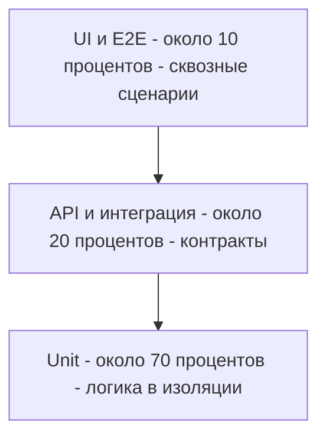
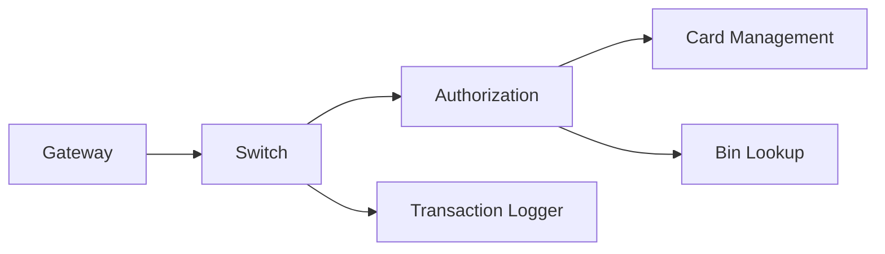
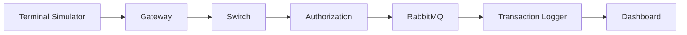
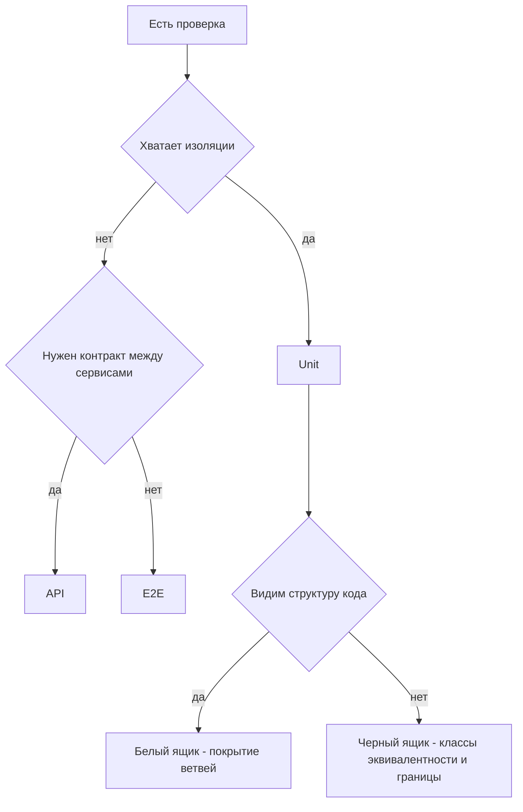
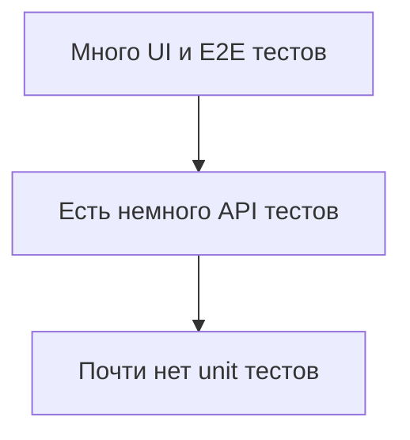
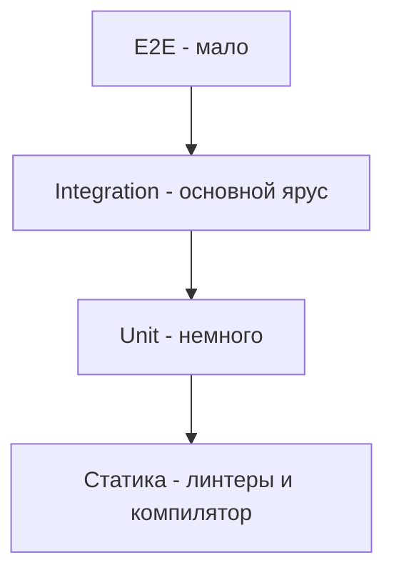
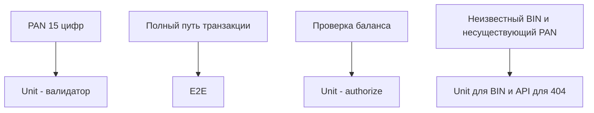

# Lecture 5: Пирамида тестирования — уровни, пропорции, антипаттерны

> **Модуль**: 3 — Пирамида тестирования и основы CI/CD
> **Лектор**: Вера Терентьева
> **Длительность**: 1 час 5 минут (65 мин)
> **Слайдов**: 16
> **Формат**: Markdown, каждый слайд — раздел `###`
> **Структура слайда**: Заголовок + 2–5 буллетов + блок **Визуализация** + speaker notes
> **Дата**: 13.08.2026
> **Литература**: см. [Источники](#источники) в конце файла
>
> **Соглашение о визуализации**: на каждом слайде есть блок **Визуализация** с описанием макета и рекомендацией по иллюстрации. Изображения пока только рекомендованы, имя файла и папка указаны условно; реальные файлы кладём в `Pictires/lecture-05/`. Диаграммы описаны кодом mermaid прямо в файле.

---

## Тайминг

| Время | Блок | Слайды | Назначение |
|:---:|---|:---:|---|
| 0:00–0:08 | Введение и мотивация | 1–2 | Зачем нужна модель распределения тестов |
| 0:08–0:26 | Уровни пирамиды | 3–6 | Unit, Service/API, UI/E2E — что и зачем |
| 0:26–0:34 | Тест-дизайн по уровням | 7 | Black-box / white-box / experience, методология выбора |
| 0:34–0:46 | Пропорции и экономика | 8–10 | 70/20/10, скорость обратной связи, стоимость поддержки |
| 0:46–0:57 | Антипаттерны и альтернативы | 11–13 | Ice-cream cone, Test Pyramid vs Testing Trophy |
| 0:57–1:05 | Практика и интерактив | 14–16 | Примеры СМП, вопросы аудитории, выводы |

---

### Слайд 1. Титульный

**Слайд:**
- Курс «Тестирование программного обеспечения»
- Модуль 3. Пирамида тестирования и основы CI/CD
- Лекция 5. Пирамида тестирования: уровни, пропорции, антипаттерны
- Лектор: Вера Терентьева, компания Lekton
- ИТМО, 4 курс

**Визуализация:**
- Макет: полноэкранный титульный фон, поверх него название лекции и имя лектора.
- Иллюстрация: `Pictires/lecture-05/img-1-cover.jpg` — титульный фон из брендового набора курса, тот же стиль, что в модулях 1 и 2.

**Speaker notes:**

> Добрый день, коллеги. Сегодня мы начинаем модуль 3, он называется «Пирамида тестирования и основы CI/CD». Наша лекция посвящена пирамиде. Мы разберемся, какие уровни тестирования бывают, в какой пропорции их писать и каких ошибок стараться избегать.
>
> Сразу договоримся: пирамида это не догма и не нормативный документ. Это экономическая модель. Она отвечает на очень практический вопрос. Как распределить ограниченное время и деньги на тестирование так, чтобы поймать максимум дефектов при минимальной стоимости.
>
> Мы посмотрим на классическую модель Test Pyramid, которую предложил Майк Кон, и на альтернативу, Testing Trophy Кента Доддса. И все это будем привязывать к нашему учебному проекту СМП, чтобы теория не висела в воздухе.

---

### Слайд 2. Проблема: регрессионное тестирование

**Слайд:**
- Регрессионное тестирование — проверка, что изменения не сломали существующую функциональность
- Код меняется постоянно: новые фичи, исправления багов, рефакторинг, обновление зависимостей
- Ручной регресс — самая дорогая и медленная часть тестирования
- В СМП 11 микросервисов + PostgreSQL + RabbitMQ: полный ручной регресс занимает дни
- Выход один — автоматизация, но автоматизировать всё тоже нельзя

**Визуализация:**
- Макет: слева крупная цифра или иконка «дни» на ручной регресс, справа короткая цепочка из микросервисов.
- Иллюстрация: `Pictires/lecture-05/img-2-regress.png` — метафора растущей стоимости ручной проверки при частых изменениях.
- Схема: компактная цепочка сервисов СМП, участвующих в одной транзакции.

**Speaker notes:**

> Давайте начнем с проблемы, из которой пирамида и выросла. Регрессионное тестирование проверяет, что наши изменения не сломали то, что работало раньше. Каждый коммит несет риск регрессии. Это может быть новая функциональность, исправление бага, рефакторинг, даже обновление библиотеки может что-то задеть.
>
> Почему сегодня это особенно острая проблема? Потому что скорость разработки выросла радикально. В современном CI/CD код мержится десятки раз в день. Если после каждого изменения гонять ручной регресс, разработка просто встанет.
>
> Давайте посчитаем на нашем СМП. Одиннадцать микросервисов, плюс PostgreSQL, плюс RabbitMQ. Синхронный путь выглядит так. Gateway валидирует и проксирует запрос, Switch маршрутизирует по BIN, Authorization проверяет карту, срок действия, лимиты и баланс, Card Management хранит карты и резервирует средства. Еще есть асинхронные цепочки через RabbitMQ: Switch публикует транзакцию для Transaction Logger, а Card Management через outbox-паттерн отправляет события карт в Notification Service. И плюс эмуляторы: Terminal Simulator, Merchant Acquirer, внешний Bin Lookup и веб-дашборд.
>
> В обработке одной транзакции задействован почти весь стек. Проверить все сценарии руками это два или три дня работы одного человека. При ежедневных изменениях это физически невозможно.
>
> Вывод простой: регресс нужно автоматизировать. Но тут есть важный нюанс, о котором часто забывают. Автоматизировать все тоже нельзя, потому что тесты различаются по стоимости и скорости. И вот здесь на сцену выходит пирамида.

---

### Слайд 3. Пирамида тестирования — происхождение и суть

**Слайд:**
- Mike Cohn, «Succeeding with Agile» (2009) — первая популярная формулировка Test Pyramid
- Идея не нова: ISTQB выделяет уровни Component → Integration → System → Acceptance
- Пирамида переводит академические уровни в экономическую метафору
- Три уровня: Unit, Service/API/Integration, UI/E2E
- Внимание: уровень (масштаб) и категория техники (black-box / white-box / experience) — две разные оси
- Главное правило: чем выше уровень, тем меньше тестов

**Визуализация:**
- Макет: слева пирамида с подписями уровней, справа короткая заметка про две оси. Пирамида занимает примерно половину слайда.
- Диаграмма: mermaid-пирамида ниже.
- Иллюстрация: `Pictires/lecture-05/img-3-pyramid-hero.png` — стилизованная пирамида с подписями процентов, если хочется красивую графику вместо mermaid.

**Speaker notes:**

> Test Pyramid в современном виде популяризовал Майк Кон в книге «Succeeding with Agile» в 2009 году. Но сама идея уровней не новая. Стандарт ISTQB выделяет компонентное, интеграционное, системное и приёмочное тестирование. Кон сделал важный шаг: он перевел академическую классификацию в экономическую метафору.
>
> Представьте пирамиду. Внизу широкое основание, там много дешевых и быстрых тестов. Наверху узкая вершина, там мало дорогих и медленных тестов. Почему именно пирамида, а не цилиндр или куб? Потому что тесты на разных уровнях различаются по стоимости написания и по скорости обратной связи. Экономически выгодно писать много дешевых и мало дорогих.
>
> Сразу задам вам вопрос. Как вы думаете, почему E2E тестов должно быть мало? Подумайте про три параметра: скорость, стабильность и стоимость поддержки. Мы зафиксируем ответ к концу блока об уровнях.
>
> И еще одно важное разграничение, которое я хочу ввести прямо сейчас. Пирамида это про масштаб проверки, то есть сколько кода задействовано. Но есть вторая, независимая ось. Это источник информации, из которого тестировщик берет свои проверки. Источником может быть спецификация, это черный ящик. Может быть структура кода, это белый ящик. А может быть опыт тестировщика, это эвристические техники. В модуле 2 мы эти три категории уже разобрали, и сегодня на отдельном слайде свяжем их с уровнями. Потому что «unit» и «белый ящик» это не одно и то же, хотя их постоянно путают.

---

### Слайд 4. Уровень 1: Unit-тесты

**Слайд:**
- Проверяют одну единицу кода в изоляции: метод, функцию, класс
- Выполняются за миллисекунды, не зависят от сети и базы данных
- Точная локализация дефекта: упавший тест указывает на конкретную строку
- Пример СМП: Gateway `TransactionRequestValidator.validate()` — mti=«0100», PAN `\d{16}`, amount > 0, длина currencyCode=3, mcc `\d{4}`
- Пример СМП: Switch `RoutingService.getIssuerIdByPan()` и Authorization `AuthServiceImpl.authorize()` — BIN, статус карты, срок, лимиты, баланс
- Unit можно проектировать и по спецификации метода (чёрный ящик), и по структуре кода (белый ящик) — категорию задаёт источник информации, а не уровень
- Порядок проверок в наборе: сначала валидное значение (позитивный класс), затем границы и невалидные классы

**Визуализация:**
- Макет: слева код метода и список проверяемых полей, справа иконка IDE с зеленым прогоном тестов.
- Иллюстрация: `Pictires/lecture-05/img-4-unit.png` — скриншот IDE с зелеными unit-тестами и таймингом в миллисекундах.
- Акцент: вынести на слайд две маленькие плашки «stub: что вернуть» и «mock: был ли вызван».

**Speaker notes:**

> Первый уровень, самый нижний, это unit-тесты. Они проверяют одну единицу кода в полной изоляции. В Java это обычно один метод или один класс. Все внешние зависимости при этом заменяются тестовыми двойниками.
>
> Про тестовые двойники скажу коротко, детали будут в модуле 4. Тестовый двойник это объект-заменитель, который встает на место реальной зависимости. Чаще всего используют два вида. Stub просто возвращает заранее заданное значение, он отвечает на вопрос «что вернуть». Mock записывает вызовы и позволяет проверить, что с ним взаимодействовали, он отвечает на вопрос «был ли вызван». Различие тонкое, но важное, и на практике мы разберем его с Mockito.
>
> Unit-тесты выполняются за миллисекунды. Тысяча таких тестов прогоняется за секунды. Отсюда два больших преимущества. Первое, это скорость обратной связи: разработчик меняет код и сразу видит результат прямо в IDE. Второе, это точность локализации: упавший unit-тест указывает на конкретную функцию и строку, а не на что-то размытое в цепочке из пяти сервисов.
>
> Посмотрим на примеры из СМП. В Gateway есть класс [`TransactionRequestValidator`](../Practic-SMP/services/gateway/src/main/java/com/processing/gateway/validation/TransactionRequestValidator.java:21) с методом `validate()`. Он проверяет поля контракта авторизации: `mti` строго «0100», `pan` ровно 16 цифр, `amount` больше нуля, `currencyCode` ровно 3 символа, `mcc` ровно 4 цифры, плюс обязательные `stan`, `terminalId`, `merchantId`. При нарушении метод бросает исключение. Это чистая логика валидации, и к ней прекрасно применимы техники из модуля 2. Для `pan` мы выделяем классы эквивалентности: валидный это ровно 16 цифр, невалидный это любая другая длина. Для длины берем граничные значения: 15 и 17 цифр. Так один валидатор раскладывается на десяток тестов, каждый проверяет один класс или одну границу.
>
> В Authorization есть [`AuthServiceImpl`](../Practic-SMP/services/authorization/src/main/java/com/processing/authorization/services/AuthServiceImpl.java:43) с методом `authorize()`, и это самая насыщенная бизнес-логика в СМП. Порядок проверок строго определен: сначала получить карту, потом проверить статус, потом срок действия, потом достаточность баланса, и только затем резервирование. Каждая ветка отказа упакована в enum [`DeclineOutcome`](../Practic-SMP/services/authorization/src/main/java/com/processing/authorization/constants/DeclineOutcome.java:30), где на каждую причину есть свой ISO-код. То есть тест-дизайн здесь это перечисление всех веток алгоритма, и для каждой ветки уже есть готовое ожидаемое значение.
>
> И последнее, что я хочу здесь подчеркнуть. Unit можно проектировать двумя способами. Если мы берем требование к методу из спецификации и не смотрим в код, это черный ящик. Если мы открываем реализацию и требуем покрытия всех ветвей, это белый ящик. Категорию задает источник информации, а не сам уровень.
>
> И еще одно правило, которое задает порядок работы с любым набором тестов. Сначала мы пишем и проверяем позитивный сценарий, и только потом негативный. Это правило введено в модуле 2 на слайде «Будьте позитивны!», и оно будет повторяться на каждом уровне. Смысл простой. Негативная проверка имеет ценность только тогда, когда основной сценарий уже подтвержден рабочим. Если валидатор не пропускает даже корректный запрос, то его отказ на PAN из 15 цифр ничего не доказывает. Поэтому в наборе первым идет тест с валидным PAN из 16 цифр, а уже потом границы и невалидные классы.

---

### Слайд 5. Уровень 2: Service/API/Integration-тесты

**Слайд:**
- Проверяют взаимодействие компонентов через реальные интерфейсы, без UI
- HTTP API, база данных, очереди сообщений
- Быстрее E2E, медленнее unit (сотни миллисекунд)
- Проверяют контракты: форматы запросов и ответов, статус-коды
- Пример СМП: внутренние контракты `/api/internal/route` и `/api/internal/authorize`, формат AuthorizationRequest/AuthorizationResponse, статус-коды 200/400/503
- Порядок проверок: сначала позитивный сценарий (200 / APPROVED), затем негативные — правило «сначала позитив, потом негатив» из модуля 2 (лекция 3, слайд «Будьте позитивны!»)

**Визуализация:**
- Макет: схема контрактов между сервисами по центру, справа пример запроса и ответа.
- Диаграмма: цепочка контрактов СМП ниже.
- Иллюстрация: `Pictires/lecture-05/img-5-api.png` — иконки сервисов со стрелками HTTP между ними.

**Speaker notes:**

> Второй уровень, это сервисные, или API-интеграционные тесты. Они проверяют, что компоненты правильно общаются друг с другом через реальные интерфейсы. Через HTTP, через базу данных, через очереди сообщений. Но без пользовательского интерфейса и без полной картины системы.
>
> Ключевой вопрос этого уровня звучит так: правильно ли сервис A вызывает сервис B? В микросервисной архитектуре это критично, потому что каждый сервис живет отдельно и общается с другими через контракты. Контракт это формальное соглашение о формате запросов и ответов. Подробно мы разберем контракты в лекции 9 модуля 5.
>
> В СМП таких контрактов много. Внутренние эндпоинты описаны в спецификации: `POST /api/internal/route` у Switch и `POST /api/internal/authorize` у Authorization. Оба принимают `AuthorizationRequest` и возвращают `AuthorizationResponse`. Дальше по цепочке: Gateway вызывает Switch, правильно ли валидирован и проксирован JSON. Switch вызывает Authorization, верно ли извлечен BIN из первых шести цифр PAN. Authorization обращается к Card Management за картой и к Bin Lookup за issuerId. А Switch отправляет транзакцию в Transaction Logger уже асинхронно, через RabbitMQ.
>
> Тест-дизайн на этом уровне строится иначе, чем на unit. Здесь центральное место занимают позитивные и негативные сценарии. Позитивный сценарий: отправляем валидный запрос и проверяем корректный ответ, статус-код 200 и правильное тело. Негативные сценарии бывают двух видов. Первый это ошибки валидации, когда данные неверны и мы ждем 400. Второй это бизнес-отказы, когда запрос корректен, но карта, например, заблокирована, и мы ждем 200 со статусом DECLINED. Плюс отдельно проверяем статус-коды как измерение: на каждый код из контракта свой тест. Подробно это будет в лекциях 9 и 10 модуля 5.
>
> Здесь же закрепим порядок проверок. Сначала позитивный сценарий: отправляем валидный `AuthorizationRequest`, ждем 200 и корректный ответ со статусом APPROVED. И только убедившись, что happy path зеленый, начинаем ломать систему негативными данными. Почему такой порядок важен? Потому что при красном позитивном тесте любые 400 и DECLINED просто неинформативны. Система может отклонять вообще все, и мы не поймем, работает ли валидация и бизнес-логика. Это правило из модуля 2, и в модуле 5 мы применим его к API.
>
> И в целом API-тесты это золотая середина автоматизации. Они достаточно быстрые, сотни миллисекунд на тест, достаточно надежные, потому что зависимости контролируются, и при этом покрывают реальные интеграционные риски, которых unit-тесты не видят.

---

### Слайд 6. Уровень 3: UI/E2E-тесты

**Слайд:**
- Проверяют систему целиком через пользовательский интерфейс или полный путь
- Самые медленные (секунды и минуты) и самые нестабильные
- Самые дорогие в поддержке: любое изменение UI или данных ломает тест
- Проверяют то, что не ловится ниже: сквозные бизнес-сценарии
- Пример СМП: Terminal Simulator → Gateway → Switch → Authorization (+ Bin Lookup, Card Management) → RabbitMQ → Transaction Logger → Dashboard

**Визуализация:**
- Макет: горизонтальная цепочка сервисов на всю ширину слайда, над ней подпись «один сквозной сценарий».
- Диаграмма: путь транзакции ниже.
- Иллюстрация: `Pictires/lecture-05/img-6-e2e.png` — та же цепочка, но в виде красивой схемы с иконками, если нужна графика вместо mermaid.

**Speaker notes:**

> Третий уровень, это E2E-тесты, то есть end-to-end, сквозные. Они проверяют систему целиком, от входа до выхода. Это самые медленные, самые нестабильные и самые дорогие в поддержке тесты.
>
> Почему они нестабильные? Потому что E2E-тест зависит от всего сразу. От сети, от базы данных, от состояния всех сервисов, от таймингов, от параллельно запущенных тестов. Любой сбой в любом звене дает ложное падение. В индустрии это называют flaky-тестами, то есть тестами, которые падают случайно, а не из-за реального бага. Команды могут тратить до двадцати процентов времени на их починку.
>
> Пример из СМП. Terminal Simulator отправляет запрос авторизации на `POST /api/transactions`. Gateway его валидирует, Switch маршрутизирует по BIN, Authorization обогащает данные из Bin Lookup и проверяет карту в Card Management, при одобрении резервирует средства. А результат асинхронно уходит через RabbitMQ в Transaction Logger, откуда его подхватывает веб-дашборд. Мы проверяем финальное состояние: ответ клиенту, запись в логе и изменение баланса. Весь путь может занимать секунды, а запись в лог появляется с задержкой, потому что у нас есть eventual consistency.
>
> Тест-дизайн здесь отталкивается от бизнес-сценариев, а не от классов входных данных. Мы задаем вопрос: какие сквозные сценарии критичны для бизнеса и их нельзя проверить на нижних уровнях? В СМП это успешная покупка полным путем, отклонение по недостатку средств и отклонение по заблокированной карте. Таких сценариев немного, поэтому и E2E-тестов немного. Трехзвенную проверку, когда мы сверяем ответ, запись в логе и баланс, мы подробно разберем в модуле 7.
>
> И процитирую ISTQB, который отдельно подчеркивает: зависимость от окружения это одна из главных проблем тестирования. Поэтому E2E-тесты нужны, но их должно быть мало, только критичные бизнес-сценарии.

---

### Слайд 7. Тест-дизайн по уровням: black-box, white-box, experience

**Слайд:**
- Две ортогональные оси: **масштаб** (пирамида: unit → API → E2E) и **источник информации** (ISTQB: specification-based / structure-based / experience-based)
- Чёрный ящик (specification-based) — проверяем по спецификации, не глядя в код
- Белый ящик (structure-based) — проверяем по структуре кода: ветви, условия, пути; измеряем покрытие
- Серый ящик (grey-box) — частичное знание внутренностей (схема БД, формат очереди); типично для интеграционных тестов
- Unit ≠ автоматически white-box, API ≠ автоматически black-box: категория зависит от источника информации, а не от уровня
- Покрытие кода — метрика white-box; осмысленна прежде всего на unit (детали — модуль 4)

| Уровень | Категория (источник) | Основные техники | Пример СМП |
|---|---|---|---|
| Unit | structure-based, частично specification-based | покрытие ветвей, условий, путей; КЭ и ГЗ на параметры метода | ветки `AuthServiceImpl.authorize()`, `TransactionRequestValidator.validate()` |
| Service/API | specification-based (black-box) | КЭ, ГЗ, таблицы решений, проверка статус-кодов, позитив/негатив | `POST /api/transactions`, `GET /api/cards/{pan}` |
| E2E | black-box + experience-based | сценарии бизнес-процессов, state-transition, исследовательское тестирование | Terminal Simulator → Gateway → Switch → Authorization → Transaction Logger |

**Визуализация:**
- Макет: сверху схема выбора, снизу таблица уровней и техник.
- Диаграмма: дерево выбора уровня и категории ниже.
- Иллюстрация: `Pictires/lecture-05/img-7-two-axes.png` — две перпендикулярные оси: по одной масштаб, по другой источник информации.

**Speaker notes:**

> До того как перейти к пропорциям, давайте зафиксируем методологию. Как выбирать, чем проверять каждый уровень. В модуле 2 мы разобрали три категории техник по источнику информации: спецификация, структура кода и опыт. Теперь свяжем их с пирамидой.
>
> Ключевая мысль такая. У нас две независимые оси. Первая ось это масштаб, ее задает пирамида: unit, API, E2E. Вторая ось это источник информации, ее задают категории ISTQB. Их нельзя смешивать. Пирамида отвечает на вопрос «какой масштаб проверки». А black-box и white-box отвечают на другой вопрос: откуда тестировщик берет информацию для проверки.
>
> Разберем первое заблуждение: будто unit-тест это всегда белый ящик, а API-тест это всегда черный ящик. Это неверно. Unit-тест метода `validate()` можно спроектировать по спецификации метода, тогда мы не смотрим в реализацию и остаемся в черном ящике. А можно пойти по ветвям кода и потребовать покрытия всех условий, тогда это белый ящик. Точно так же на уровне API мы почти всегда в черном ящике, потому что кода потребителя не видим, но метрику покрытия внутри сервиса измеряют отдельно. Категорию определяет источник информации, а не уровень пирамиды.
>
> Второе, про серую зону, это grey-box. Так называют частичное знание внутренностей. Типичный пример это интеграционный тест, где мы знаем схему базы данных или формат сообщения в очереди, потому что сами их и готовим, но при этом не знаем, как сервис устроен внутри. Ровно этот режим будет в модуле 6, когда вы будете поднимать PostgreSQL и RabbitMQ в контейнерах и проверять реальное состояние базы после запроса. Формально для HTTP-интерфейса это черный ящик, а для хранилища белый. Поэтому и говорят «серый».
>
> Третье, про покрытие. Покрытие кода, будь то строки, ветви, условия, пути или мутации, это инструмент белого ящика, и его ценность максимальна именно на unit-уровне. На API- и тем более на E2E-уровне покрытие кода почти ничего не говорит. Вы исполняете огромный объем кода, но не знаете, проверены ли конкретные ветки. Там покрытие считают не по строкам, а по требованиям и контрактам. Детали метрик мы разберем в модуле 4, во второй лекции. А здесь важно запомнить принцип: не всякая метрика применима на каждом уровне.
>
> Посмотрим на таблицу. Unit: основа это белый ящик, мы покрываем ветви authorize, там статус карты, срок, лимиты, баланс. Но контракт самого метода удобно проектировать и по спецификации. API: это чистый черный ящик по спецификации, классы эквивалентности и границы полей, таблицы решений для комбинаций условий, проверка статус-кодов, позитив и негатив. E2E: это черный ящик плюс опыт, то есть сквозные бизнес-сценарии, переходы состояний и исследовательское тестирование там, где документация молчит.
>
> И отсюда главный методический вывод, который связывает всю лекцию. Сначала мы выбираем уровень, самый низкий, который адекватно проверяет сценарий. Потом источник информации: есть ли спецификация, есть ли доступ к структуре кода. И только потом конкретную технику из модуля 2. То есть пирамида это не про количество тестов, а про метод: где и по какому источнику проверять.
>
> Вопрос к вам. Тест `TransactionRequestValidator` на PAN из 15 цифр, это черный или белый ящик? Если вы взяли требование «16 цифр» из спецификации, это черный ящик. Если вы посмотрели на регулярку в коде, это уже белый ящик. Мыслительный инструмент один, а источник информации разный, и это меняет способ проверки.

---

### Слайд 8. Пропорции: правило 70/20/10

**Слайд:**
- Классическая рекомендация Cohn: около 70% unit, 20% service/integration, 10% E2E
- Это ориентир, а не жёсткая догма
- Enterprise с плотными интеграциями: доля service-тестов может вырасти до 30–40%
- Стартап с простым бэкендом и сложным UI: риск скатиться в ice-cream cone
- Важнее процентов принцип: каждый сценарий на самом низком возможном уровне

**Визуализация:**
- Макет: слева круговая или столбчатая диаграмма 70/20/10, справа короткая заметка про контекст.
- Иллюстрация: `Pictires/lecture-05/img-8-proportions.png` — диаграмма пропорций с подписями уровней.

**Speaker notes:**

> Теперь о пропорциях, ради которых пирамида и существует. Майк Кон предложил ориентир: около семидесяти процентов unit-тестов, двадцать процентов сервисных и интеграционных, и десять процентов E2E. Повторю, это ориентир, а не догма.
>
> Реальность зависит от контекста. В enterprise-проектах вроде Lekton, где микросервисов много и контракты плотные, доля сервисных тестов может быть выше, вплоть до тридцати или сорока процентов, потому что именно там живут основные интеграционные риски. А в стартапе с простым бэкендом и сложным интерфейсом есть риск уйти в другую крайность и написать слишком много E2E. Это антипаттерн, мы разберем его через пару слайдов.
>
> И важное замечание с точки зрения тест-дизайна. Пропорции это результат приоритизации. Мы же не пишем все возможные тесты. Мы выбираем, какие проверки дают максимум информации о качестве за минимум ресурсов. Это тот же принцип, что в модуле 2 при выборе классов эквивалентности: не перебираем все, а отбираем представительные случаи. Только здесь отбор идет по уровню. Каждый сценарий тестируйте на самом низком уровне, который способен его адекватно проверить. Нужна только логика, это unit. Нужен контракт между сервисами, это API. Нужна вся цепочка, это E2E.

---

### Слайд 9. Экономика: скорость обратной связи

**Слайд:**
- Unit-тест: 10–100 мс → результат за секунды
- API-тест: 100–500 мс → результат за минуты
- E2E-тест: 1–30 сек → результат за десятки минут
- Правило 1:10:100: дефект дешевле ловить раньше
- Психология: разработчик в потоке, пять минут ожидания срывают контекст

**Визуализация:**
- Макет: горизонтальная логарифмическая шкала времени, на ней три отметки по уровням.
- Иллюстрация: `Pictires/lecture-05/img-9-feedback.png` — шкала от миллисекунд до минут с иконками уровней.

**Speaker notes:**

> Почему пропорции именно такие? Давайте посмотрим на скорость обратной связи. Это первая половина экономики пирамиды.
>
> Unit-тест выполняется за десять или сто миллисекунд. Тысяча unit-тестов это секунды. Разработчик меняет код и видит результат немедленно. API-тест это уже сто или пятьсот миллисекунд плюс время на поднятие контекста и тестовых данных. Сотни API-тестов это минуты. А E2E-тест это секунды или даже минуты на один тест, плюс поднятие всего окружения. Сотни E2E-тестов это уже десятки минут или часы.
>
> Вспомним правило один к десяти к ста из лекции 1. Дефект, пойманный на unit-уровне, стоит условную единицу. На интеграционном уже десять. На E2E сто. А в продакшне тысячу. То есть скорость обратной связи напрямую определяет стоимость дефекта.
>
> Есть и психологический фактор. Разработчик работает в состоянии потока. Если тесты идут двадцать минут, он переключится на другую задачу и потеряет контекст. А обратная связь за секунды поддерживает концентрацию.
>
> И заметьте, скорость обратной связи это мостик к следующей лекции. В лекции 6 мы увидим, как скорость тестов определяет, в какой части CI/CD-пайплайна они запускаются. Быстрые на каждом коммите, медленные раз в сутки.

---

### Слайд 10. Экономика: стоимость поддержки

**Слайд:**
- Unit-тест меняется только при изменении логики метода
- API-тест меняется при изменении контракта (формат запросов и ответов)
- E2E-тест меняется при любом изменении — UI, контракта, данных, таймингов
- Парадокс пестицида: тесты требуют регулярного обновления
- Чем выше уровень, тем выше стоимость сопровождения

**Визуализация:**
- Макет: три столбика «что ломает тест» по уровням, от узкого к широкому.
- Иллюстрация: `Pictires/lecture-05/img-10-maintenance.png` — график роста стоимости сопровождения с высотой уровня.

**Speaker notes:**

> Вторая половина экономики это стоимость поддержки. Тесты, которые вы написали, нужно сопровождать весь срок жизни проекта.
>
> Unit-тест привязан к конкретному методу. Если метод не трогали, тест живет годами. API-тест привязан к контракту. Переименовали поле в JSON-ответе, и тест упал. Это происходит чаще. А E2E-тест привязан ко всей цепочке: изменение в любом сервисе, в интерфейсе, в таймингах, в данных может его сломать. И каждый раз инженер разбирается, это реальный баг или тест пора обновить.
>
> Здесь уместно вспомнить парадокс пестицида из принципов ISTQB. Одни и те же тесты со временем перестают находить новые баги, их нужно обновлять. И чем выше уровень теста, тем дороже это обновление.
>
> Вывод для практики такой. Пишите E2E-тест только тогда, когда сценарий действительно нельзя проверить ниже. Каждый лишний E2E-тест это долг по сопровождению на годы вперед.

---

### Слайд 11. Антипаттерн: ice-cream cone

**Слайд:**
- Перевёрнутая пирамида: много E2E/UI-тестов, мало unit-тестов
- Причина: команда начинает автоматизацию «сверху», ручные тестировщики переходят в автоматизацию через UI
- Симптом: «200 E2E-тестов, идут 45 минут, 15 из них flaky»
- Последствия: медленный CI, потеря доверия к тестам, дорогая поддержка
- Лечение: постепенный перенос проверок вниз по пирамиде

**Визуализация:**
- Макет: перевернутая пирамида рядом с правильной, для контраста.
- Диаграмма: mermaid ниже.
- Иллюстрация: `Pictires/lecture-05/img-11-icecream.png` — рожок мороженого как метафора перевернутой пирамиды.

**Speaker notes:**

> Теперь про антипаттерны. Самый частый из них это ice-cream cone, то есть перевернутая пирамида. Много E2E-тестов и мало unit-тестов. Выглядит как рожок мороженого: широкая вершина и узкое основание.
>
> Как это обычно происходит? Типичная история. В компании есть ручные тестировщики. Руководство говорит: давайте автоматизировать. И начинают с интерфейса, потому что это то, что ручные тестировщики видят каждый день. Они пишут Selenium-скрипты, повторяющие ручные сценарии. Получается двести E2E-тестов. Они идут сорок пять минут. Пятнадцать из них падают не по делу. И команда перестает доверять CI: «красный билд, ну это опять flaky, не обращаем внимания». Автоматизация перестает работать как сигнал качества.
>
> Лечение это постепенный перенос проверок вниз. То, что кнопка «Отправить» вызывает `POST /api/transactions`, проверяется unit-тестом контроллера. То, что транзакция с отрицательной суммой отклоняется, это unit-тест валидатора. А E2E оставляет только проверку сквозного сценария.
>
> Вопрос к вам. Почему начать автоматизацию с интерфейса так заманчиво для бизнеса, если это экономически невыгодно? Подумайте пару секунд.
>
> Ответ такой. UI-тесты наглядны. Они показывают, что система кликается и все работает. Это легко продемонстрировать руководству и заказчику. А дешевые unit-тесты невидимы, они не дают красивой картинки. К тому же ручные тестировщики, переходя в автоматизацию, переносят свои привычные сценарии из интерфейса почти без изменений. Проблема в том, что эта наглядность дорого стоит. Каждый UI-тест это часы сопровождения в будущем, а суммарный прогон замедляет CI до часов. Хорошая метафора здесь: быстрый старт с долгим торможением.

---

### Слайд 12. Альтернатива: Testing Trophy

**Слайд:**
- Kent C. Dodds, «Write tests. Not too many. Mostly integration» (2018)
- Testing Trophy: фокус на integration-тестах как основном уровне
- Аргумент: unit-тесты проверяют реализацию, а не поведение
- Слишком много unit → хрупкие тесты мешают рефакторингу (brittle tests)
- Статика (линтеры, компилятор, TypeScript) — дешёвая замена части unit-проверок

**Визуализация:**
- Макет: кубок из четырех ярусов, подписи справа.
- Диаграмма: mermaid ниже.
- Иллюстрация: `Pictires/lecture-05/img-12-trophy.png` — стилизованный кубок Testing Trophy.

**Speaker notes:**

> Есть и альтернативный взгляд, это Testing Trophy Кента Доддса, специалиста по тестированию фронтенда. Его манифест звучит так: пишите тесты, не слишком много, в основном интеграционные.
>
> Форма это кубок. Внизу узкое основание из статических проверок: линтеры, компилятор. В середине широкий ярус из интеграционных тестов. А сверху узкая вершина E2E и небольшая прослойка unit.
>
> Главный аргумент Доддса против перекоса в unit звучит так: unit-тесты проверяют реализацию, а не поведение. Хороший рефакторинг, когда внутренняя структура изменилась, а поведение осталось тем же, может сломать десятки unit-тестов. Это так называемые хрупкие, brittle-тесты, которые мешают рефакторингу, а не помогают. Доддс предлагает сместить фокус на интеграционные тесты, которые проверяют поведение. А тривиальные ошибки ловит статика: линтеры, компилятор, система типов.
>
> Важно понимать, что Trophy не выступает против пирамиды. Это уточнение для определенного контекста. Для enterprise-микросервисов integration в Trophy это как раз API- и контрактные тесты между сервисами. Обе модели сходятся в главном: E2E-тестов должно быть мало.
>
> И отдельно предупрежу про терминологическую ловушку. В Testing Trophy слово integration означает, что компоненты собраны вместе рядом, но обычно без реальной базы данных и сети. Фактически это тесты поведения. А в нашем курсе интеграционное тестирование, модуль 6, это другое: реальная база данных в контейнере, реальные зависимости, реальная очередь. Одинаковое слово, но разные смыслы. Поэтому, читая Trophy, не переносите автоматически его integration на модуль 6.

---

### Слайд 13. Test Pyramid vs Testing Trophy — сравнение

**Слайд:**
- Pyramid: 70% unit / 20% integration / 10% E2E — фокус на дешёвой изоляции
- Trophy: статика в основании, integration в центре, мало unit и E2E — фокус на поведении
- Общее: E2E всегда мало, обратная связь всегда быстрая
- Различие: сколько unit и насколько доверять статике
- Правило выбора: монолит с чистой бизнес-логикой → Pyramid; микросервисы и фронтенд → ближе к Trophy
- Терминология: «integration» в Trophy (компоненты вместе, без реальных зависимостей) ≠ «интеграционное тестирование» в модуле 6 (БД и зависимости в контейнерах)

**Визуализация:**
- Макет: две фигуры бок о бок, слева пирамида, справа кубок, под ними строка «общее» и строка «различие».
- Иллюстрация: `Pictires/lecture-05/img-13-pyramid-vs-trophy.png` — обе модели рядом для прямого сравнения.

**Speaker notes:**

> Давайте сведем две модели вместе. Test Pyramid: семьдесят процентов unit, двадцать интеграционных, десять E2E. Логика в том, чтобы получить максимум дешевых изолированных проверок. Testing Trophy: в основании статика, в центре интеграционные тесты, а unit и E2E меньше. Логика в том, чтобы получить максимум проверок поведения, а не реализации.
>
> Что у них общего? Обе модели согласны в двух пунктах. Первое, E2E-тестов всегда мало. Второе, обратная связь должна быть быстрой. А спор идет только о том, сколько писать unit-тестов и насколько доверять статическому анализу.
>
> Как выбирать? Если у вас монолит с тяжелой бизнес-логикой, классическая пирамида работает отлично, unit-тесты дешевы и точны. Если это микросервисы с тонкой логикой и плотными контрактами, или фронтенд, то ближе Trophy, потому что интеграционные и контрактные тесты дают больше пользы на единицу стоимости.
>
> В нашем СМП мы используем гибрид. Тяжелую бизнес-логику Authorization и валидацию Gateway покрываем unit-тестами, как в пирамиде. А контракты между сервисами покрываем API-тестами, как в Trophy. Конкретные примеры этих контрактов разберем в модуле 5.

---

### Слайд 14. Как это работает в реальных компаниях

**Слайд:**
- Google: таксономия Small/Medium/Large — 80% Small (unit), 15% Medium (integration), 5% Large (E2E) [Winters et al., 2020]
- Google: Small-тесты на pre-commit (секунды), Medium — в CI (минуты), Large — nightly (часы)
- Lekton: Unit → Модульные (Java) → Интеграционные (малые контура) → E2E+Системное (объединённый контур) → Клиентские конфигурации
- Общее правило: группировка тестов по времени выполнения
- Pre-commit: только unit. CI: unit + integration. Nightly: E2E + нагрузочные

**Визуализация:**
- Макет: две колонки, слева Google, справа Lekton, одинаковая структура уровней.
- Иллюстрация: `Pictires/lecture-05/img-14-companies.png` — сопоставление таксономий Google и Lekton.

**Speaker notes:**

> Давайте посмотрим, как это устроено в реальных компаниях. Google в книге «Software Engineering at Google» описывает трехуровневую таксономию. Small, это unit, около восьмидесяти процентов. Medium, это интеграция, около пятнадцати. Large, это E2E, около пяти процентов. При этом Small-тесты обязаны проходить за секунды и запускаются на pre-commit, до отправки кода в репозиторий. Medium идут в CI, это минуты. А Large в ночном прогоне, это часы.
>
> В Lekton структура похожая. Unit-тесты пишут разработчики. Модульные тесты полностью автоматизированы на Java. Интеграционные идут на малых контурах. E2E и системное тестирование на объединенном контуре. И отдельно тестирование клиентских конфигураций, потому что каждый банк настраивает систему под себя.
>
> Общее правило индустрии такое: тесты группируются по времени выполнения. Pre-commit это только unit, секунды. CI-пайплайн это unit плюс integration, минуты. Ночной прогон это E2E плюс нагрузочные, десятки минут. Вот это и есть пирамида в действии. Не просто «много unit и мало E2E», а грамотное распределение по скорости. Детально CI/CD-пайплайн мы разберем на следующей лекции.

---

### Слайд 15. Интерактив: распределение сценариев по уровням

**Слайд:**
- Сценарий 1: PAN из 15 цифр отклоняется Gateway — `TransactionRequestValidator` бросает `TransactionValidationException` (HTTP 400)
- Сценарий 2: транзакция на 150000 (1500 ₽) проходит путь Terminal Simulator → Gateway → Switch → Authorization → Logger и оставляет запись в поиске
- Сценарий 3: Authorization проверяет достаточность баланса: `amount ≤ availableBalance`
- Сценарий 4: Switch на неизвестный BIN бросает `UnknownBinException` → DECLINED, responseCode 14; Card Management на несуществующий PAN — 404
- Вопрос: на каком уровне тестировать каждый сценарий и почему?
- Критерий ответа: назвать уровень, категорию (black-box / white-box / experience) и порядок проверок (сначала позитив, затем негатив)

**Визуализация:**
- Макет: четыре карточки сценариев в два ряда, под ними пустое поле для ответов студентов.
- Диаграмма: разбор соответствия сценариев уровням ниже, показывать по щелчку.
- Иллюстрация: `Pictires/lecture-05/img-15-interactive.png` — пирамида, куда студенты приклеивают сценарии.

**Speaker notes:**

> Теперь ваша очередь. Вот четыре сценария из СМП. Скажите, на каком уровне пирамиды их тестировать. И не только уровень: рассуждайте через тест-дизайн, какие входные данные возьмете, что именно проверите и какие шаги выполните. После обсуждения я дам эталонные ответы.
>
> Сценарий 1, PAN из 15 цифр. Это валидация входных данных, то есть чистая логика. Уровень unit, тест метода `validate()` класса [`TransactionRequestValidator`](../Practic-SMP/services/gateway/src/main/java/com/processing/gateway/validation/TransactionRequestValidator.java:21). Конкретно: создаем запрос с PAN из 15 цифр и валидными остальными полями, вызываем `validate()`, ожидаем исключение с сообщением про PAN. Никакого HTTP и Spring-контекста, тест работает за миллисекунды. И вспомните граничные значения: 15 цифр это нижняя граница невалидного класса. Хорошо дополнить тестом на 17 цифр.
>
> Сценарий 2, полный путь транзакции. Это E2E. Нужен весь контур. Terminal Simulator отправляет `POST /api/transactions`, запрос проходит Gateway, Switch, Authorization с обращениями к Bin Lookup и Card Management, при одобрении средства резервируются, а результат асинхронно попадает в Transaction Logger. Здесь тест-дизайн другой: мы не изолируем компоненты, а наоборот, проверяем их связность. Шаги: поднять стек через `docker compose up -d`, отправить транзакцию, дождаться записи в лог и сверить статус. Это самый дорогой тест, поэтому таких тестов немного, только критичные бизнес-сценарии.
>
> Сценарий 3, проверка достаточности баланса. Это чистая бизнес-логика внутри Authorization. Уровень unit, тест `authorize()`. Подменяем клиент Card Management заглушкой, которая возвращает карту с известным балансом, вызываем метод и проверяем исход. Через граничные значения: баланс ровно равен сумме, это граница одобрения, и баланс на копейку меньше, это граница отказа с исходом INSUFFICIENT_FUNDS. При отказе важно убедиться, что метод резервирования не вызывался, а это проверяется на моке.
>
> Сценарий 4 разбивается на два уровня. Неизвестный BIN: если первых шести цифр нет в bin-таблице Switch, [`RoutingService.getIssuerIdByPan()`](../Practic-SMP/services/switch/src/main/java/com/processing/service/RoutingService.java:30) бросает `UnknownBinException`, это unit-тест чистой логики. А HTTP 404 на несуществующий PAN от Card Management это уже API-тест: поднимаем сервис, делаем `GET /api/cards/{pan}` и проверяем статус-код и тело ответа. Почему не unit? Потому что нам важен контракт, статус-код и формат ответа, а не только логика. Это хороший пример того, как один сценарий живет на двух уровнях пирамиды.
>
> И расширенный критерий ответа. Я буду ждать от вас еще две вещи. Первое, категорию по источнику информации: это проверка по спецификации, по структуре кода или по опыту. Например, сценарий 1 можно решить и как черный ящик, взяв границу 15 из требования, и как белый ящик, глядя на регулярку в коде. Полезно, чтобы вы называли, каким источником пользуетесь. Второе, порядок проверок. В наборе позитивный сценарий должен идти первым. Поэтому спрошу: а какой тест вы напишете самым первым и почему? Правильный ответ: валидный сценарий, то есть успешную авторизацию или корректный запрос, потому что без него негативные проверки неинформативны.

---

### Слайд 16. Выводы и анонс

**Слайд:**
- Пирамида — экономическая модель, а не догма
- Уровни: unit (быстро, изолированно), API (контракты), E2E (сквозные сценарии)
- Пропорции 70/20/10 — ориентир; важнее принцип «самый низкий возможный уровень»
- Главный враг — ice-cream cone и flaky-тесты
- Pyramid vs Trophy: обе согласны, что E2E мало; спор о доле unit
- Метод выбора: сначала уровень, затем источник информации (black-box / white-box / experience), затем техника из модуля 2
- Порядок проверок: всегда сначала позитив, затем негатив
- Лекция 6: основы CI/CD — как запускать эти тесты в пайплайне

**Визуализация:**
- Макет: пирамида по центру, вокруг нее четыре коротких вывода по углам слайда.
- Иллюстрация: `Pictires/lecture-05/img-16-summary.png` — итоговая пирамида с ключевыми правилами.

**Speaker notes:**

> Давайте подведем итог. Пирамида это экономическая модель распределения ресурсов тестирования, а не догма. Три уровня: unit, это быстро, изолированно и точно. API и интеграция, они проверяют контракты. И E2E, это сквозные бизнес-сценарии. Пропорции семьдесят на двадцать на десять это ориентир, но важнее принцип: каждый сценарий на самом низком возможном уровне.
>
> Главный враг это перевернутая пирамида, где двести flaky E2E-тестов убивают доверие к автоматизации. Пирамида и Trophy спорят о доле unit, но согласны в том, что E2E всегда мало, а обратная связь всегда должна быть быстрой.
>
> И зафиксируем методическую линию всей лекции. Мы развели две оси: масштаб, это пирамида, и источник информации, это черный ящик, белый ящик и опыт. Выбор способа проверки это последовательность. Определить самый низкий уровень, который адекватно проверяет сценарий. Понять, есть ли спецификация или доступ к структуре кода. Применить подходящую технику из модуля 2. И помнить про порядок: сначала позитив, затем негатив, потому что без зеленого основного сценария негативные проверки неинформативны. Вот это и есть метод, в отличие от механического «напишем побольше тестов».
>
> Мы научились решать, какие тесты писать и в каком количестве. Но тесты бесполезны, если они не запускаются автоматически при каждом изменении. Этому посвящена следующая лекция. Мы разберем основы CI/CD: быструю обратную связь, билд-пайплайн и запуск тестов по push. А еще поговорим о том, что такое smoke-тесты и какие инструменты CI/CD бывают.
>
> Спасибо за внимание. Если есть вопросы, задавайте.

---

## Источники

1. **Spillner, A., Linz, T., & Schaefer, H.** (2014). *Software Testing Foundations: A Study Guide for the Certified Tester Exam* (4th ed.). Rocky Nook. ISBN 978-1-937538-42-2. — Главы 2.4 (принципы тестирования), 3 (уровни тестирования), 6.3.1 (стоимость дефекта).

2. **Cohn, M.** (2009). *Succeeding with Agile: Software Development Using Scrum*. Addison-Wesley. ISBN 978-0-321-57936-2. — Глава 15 (Testing), Test Pyramid.

3. **Dodds, K. C.** (2018). «Write tests. Not too many. Mostly integration». Блог: [kentcdodds.com/blog/write-tests](https://kentcdodds.com/blog/write-tests) — Testing Trophy.

4. **Winters, T., Manshreck, T., & Wright, H.** (2020). *Software Engineering at Google*. O'Reilly. ISBN 978-1-492-08279-8. — Глава 11 (Testing Overview), таксономия Small/Medium/Large.

5. **Myers, G., Sandler, C., & Badgett, T.** (2011). *The Art of Software Testing* (3rd ed.). Wiley. ISBN 978-1-118-03196-4. — Глава 5 (Test-Case Design).

6. **Bach, J., & Bolton, M.** (2025). *Taking Testing Seriously: The Rapid Software Testing Methodology*. Wiley. ISBN 978-1-394-25320-3. — Глава 6 (Automation).

7. **ISTQB** — Certified Tester Foundation Level (CTFL) v4.0, Syllabus и Glossary. — Категории техник: specification-based (чёрный ящик), structure-based (белый ящик), experience-based; разграничение уровней тестирования (component / integration / system / acceptance). Практический гибрид «серый ящик» — частичное знание внутренней структуры.
