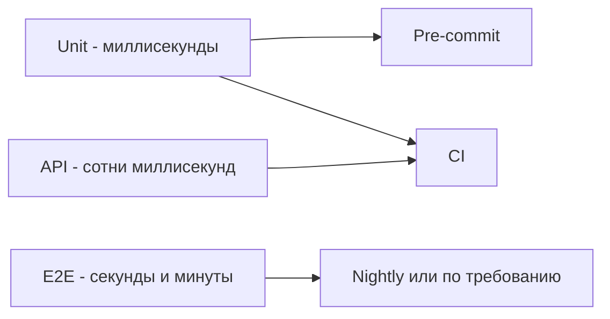
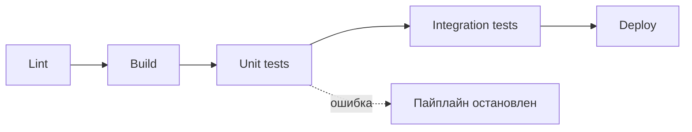
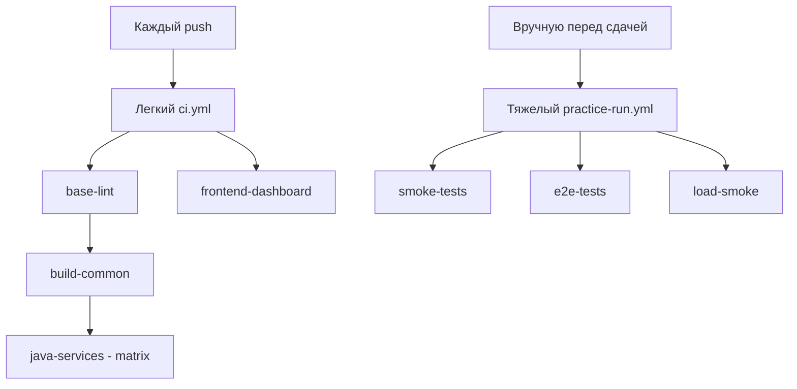
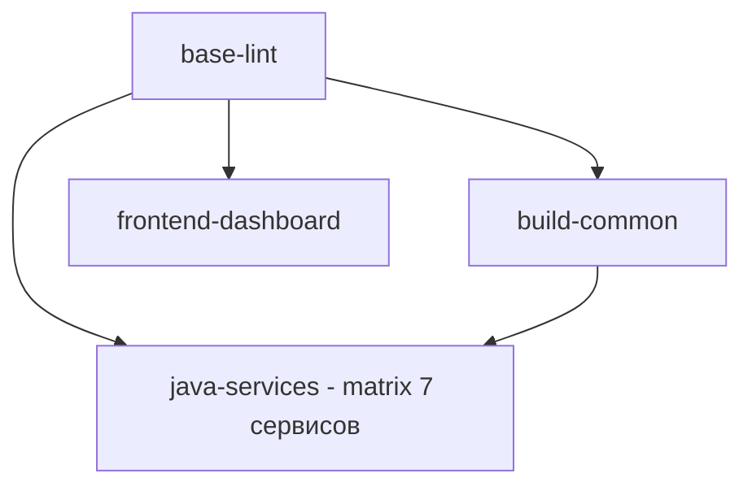
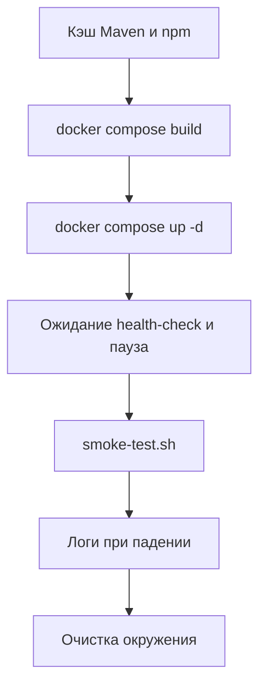
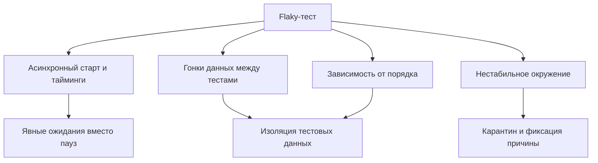

# Lecture 6: Основы CI/CD в контексте тестирования

> **Модуль**: 3 — Пирамида тестирования и основы CI/CD
> **Лектор**: Вера Терентьева
> **Длительность**: 1 час 5 минут (65 мин)
> **Слайдов**: 16
> **Формат**: Markdown, каждый слайд — раздел `###`
> **Структура слайда**: Заголовок + 2–5 буллетов + блок **Визуализация** + speaker notes
> **Дата**: 13.08.2026
> **Литература**: см. [Источники](#источники) в конце файла
>
> **Соглашение о визуализации**: на каждом слайде есть блок **Визуализация** с описанием макета и рекомендацией по иллюстрации. Изображения пока только рекомендованы, имя файла и папка указаны условно; реальные файлы кладём в `Pictires/lecture-06/`. Диаграммы описаны кодом mermaid прямо в файле.

---

## Тайминг

| Время | Блок | Слайды | Назначение |
|:---:|---|:---:|---|
| 0:00–0:08 | Введение: зачем CI/CD тестировщику | 1–2 | Связь пирамиды и пайплайна |
| 0:08–0:22 | Инструменты CI/CD | 3–4 | GitHub Actions, GitLab CI, Jenkins, TeamCity — что выбрать |
| 0:22–0:36 | Быстрая обратная связь | 5–6 | Почему скорость критична, пирамида как карта скоростей |
| 0:36–0:52 | Билд-пайплайн и smoke-тесты | 7–10 | Стадии, smoke-тесты, два пайплайна СМП |
| 0:52–0:56 | Flaky-тесты и доверие к CI | 11 | Причины нестабильности, карантин, политика ретраев |
| 0:56–1:05 | Выводы и интерактив | 12–16 | Makefile, отчёты, сдача, вопросы аудитории, анонс |

---

### Слайд 1. Титульный

**Слайд:**
- Курс «Тестирование программного обеспечения»
- Модуль 3. Пирамида тестирования и основы CI/CD
- Лекция 6. Основы CI/CD в контексте тестирования
- Лектор: Вера Терентьева, компания Lekton
- ИТМО, 4 курс

**Визуализация:**
- Макет: полноэкранный титульный фон, поверх него название лекции и имя лектора.
- Иллюстрация: `Pictires/lecture-06/img-1-cover.jpg` — титульный фон из брендового набора курса.

**Speaker notes:**

> Добрый день, коллеги. На прошлой лекции мы разобрали пирамиду тестирования. Мы решили, какие тесты писать и в каком количестве. Сегодня отвечаем на следующий вопрос: как эти тесты запускаются автоматически при каждом изменении кода. Это и есть CI/CD в контексте тестирования.
>
> Сразу разберемся с определениями. CI это Continuous Integration, непрерывная интеграция. Это значит, что каждый коммит автоматически собирается и проверяется. CD это Continuous Delivery или Continuous Deployment, непрерывная доставка или развертывание. Это значит, что проверенный код автоматически доставляется в окружение. Нас как тестировщиков в первую очередь интересует CI, то есть автоматический запуск тестов по каждому изменению.

---

### Слайд 2. Зачем тестировщику CI/CD

**Слайд:**
- Тесты без автоматического запуска — мёртвый код
- CI — это машина, которая запускает пирамиду по каждому изменению
- Быстрая обратная связь = дешёвое исправление (правило 1:10:100)
- CI/CD — не «инструмент девопса», а условие существования автоматизации тестирования
- В СМП: GitHub Actions по каждому push гоняет линтеры и сборку; тяжёлые проверки — вручную

**Визуализация:**
- Макет: слева иконка коммита, справа конвейер со стадиями и зеленой галочкой.
- Иллюстрация: `Pictires/lecture-06/img-2-why-cicd.png` — метафора «тесты без запуска это мертвый код».
- Акцент: вынести на слайд схему «коммит → пайплайн → результат».

**Speaker notes:**

> Почему тестировщику важно понимать CI/CD? Потому что тесты, которые никто не запускает автоматически, это мертвый код. Пирамида тестирования, которую мы разобрали на прошлой лекции, живет только внутри пайплайна.
>
> CI это машина, которая по каждому изменению запускает всю пирамиду: unit, API, E2E. Если тесты не запускаются автоматически, разработчик их просто не гоняет, и регрессия накапливается.
>
> Быстрая обратная связь это деньги. Вспомним правило один к десяти к ста: чем раньше пойман дефект, тем дешевле исправление. CI дает обратную связь за минуты, а не за дни ручного прогона.
>
> В нашем СМП CI реализован на GitHub Actions. И здесь есть важная деталь. Используются два пайплайна. По каждому push в любую ветку запускается легкий пайплайн: линтеры, сборка Java-модулей и frontend. А тяжелые проверки, то есть Docker-сборка, поднятие всего стека, smoke и E2E, вынесены в отдельный пайплайн, который запускается вручную перед сдачей. Оба мы детально разберем в конце лекции.

---

### Слайд 3. Инструменты CI/CD: обзор

**Слайд:**
- GitHub Actions — встроен в GitHub, YAML-пайплайны, бесплатен для публичных репозиториев
- GitLab CI — встроен в GitLab, `.gitlab-ci.yml`, мощные stage-графы
- Jenkins — open-source, гибкий через плагины, требует собственного сервера
- TeamCity — коммерческий от JetBrains, удобен для JVM-проектов, богатые отчёты
- Выбор зависит от того, где живёт код и какие нужны интеграции

**Визуализация:**
- Макет: четыре плитки с логотипами инструментов в два ряда, под каждой одна короткая характеристика.
- Иллюстрация: `Pictires/lecture-06/img-3-tools.png` — логотипы GitHub Actions, GitLab CI, Jenkins, TeamCity.

**Speaker notes:**

> Прежде чем разбирать пайплайн СМП, давайте посмотрим на ландшафт инструментов CI/CD. В разных компаниях он разный, и вам нужно уметь выбирать.
>
> GitHub Actions это система, встроенная прямо в GitHub. Пайплайны описываются YAML-файлами в папке workflows. Для проектов на GitHub это самый простой старт: ничего не надо ставить, раннеры предоставляет GitHub. Именно его мы используем в СМП.
>
> GitLab CI это аналог от GitLab, пайплайн описывается в файле `gitlab-ci.yml`. Он отличается тем, что позволяет строить наглядные графы стадий с ручными шагами-гейтами. Это удобно, когда нужны промежуточные ручные одобрения перед выкаткой.
>
> Jenkins это старейший open-source сервер CI. Он очень гибкий за счет тысяч плагинов, но эту гибкость нужно обслуживать. Jenkins обычно требует собственный сервер, администрирование, следить за обновлениями. Его выбирают, когда нужен полный контроль над инфраструктурой.
>
> TeamCity это коммерческий продукт JetBrains, той же компании, что делает IntelliJ IDEA. Он особенно удобен для JVM-проектов: глубоко понимает Java, Maven, Gradle, умеет строить красивые отчеты по тестам и сборкам из коробки. В enterprise, где стек Java, TeamCity часто выбирают за готовую интеграцию и стабильность.
>
> Как выбирать? Смотрите на три вещи. Где живет репозиторий: GitHub, значит Actions, GitLab, значит GitLab CI. Какой стек: для JVM удобен TeamCity. И сколько вы готовы инвестировать в инфраструктуру: Jenkins требует больше всего. В СМП выбор очевиден, код на GitHub, значит GitHub Actions.
>
> Спрошу вас: слышали ли вы о каком-нибудь из этих инструментов? В каких компаниях, по вашему опыту, что используют? Если обобщить, то в open-source и стартапах чаще GitHub Actions и GitLab CI из-за простоты и низкого порога входа. А в крупном enterprise с историей чаще Jenkins и TeamCity, потому что они давно внедрены, а миграция дорога.

---

### Слайд 4. Пайплайн как код

**Слайд:**
- Пайплайн описывается файлом в репозитории, а не настройками в UI
- Это значит: пайплайн версионируется, ревьюится и воспроизводится
- Примеры файлов: `.github/workflows/ci.yml` (Actions), `.gitlab-ci.yml` (GitLab), `Jenkinsfile` (Jenkins)
- Изменение пайплайна идёт через обычный pull request
- Это устраняет проблему «настройки живут только в голове админа»

**Визуализация:**
- Макет: слева значок репозитория с YAML-файлом, справа значок pull request.
- Иллюстрация: `Pictires/lecture-06/img-4-pipeline-as-code.png` — файл пайплайна внутри репозитория и ревью через PR.

**Speaker notes:**

> Общий принцип всех современных инструментов CI/CD это пайплайн как код. Это значит, что конфигурация пайплайна хранится в файле внутри репозитория, а не задается кликами в веб-интерфейсе.
>
> Почему это важно? Пайплайн становится обычным кодом. Он версионируется, его можно ревьюить через pull request, его можно воспроизвести на другой машине. Если кто-то сломал пайплайн, видно, кто и когда это сделал, и можно откатить. А если пайплайн живет только в настройках интерфейса, то это знание в голове одного администратора, и потерять его очень просто.
>
> Форматы файлов у каждого инструмента свои. GitHub Actions это файлы в папке workflows, GitLab CI это `gitlab-ci.yml`, Jenkins это `Jenkinsfile`. Но идея одна и та же: декларативно описать, что должно происходить после коммита.
>
> В СМП пайплайн описан в файле [`practic/.github/workflows/ci.yml`](https://github.com/LektonSoftwareTestingCourse/Practic/blob/main/.github/workflows/ci.yml), и мы сейчас разберем его по частям.

---

### Слайд 5. Быстрая обратная связь — ключевой принцип

**Слайд:**
- Обратная связь = время от изменения кода до получения результата тестов
- Цель: чем короче цикл «изменил → узнал результат», тем лучше
- Pre-commit: секунды. CI: минуты. Nightly: часы
- Разработчик в потоке: пять–десять минут ожидания срывают контекст
- Быстрая обратная связь — не «приятный бонус», а экономическая необходимость

**Визуализация:**
- Макет: три концентрических кольца или три полосы, подписанные pre-commit, CI, nightly, от быстрого к медленному.
- Иллюстрация: `Pictires/lecture-06/img-5-feedback-loops.png` — слоистая модель обратной связи.

**Speaker notes:**

> Ключевой принцип CI это быстрая обратная связь. Это время от изменения кода до получения результата тестов. Цель сделать этот цикл максимально коротким.
>
> Почему это экономически критично? Разработчик работает в состоянии потока. Если тесты идут двадцать минут, он переключился на другую задачу и потерял контекст. И когда тесты наконец упали, ему нужно заново погружаться в код, который он писал двадцать минут назад. А если тесты идут тридцать секунд, он еще в потоке и чинит баг немедленно.
>
> Отсюда вытекает слоистая структура пайплайна: pre-commit это секунды, CI это минуты, nightly это часы. Каждый слой это свой компромисс между полнотой проверок и скоростью. И это напрямую связано с пирамидой: unit-тесты быстрые и идут в pre-commit, E2E-тесты медленные и идут в ночной прогон.
>
> Вопрос к вам: что произойдет, если все тесты, включая E2E, гонять на каждый коммит? Оцените время и последствия.
>
> Ответ: прогон растянется до десятков минут или часов на каждый коммит. Разработчик будет ждать результат и терять поток, а CI-раннеры будут постоянно заняты. И в итоге команда начнет игнорировать пайплайн или пропускать его запуск. Поэтому медленные тесты выносят в ночной прогон.

---

### Слайд 6. Пирамида как карта скоростей

**Слайд:**
- Unit-тесты: миллисекунды → pre-commit и CI
- API/интеграционные: сотни миллисекунд → CI
- E2E: секунды/минуты → nightly
- Пирамида = карта, какие тесты куда ставить по скорости
- Чем ниже уровень, тем раньше в пайплайне он запускается
- Категория техники коррелирует со скоростью: быстрые unit — обычно белый ящик (покрытие ветвей), медленные API/E2E — чёрный ящик (спецификация и сценарии)

**Визуализация:**
- Макет: пирамида, рядом с каждым уровнем подпись времени прогона и места запуска.
- Диаграмма: соответствие уровней и стадий пайплайна ниже.
- Иллюстрация: `Pictires/lecture-06/img-6-speed-map.png` — пирамида как карта скоростей.



**Speaker notes:**

> Пирамида тестирования это одновременно карта скоростей для CI. Давайте посмотрим на уровни через призму того, сколько времени занимает прогон.
>
> Unit-тесты: миллисекунды. Тысяча штук это секунды. Их можно гонять на pre-commit, до отправки кода в репозиторий. API- и интеграционные тесты: сотни миллисекунд плюс поднятие контекста. Сотни штук это минуты. Их место в CI-пайплайне. E2E-тесты: секунды и минуты плюс полное окружение. Их место в ночном прогоне, раз в сутки.
>
> Правило простое: чем ниже уровень теста, тем раньше в пайплайне он запускается. Чем выше, тем позже. Это и есть связь лекции 5 и лекции 6: пирамида определяет, что писать, а CI/CD определяет, когда запускать.
>
> И добавим к карте скоростей вторую ось из лекции 5, это источник информации. Быстрые unit-тесты удобнее всего строить как белый ящик: у нас есть структура кода, и мы требуем покрытия ветвей, это дешево и точно. Медленные API- и E2E-тесты, наоборот, почти всегда черный ящик: мы проверяем поведение по спецификации и сценариям, не заглядывая в реализацию. Это совпадает с порядком запуска: быстрая белоящичная проверка идет на pre-commit, медленная черноящичная в CI и nightly.

---

### Слайд 7. Что такое билд-пайплайн

**Слайд:**
- Пайплайн — последовательность автоматических шагов от коммита до результата
- Стадии (stages): lint → build → unit-test → integration-test → deploy
- Каждая стадия — отдельный набор команд с чётким критерием успеха
- Стадии выполняются последовательно, но внутри могут распараллеливаться
- Упавшая стадия останавливает пайплайн — код не идёт дальше

**Визуализация:**
- Макет: горизонтальный конвейер из пяти стадий, между ними стрелки, последняя стадия показана красной и обрывающей цепочку.
- Диаграмма: стадии и fail fast ниже.
- Иллюстрация: `Pictires/lecture-06/img-7-pipeline.png` — схема конвейера со стадиями.



**Speaker notes:**

> Билд-пайплайн это последовательность автоматических шагов, которые выполняются после коммита. Каждый шаг называется стадией.
>
> Типичная цепочка: lint, то есть проверка стиля кода. Потом build, компиляция. Потом unit-test, модульные тесты. Потом integration-test, интеграционные тесты. И в конце deploy, развертывание. Каждая стадия это отдельный набор команд с четким критерием успеха: линтер прошел без ошибок, сборка собралась, тесты зеленые.
>
> Ключевые свойства. Стадии выполняются последовательно, потому что нельзя разворачивать то, что не собралось. Но внутри стадии работа может распараллеливаться: в СМП семь Java-сервисов собираются параллельно через matrix-стратегию. И самое главное: упавшая стадия останавливает пайплайн. Если линтер красный, сборка не запустится. Если сборка упала, следующие шаги не пойдут. Это принцип fail fast, то есть ловить проблему как можно раньше.
>
> Вопрос к вам: почему важно, чтобы упавшая стадия останавливала пайплайн, а не продолжала выполнение? Что будет, если игнорировать красные тесты?
>
> Ответ: если пайплайн продолжает работу после красной стадии, мы тратим ресурсы на запуск дорогих тестов поверх уже известной проблемы. Хуже того, команда привыкает видеть «красный, но продолжает» и перестает воспринимать падение как сигнал к действию. Так мы возвращаемся к антипаттерну ice-cream cone из прошлой лекции: пайплайн перестает быть источником правды о качестве.

---

### Слайд 8. Что такое smoke-тесты

**Слайд:**
- Smoke-тест — минимальная проверка, что система «дымит», то есть запустилась и базово работает
- Термин из электроники: прибор включают и смотрят, не пошёл ли дым
- Проверяет критические пути, а не детальную логику
- В СМП: [`scripts/smoke-test.sh`](https://github.com/LektonSoftwareTestingCourse/Practic/blob/main/scripts/smoke-test.sh) гоняет 7 блоков проверок
- Быстрый отсев: если smoke красный, гонять полный набор бессмысленно
- Smoke — это позитивный барьер: «система базово работает». Он логически идёт до полного негативного регресса (правило из лекции 5: сначала позитив, потом негатив)

**Визуализация:**
- Макет: слева прибор с дымом как метафора, справа семь блоков проверок списком.
- Иллюстрация: `Pictires/lecture-06/img-8-smoke.png` — метафора дыма из электроники.
- Код: текстовый блок со структурой smoke-скрипта ниже.

```text
Структура scripts/smoke-test.sh (7 блоков):
1. Health-check всех 11 сервисов + RabbitMQ Management UI + Dashboard
2. Генерация 500 тестовых карт (POST /api/cards/generate, bins 400000-400004)
3. Одиночная транзакция (POST /api/transactions)
3a. Bin Lookup: GET /api/bin/400000 → issuerId=ISS001
3b. Notification Service: GET /api/notifications → 200
4. Симулятор терминалов: 50 транзакций, сценарий mixed
5. Поиск транзакций (GET /api/transactions/search)
6. Статистика дашборда (GET /api/dashboard/stats)
7. Последние транзакции (GET /api/dashboard/recent)
→ финал: ALL CHECKS PASSED
```

**Speaker notes:**

> Отдельно остановимся на термине smoke-тест, потому что он будет встречаться дальше по курсу. Это важное понятие.
>
> Smoke-тест это минимальная проверка того, что система вообще запустилась и базово работает. Термин пришел из электроники: когда собирают прибор, его включают и смотрят, не пошел ли дым. Если дым пошел, дальше тестировать нечего. В тестировании аналогия прямая: если система не поднялась и не отвечает на базовые запросы, гонять полный набор бессмысленно.
>
> Чем smoke отличается от полного регресса? Smoke проверяет критические пути, а не детальную логику. Он отвечает на вопрос «система жива?», а не «все ли сценарии работают корректно?». Поэтому он быстрый, минуты, а не часы.
>
> В СМП smoke-скрипт [`scripts/smoke-test.sh`](https://github.com/LektonSoftwareTestingCourse/Practic/blob/main/scripts/smoke-test.sh) устроен как семь последовательных блоков. Блок 1 это health-check всех одиннадцати сервисов: Gateway, Card Management, Switch, Authorization, Merchant Simulator, Terminal Simulator, Transaction Logger, Bin Lookup, Notification Service, а также RabbitMQ Management UI и веб-дашборд. Блок 2 это генерация пятисот тестовых карт по нескольким BIN. Блок 3 это одиночная транзакция через `POST /api/transactions`. Дальше идут точечные проверки интеграций: Bin Lookup должен вернуть нужный issuerId, Notification Service должен ответить 200. Блок 4 это симулятор терминалов на пятьдесят транзакций в сценарии mixed. Блоки 5, 6 и 7 проверяют поиск, статистику и последние транзакции дашборда. И финал это строка ALL CHECKS PASSED.
>
> Обратите внимание на природу этих проверок. Это не подробное тестирование логики, это барьер «система собрана и основные интеграции живы». Именно поэтому smoke поднимает весь стек через Docker Compose и прогоняется один раз как приёмка.
>
> И свяжем это с правилом из лекции 5. Smoke это по сути позитивный барьер. Он отвечает на вопрос «работает ли система так, как задумано, на основных путях», а не «корректно ли она отклоняет плохие данные». То есть smoke подтверждает happy path до того, как мы перейдем к негативному регрессу. Если smoke красный, нет смысла гонять негативные проверки: база не подтверждена, и любое отклонение ничего не докажет.
>
> Мы встретим smoke-тесты еще раз в модуле 8, при нагрузочном smoke, и на практике 6, где вы будете настраивать CI-пайплайн. Пока запомните принцип: smoke это дешевый быстрый барьер на входе в тестирование.

---

### Слайд 9. Стадии пайплайна: что где запускать

**Слайд:**
- Pre-commit: линтеры + быстрые unit-тесты (секунды)
- CI (по push/PR): линтеры + сборка + все unit + API-тесты (минуты)
- Nightly / по требованию: E2E + нагрузочные + миграции (часы)
- Принцип: каждая стадия — свой уровень пирамиды
- Быстрые тесты — часто, медленные — редко

**Визуализация:**
- Макет: три горизонтальные полосы с подписями времени и составом проверок.
- Иллюстрация: `Pictires/lecture-06/img-9-stages.png` — сопоставление стадий пайплайна и уровней пирамиды.

**Speaker notes:**

> Давайте сведем все в единую схему. Pre-commit это хук, который выполняется до того, как код попадет в репозиторий. Там только линтеры и быстрые unit-тесты, все, что укладывается в секунды. Это первый барьер.
>
> CI по push или pull request это основная проверка: линтеры, полная сборка, все unit-тесты, API-тесты. Это минуты. Здесь живет основная масса проверок из пирамиды.
>
> Nightly это ночной прогон: E2E-тесты, нагрузочные, миграции данных. Часы. Раз в сутки.
>
> Принцип такой: быстрые тесты гоняем часто, медленные редко. Не потому что медленные неважны, а потому что их стоимость запуска высока. Если E2E-тест идет десять минут, а коммитов пятьдесят в день, это пятьсот минут машинного времени в день только на E2E. Поэтому E2E уходит в ночь или запускается по требованию.
>
> И последнее уточнение важно для СМП. Там медленные проверки запускаются не по расписанию nightly, а по требованию, вручную перед сдачей. Причина та же, это стоимость: незачем гонять docker-сборку и E2E, пока наработка не готова к приёмке. Планировщик и ручной триггер это две формы одного принципа «редко и дорого».
>
> Теперь посмотрим, как это конкретно устроено в СМП.

---

### Слайд 10. CI/CD в СМП: два пайплайна

**Слайд:**
- СМП использует **два** workflow, а не один: лёгкий и тяжёлый
- `ci.yml` — на каждый push: линтеры, сборка Java-модулей, сборка frontend (без Docker)
- `practice-run.yml` — вручную (`workflow_dispatch`) для тяжёлых проверок: Docker build + smoke/e2e/load
- Почему так: docker-сборка 11 образов дорога, нецелесообразно гонять её на каждый коммит
- Лёгкий пайплайн даёт быструю обратную связь, тяжёлый — полную проверку перед сдачей

**Визуализация:**
- Макет: две дорожки, верхняя легкая и частая, нижняя тяжелая и редкая.
- Диаграмма: две ветки пайплайнов ниже.
- Иллюстрация: `Pictires/lecture-06/img-10-two-pipelines.png` — две дорожки разной «весовой категории».



**Speaker notes:**

> Посмотрим, как CI/CD реально устроен в СМП. Здесь есть важная деталь, которую многие упускают. Используются два workflow-файла, а не один. Легкий [`practic/.github/workflows/ci.yml`](https://github.com/LektonSoftwareTestingCourse/Practic/blob/main/.github/workflows/ci.yml) запускается на каждый push, а тяжелый [`practic/.github/workflows/practice-run.yml`](https://github.com/LektonSoftwareTestingCourse/Practic/blob/main/.github/workflows/practice-run.yml) только вручную.
>
> Почему так? Docker-сборка одиннадцати образов занимает много времени и расходует Actions-минуты. Гонять ее на каждый коммит экономически невыгодно: разработчик меняет одну строку в gateway, а пайплайн полчаса собирает весь стек. Поэтому тяжелые проверки вынесены в отдельный workflow, который студент запускает вручную перед сдачей артефакта.
>
> Легкий `ci.yml` решает задачу быстрой обратной связи. Он проверяет линтеры, компиляцию Java-модулей и сборку frontend, но не собирает Docker-образы и не поднимает стек. А тяжелый `practice-run.yml` решает задачу полной проверки. Он собирает образы, поднимает весь стек через Docker Compose и прогоняет smoke, E2E или нагрузочный smoke.
>
> Заметьте связь с пирамидой из прошлой лекции: дешевые и быстрые проверки идут на каждый коммит, дорогие и медленные по требованию. Это ровно тот же принцип распределения по стоимости, что и в пирамиде, только примененный не к уровням тестов, а к пайплайнам.

---

### Слайд 11. Разбор ci.yml: лёгкий пайплайн (на каждый push)

**Слайд:**
```yaml
on:
  push:
    branches: [ '**' ]
    paths-ignore: [ 'docs/**', 'tz/**', '**/*.md', '**/*.png' ]
  pull_request:
    branches: [ main ]
    paths: [ 'services/**', 'docker-compose.yaml', ... ]

concurrency:
  group: ci-${{ github.repository }}-${{ github.ref }}
  cancel-in-progress: true

jobs:
  base-lint:          # pre-commit hooks
  build-common:       # needs: base-lint → сборка services/common
  java-services:      # needs: [base-lint, build-common]
    strategy:
      matrix:
        service: [ gateway, switch, authorization, card-management,
                   terminal-simulator, merchant-acquirer, transaction-logger ]
    steps: [ checkstyle, install -DskipTests ]
  frontend-dashboard: # npm install, ESLint, build
```
- 4 джоба: `base-lint`, `build-common`, `java-services`, `frontend-dashboard`
- `needs` — зависимости между джобами; упавший джоб блокирует зависимые
- matrix из **7** Java-сервисов: параллельная сборка + checkstyle
- Тесты пока пропускаются (`-DskipTests`), пока студенты их не напишут

**Визуализация:**
- Макет: YAML-блок слева, справа граф джобов с зависимостями.
- Диаграмма: граф джобов `needs` ниже.
- Иллюстрация: `Pictires/lecture-06/img-11-ci-yml.png` — скриншот графа джобов из GitHub Actions.



**Speaker notes:**

> Разберем легкий пайплайн через ключевое слово `needs`. Именно оно задает зависимости между джобами.
>
> `base-lint` это первая стадия, она запускает pre-commit-хуки и ни от чего не зависит. `build-common` зависит от `base-lint`: сначала проверяем стиль, потом собираем общий модуль, от которого зависят все сервисы. `java-services` зависит от обоих и через matrix запускает сборку каждого из семи Java-сервисов. А `frontend-dashboard` зависит только от `base-lint` и параллельно собирает React-дашборд.
>
> Триггеры и фильтры здесь продуманы. На push в любую ветку пайплайн игнорирует изменения в документации и картинках, потому что правка документации не должна занимать раннер. На pull request в main пайплайн запускается только при изменениях в коде сервисов, в docker-compose, в самом workflow, в примере окружения и в скриптах smoke.
>
> Еще одна деталь это `concurrency` с `cancel-in-progress`. Если вы запушили новый коммит, пока предыдущий прогон еще идет, старый автоматически отменяется. Это экономит минуты и не дает очереди из устаревших прогонов.
>
> Важное свойство: если `base-lint` или `build-common` упал, `java-services` вообще не запустится. Это и есть fail fast, не собирать сервисы, когда сломан стиль или общий модуль. Вопрос к вам: почему тесты в этом пайплайне пока пропускаются, то есть сборка идет с `-DskipTests`?
>
> Ответ такой. В стартовом репозитории СМП все тесты удалены, потому что студенты пишут их в течение семестра. Поэтому сборка идет с пропуском тестов: пайплайн проверяет, что код компилируется и проходит checkstyle. По мере того как вы добавляете свои тесты, они начинают исполняться в этом же джобе. То есть легкий пайплайн изначально настроен пустым под тесты и наполняется вашей работой.

---

### Слайд 12. Разбор practice-run.yml: тяжёлый пайплайн

**Слайд:**
```yaml
on:
  workflow_dispatch:
    inputs:
      practice:
        type: choice
        options: [ '1', '5', '6' ]   # 1=smoke, 5=e2e, 6=load-smoke

jobs:
  smoke-tests:
    if: github.event.inputs.practice == '1'
    steps:
    - run: echo "GHCR_USER=${OWNER,,}" >> "$GITHUB_ENV"
    - run: sudo apt-get install -y jq bc
    - run: cp .env.example .env
    - uses: docker/setup-buildx-action@v3
    - uses: actions/cache@v4                 # var-cache-m2, var-cache-npm
    - uses: reproducible-containers/buildkit-cache-dance@v3.1.2
    - run: docker compose build
    - run: docker compose up -d
    - name: Wait for services to be ready
      run: |
        for i in {1..60}; do
          curl -s http://localhost:8080/health && break
          sleep 5
        done
        sleep 15
    - run: ./scripts/smoke-test.sh
    - name: Show logs on failure
      if: failure()
      run: docker compose logs --tail=100
    - name: Cleanup
      if: always()
      run: docker compose down -v
```
- Триггер `workflow_dispatch` + выбор практики: 1 = smoke, 5 = e2e, 6 = load-smoke
- Три джоба с условием `if: practice == ...`; исполняется только выбранный
- Кэш Maven/npm монтируется в Buildx (`buildkit-cache-dance`) — ускоряет docker-сборку

**Визуализация:**
- Макет: YAML-блок слева, справа вертикальная цепочка шагов джоба от сборки до очистки.
- Диаграмма: последовательность шагов smoke-джоба ниже.
- Иллюстрация: `Pictires/lecture-06/img-12-practice-run.png` — скриншот ручного запуска workflow с выбором практики.



**Speaker notes:**

> Теперь разберем тяжелый пайплайн [`practice-run.yml`](https://github.com/LektonSoftwareTestingCourse/Practic/blob/main/.github/workflows/practice-run.yml). Его ключевое отличие это триггер `workflow_dispatch`: он не запускается сам, а стартует вручную из вкладки Actions. При запуске вы выбираете входной параметр practice из набора: один, пять или шесть.
>
> Под этот выбор настроены три джоба. `smoke-tests` с условием practice равно единице, `e2e-tests` с условием practice равно пяти, и `load-smoke` с условием practice равно шести. При любом запуске исполняется ровно один из них, тот, что соответствует выбранной практике. Это и есть экономия: одна docker-сборка, один поднятый стек, ровно под ту проверку, которую вы сдаете.
>
> Разберем шаги джоба `smoke-tests`, это интеграционный уровень пирамиды. Сначала нормализуется имя неймспейса в реестре: владелец репозитория приводится к нижнему регистру, потому что имена Docker-образов обязаны быть в нижнем регистре. Затем ставятся утилиты, нужные smoke-скрипту, и копируется файл окружения. Дальше идут три важных технических шага: включается Buildx, кэшируются каталоги Maven и npm, и этот кэш монтируется внутрь сборки. Так зависимости не скачиваются заново при каждой сдаче.
>
> Потом `docker compose build` собирает образы, `docker compose up -d` поднимает стек, и начинается ожидание готовности: цикл до шестидесяти итераций, каждые пять секунд проверка health-endpoint Gateway, пока он не ответит, плюс пауза пятнадцать секунд. После этого запускается smoke-скрипт, те самые семь блоков со слайда 8.
>
> Обратите внимание на два приема гигиены. При падении выводятся последние сто строк логов. А очистка окружения через `docker compose down -v` выполняется в любом случае, иначе контейнеры останутся висеть и займут раннер.
>
> Вопрос к вам: зачем после цикла ожидания дополнительная пауза в пятнадцать секунд, если health-check Gateway уже ответил?
>
> Ответ: health-check Gateway может ответить «ok», но downstream-сервисы еще не до конца поднялись и не установили соединения между собой. Например, Switch еще подключается к RabbitMQ, а Authorization к Card Management. Короткая пауза дает системе стабилизироваться. Без нее первые smoke-запросы могут упасть ложно. Это классическая проблема асинхронного старта распределенной системы, и мы еще столкнемся с ней в модуле 6 при интеграционном тестировании.

---

### Слайд 13. Makefile как локальный интерфейс к пайплайну

**Слайд:**
```makefile
run:    docker compose up -d
stop:   docker compose down
clean:  docker compose down -v --remove-orphans
build:  docker compose build
status: docker compose ps
logs:   docker compose logs -f $(SERVICE)     # SERVICE=gateway
smoke:  ./scripts/smoke-test.sh               # Windows: pwsh scripts/smoke-test.ps1
test:   mvn-test npm-test                     # Maven + npm
lint:   mvn-lint npm-lint                     # checkstyle + ESLint
mvn-service: mvn -f services/pom.xml -P$(SERVICE) package
```
- Makefile — единая точка входа для локальных команд
- `test` и `lint` — композиция Maven- и npm-целей (`mvn-test`/`npm-test`, `mvn-lint`/`npm-lint`)
- Кроссплатформенность: на Windows `.env` копируется через `copy`, smoke — через `pwsh`
- `make mvn-service SERVICE=authorization` — сборка одного сервиса с зависимостями

**Визуализация:**
- Макет: списком команды Makefile с краткими подписями, справа стрелка «то же самое локально и в CI».
- Иллюстрация: `Pictires/lecture-06/img-13-makefile.png` — терминал с командой `make lint` и зеленым результатом.

**Speaker notes:**

> В СМП есть [`Makefile`](https://github.com/LektonSoftwareTestingCourse/Practic/blob/main/Makefile), это единая точка входа для локальных команд. Зачем он нужен, если есть CI?
>
> Makefile фиксирует те же команды, что запускаются в CI, но локально. Разработчик может выполнить `make lint` и `make test` до push и заранее узнать, что упадет в пайплайне. Это сокращает цикл обратной связи еще сильнее: не ждать раннера, а гонять проверки на своей машине за те же минуты.
>
> Ключевое преимущество это консистентность. Локально и в CI выполняются одни и те же команды. Нет расхождения «на моей машине работало». Это устраняет целый класс проблем.
>
> Разберем цели. Docker-цели: запуск, остановка, очистка, сборка, статус, логи с параметром сервиса. Композитные цели `test` и `lint` собираются из подцелей: тесты это Maven плюс npm, а линт это checkstyle плюс ESLint. Есть и точечная цель, которая собирает один сервис с его зависимостями.
>
> Makefile еще и кроссплатформенный. Он определяет операционную систему: на Windows файл окружения создается через `copy` и запускается PowerShell-версия smoke-скрипта, а на Linux и Mac через `cp` и shell-версию. Это снимает классическую проблему «на Windows скрипт не работает».
>
> И заметьте связь: `make smoke` это локальный аналог джоба `smoke-tests` из тяжелого пайплайна, а `make lint` и `make test` это локальные аналоги легкого `ci.yml`. Разработчик может прогнать то же самое у себя, не дожидаясь CI. Это пример того, как быстрая обратная связь реализуется на нескольких уровнях.

---

### Слайд 14. Flaky-тесты: почему CI перестают доверять

**Слайд:**
- Flaky-тест — тест, который на одном и том же коде иногда падает, иногда проходит
- Это самый опасный враг CI: падение перестаёт быть сигналом, и команда учится игнорировать красный билд
- Типичные причины: асинхронный старт сервисов и тайминги; гонки данных между параллельными тестами; зависимость от порядка; нестабильное окружение; зависимость от внешних систем
- СМП: `sleep 15` в `practice-run.yml` после health-check — прямое следствие асинхронного старта; первая гипотеза при таком падении — тайминг
- Лечение: изоляция тестовых данных, явные ожидания вместо sleep (Awaitility в модуле 5), карантин (quarantine) нестабильных тестов, фиксация причины перед возвратом
- Антипаттерн: «зелёный по ретраю» без разбора — ретрай маскирует дефект, а не чинит его

**Визуализация:**
- Макет: слева схема «один и тот же код, разные результаты», справа список причин и методов лечения.
- Диаграмма: причины flaky и лечение ниже.
- Иллюстрация: `Pictires/lecture-06/img-14-flaky.png` — один тест, который то зеленый, то красный на неизменном коде.



**Speaker notes:**

> Отдельно и подробно разберем проблему, которая прямо вытекает из разговора об ice-cream cone. Это flaky-тесты. Тесты, которые на одном и том же коде иногда падают, а иногда проходят. В лекции 5 мы упоминали их как признак больной пирамиды, а теперь разберем, что с ними делать в CI.
>
> Почему это самый опасный враг пайплайна? Потому что CI существует ради одного: красный билд должен означать, что есть проблема. Flaky-тест разрушает именно эту договоренность. Если тест падает раз в пять прогонов, команда быстро учится говорить «это опять он, не обращаем внимания». И вместе с ним пропускает настоящие дефекты. Доверие к CI теряется, автоматизация перестает работать как сигнал качества.
>
> Типичные причины. Первая это асинхронный старт сервисов и тайминги: тест выполняется раньше, чем система готова. В СМП это видно прямо в тяжелом пайплайне, где после ожидания health-check стоит дополнительная пауза в пятнадцать секунд, потому что downstream-сервисы еще не поднялись. Вторая причина это гонки данных: параллельные тесты создают и удаляют одни и те же данные. Третья это зависимость от порядка выполнения. Четвертая это нестабильное окружение: сеть, раннер, внешние системы.
>
> Как лечить. Первое, изолировать тестовые данные: каждый тест работает со своими данными и не делит их с параллельными. Второе, заменить «магические» паузы на явные ожидания состояния: не просто спать фиксированное время, а ждать конкретного условия, когда система действительно готова. Инструмент для этого, Awaitility, мы разберем в модуле 5 на асинхронных контрактах. Третье, карантин: нестабильный тест выносится из обязательного прогона в отдельный набор, чтобы не ломать основной сигнал, но при этом не исчезает, по нему заводится задача с зафиксированной причиной. И четвертое, самое важное: вернуть тест в основной набор можно только после устранения корневой причины, а не после того, как он случайно позеленел.
>
> И об антипаттерне. Частый соблазн это поставить авторетрай: тест упал, прогоняем еще раз, прошел, считаем зеленым. Это обман. Ретрай не чинит причину, а маскирует дефект. Либо в тесте, это гонка или тайминг, либо в системе, это настоящая плавающая ошибка. Если мы ретраим, не разобравшись, мы теряем и сигнал, и информацию о реальном дефекте. Ретрай допустим как временная мера с явным логом «тест был нестабилен», но не как способ закрыть красную сборку.
>
> Вопрос к вам: вернемся к ситуации из интерактива, smoke падает раз в пять прогонов. Какую гипотезу проверяем первой и почему? Ответ: асинхронный старт, потому что в нашем пайплайне есть именно стартовые тайминги, а это самая вероятная и самая дешевая в проверке причина. И только потом гонки данных и порядок тестов.

---

### Слайд 15. Отчёты и уведомления в CI

**Слайд:**
- CI не только «зелёный/красный» — он должен давать информацию о падении
- Логи на падении: `docker compose logs --tail=100` при `if: failure()`
- Уведомления: статус пайплайна виден в PR; `concurrency` отменяет устаревшие прогоны
- Сдача артефакта: Issue с label `practice-N` + ссылка на зелёный Actions run
- Валидацию ссылок делает отдельный workflow `practice-check.yml`
- Без читаемых отчётов CI превращается в чёрный ящик

**Визуализация:**
- Макет: слева иконка упавшего билда с хвостом логов, справа интерфейс PR с галочкой или крестиком.
- Иллюстрация: `Pictires/lecture-06/img-15-reports.png` — интерфейс PR со статусом пайплайна и Issue со сдачей.

**Speaker notes:**

> CI это не просто «зеленый или красный». Главная ценность пайплайна в том, что он дает информацию о том, что именно упало и почему.
>
> В СМП на падении выводится хвост логов: последние сто строк. Это первая помощь при диагностике, видно, какой сервис упал и с какой ошибкой. Дальше идут артефакты: CI может сохранять отчеты тестов, XML от JUnit, HTML от Allure, чтобы их можно было скачать и изучить. Полные отчеты Allure разберем в модуле 8.
>
> Отдельно скажу про сдачу работы, потому что в СМП это часть CI-процесса. Сдача идет через Issue с меткой номера практики в эталонном репозитории. В теле Issue вы прикладываете две ссылки: на свой репозиторий и на конкретный зеленый прогон Actions в нем. Проверяет их отдельный workflow: он парсит текст Issue, ищет ссылки и, если их нет, комментирует Issue с подсказкой. А вердикт по самому CI преподаватель смотрит вручную по приложенной ссылке на прогон. Так устроена обратная связь по сдаче, тоже автоматическая и с понятным сообщением об ошибке.
>
> Про уведомления. Статус пайплайна автоматически отображается в pull request: красный крестик или зеленая галочка прямо в интерфейсе GitHub. А механизм `concurrency` с `cancel-in-progress` автоматически отменяет устаревшие прогоны той же ветки, чтобы не тратить ресурсы на проверку уже неактуального коммита.
>
> Если нет читаемых отчетов, уведомлений и понятного процесса сдачи, CI превращается в черный ящик: что-то упало, а что именно, непонятно. Команда начинает игнорировать красный билд, и мы снова возвращаемся к проблеме ice-cream cone из лекции 5.

---

### Слайд 16. Интерактив и выводы

**Слайд:**
- Ситуация 1: checkstyle упал в джобе `java-services`. Что произойдёт с остальными джобами?
- Ситуация 2: smoke-тест падает раз в пять прогонов. Какие гипотезы? Как диагностировать?
- Ситуация 3: тяжёлый пайплайн идёт 40 минут. Как сократить время, не теряя покрытия?
- Вывод: CI/CD — условие автоматизации, пайплайн как код, fail fast
- Smoke — позитивный барьер; flaky-тесты подрывают доверие к CI, лечим карантином, а не ретраем
- Модуль 4: Unit-тестирование на Java / JUnit 5

**Визуализация:**
- Макет: три карточки-ситуации рядом, под ними блок выводов.
- Иллюстрация: `Pictires/lecture-06/img-16-summary.png` — итоговая схема «пирамида и пайплайн» с тремя правилами.

**Speaker notes:**

> Финальный интерактив, три практические ситуации. Обсуждаем, я дополняю.
>
> Ситуация 1: checkstyle упал в джобе `java-services`. Что дальше? В легком `ci.yml` цепочка такая: `build-common` зависит от `base-lint`, а `java-services` зависит от обоих. При падении `java-services` сборка этого матричного джоба останавливается, шаг установки после провалившегося checkstyle не выполняется. Зависимых от `java-services` джобов в `ci.yml` нет, поэтому прогон просто помечается красным. А тяжелый `practice-run.yml` вообще не запускается автоматически: вы сами не станете запускать smoke или E2E, пока легкий пайплайн красный. Это и есть дисциплина fail fast, но на двух уровнях: внутри пайплайна и в процессе сдачи.
>
> И заметьте: fail fast в пайплайне это та же логика «сначала база, потом детали», что и «сначала позитив, потом негатив» из лекции 5. Сначала проверяем, что код вообще собирается и стиль в порядке, и только потом запускаем дорогие проверки. Негативные и медленные проверки поверх сломанной базы неинформативны.
>
> Ситуация 2: smoke-тест падает раз в пять прогонов. Это flaky-тест. Гипотезы: сервис не успел подняться, гонка данных, не контролируется порядок тестов. Диагностика: смотреть логи при падении, увеличить таймаут, изолировать тестовые данные. Работает та же логика приоритизации гипотез, что и при обычном баге: начинаем с самой вероятной причины.
>
> Ситуация 3: тяжелый пайплайн идет сорок минут. Способы ускорить: распараллелить сервисы через matrix, это уже сделано; кэшировать Maven и npm, тоже сделано; не гонять весь стек, а запускать только нужную практику, тоже сделано. Дальнейшее ускорение это компромисс между скоростью и полнотой покрытия.
>
> Вопрос к вам: в ситуации 3 какие риски у подхода «гонять только измененные сервисы»?
>
> Ответ: сервисы в микросервисной архитектуре связаны контрактами. Если вы гоняете тесты только для измененного сервиса, вы можете пропустить регрессию в сервисах-потребителях, которые зависят от его контракта. Изменили формат ответа Switch, сломался Gateway, но тесты Gateway не запустились, потому что «Gateway не менялся». Это ровно та проблема контрактов, о которой пойдет речь в лекции 9 модуля 5. Поэтому полный набор API-контрактных тестов все равно должен гоняться в CI целиком или по графу зависимостей.
>
> Подведем итог лекции. CI/CD это условие существования автоматизации тестирования: тесты без автоматического запуска мертвы. Пайплайн как код версионируется и ревьюится. Fail fast: упавшая стадия останавливает зависимые. Пирамида это карта, куда ставить тесты по скорости: unit в pre-commit, API в CI, E2E в ночной прогон. Smoke-тест это быстрый барьер проверки базовой работоспособности перед полным тестированием, и по природе это позитивный барьер до негативного регресса. А главный враг доверия к CI это flaky-тесты: их нельзя маскировать ретраями, их лечат изоляцией данных, явными ожиданиями и карантином.
>
> Следующий модуль это unit-тестирование на Java с JUnit 5. Вы будете писать тесты, которые этот самый пайплайн будет гонять по каждому push. Спасибо за внимание, если есть вопросы, задавайте.

---

## Источники

1. **Humble, J., & Farley, D.** (2010). *Continuous Delivery: Reliable Software Releases through Build, Test, and Deployment Automation*. Addison-Wesley. ISBN 978-0-321-60191-9. — Главы 1–3 (принципы CD), 8 (Automated Testing).

2. **Winters, T., Manshreck, T., & Wright, H.** (2020). *Software Engineering at Google*. O'Reilly. ISBN 978-1-492-08279-8. — Глава 11 (Testing Overview), Глава 12 (Testing at scale, CI).

3. **Forsgren, N., Humble, J., & Kim, G.** (2018). *Accelerate: The Science of Lean Software and DevOps*. IT Revolution Press. ISBN 978-1-942788-33-1. — Метрики CI/CD, скорость обратной связи.

4. **Spillner, A., Linz, T., & Schaefer, H.** (2014). *Software Testing Foundations* (4th ed.). Rocky Nook. ISBN 978-1-937538-42-2. — Глава 6 (Test Management), 6.3.1 (стоимость дефекта).

5. GitHub Actions documentation: [https://docs.github.com/en/actions](https://docs.github.com/en/actions)

6. TeamCity documentation: [https://www.jetbrains.com/teamcity/documentation/](https://www.jetbrains.com/teamcity/documentation/)

7. **Meszaros, G.** (2007). *xUnit Test Patterns: Refactoring Test Code*. Addison-Wesley. ISBN 978-0-13-149505-0. — Flaky-тесты, изоляция тестовых данных, карантин нестабильных тестов.
